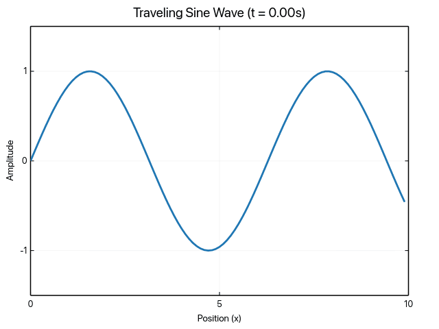

# ruviz

**High-performance 2D plotting library for Rust combining matplotlib's ease-of-use with Makie's performance.**

[](https://crates.io/crates/ruviz)
[](https://docs.rs/ruviz)
[](LICENSE-MIT)
[](https://github.com/Ameyanagi/ruviz/actions/workflows/ci.yml)

## Quick Start

```rust
use ruviz::prelude::*;

let x: Vec<f64> = (0..50).map(|i| i as f64 * 0.1).collect();
let y: Vec<f64> = x.iter().map(|&x| x * x).collect();

Plot::new()
    .line(&x, &y)
    .title("Quadratic Function")
    .xlabel("x")
    .ylabel("y = x²")
    .save("plot.png")?;
```


## Features

### 🛡️ Safety & Quality
- **Zero unsafe** in public API
- Strong type system prevents runtime errors
- Comprehensive error handling with `Result` types
- Memory-safe by design

### 📊 Rich Plot Types (25+)
**Basic**: Line, Scatter, Bar, Histogram, Box Plot, Heatmap
**Distribution**: Violin, KDE (1D/2D), Boxen, ECDF, Strip, Swarm
**Categorical**: Grouped Bar, Stacked Bar, Horizontal Bar
**Composition**: Pie, Donut, Area, Stacked Area
**Continuous**: Contour, Hexbin, Fill Between
**Error**: Error Bars (symmetric/asymmetric)
**Discrete**: Step, Stem
**Regression**: Regression Plot, Residual Plot
**Polar**: Polar Plot, Radar/Spider Chart
**Composite**: Joint Plot, Pair Plot
**Vector**: Quiver Plot
**Hierarchical**: Dendrogram

### 🎨 Publication Quality
- **High-DPI export**: 72, 96, 300, 600 DPI for print
- **Multiple formats**: PNG, SVG *(SVG in development)*
- **Professional themes**: Light, Dark, Publication, Seaborn-style
- **Custom styling**: Colors, fonts, markers, line styles
- **International text**: Full UTF-8 support (Japanese, Chinese, Korean, etc.) with cosmic-text

### ⚡ Advanced Features
- **Simple API**: One-liner functions for quick plotting
- **Parallel rendering**: Multi-threaded for large datasets (rayon)
- **GPU acceleration**: Optional wgpu backend (experimental)
- **Interactive plots**: Optional winit window integration
- **Animation**: GIF export with `record!` macro and easing functions
- **Cross-platform**: Linux, macOS, Windows

## Installation

Add to your `Cargo.toml`:

```toml
[dependencies]
ruviz = "0.1"
```

### Feature Flags

Choose features based on your needs:

```toml
[dependencies]
ruviz = { version = "0.1", features = ["parallel", "simd"] }
```

| Feature | Description | Use When |
|---------|-------------|----------|
| `default` | ndarray + parallel | General use |
| `parallel` | Multi-threaded rendering | Large datasets |
| `simd` | Vectorized transforms | Performance-critical |
| `animation` | GIF animation export | Animated plots |
| `gpu` | GPU acceleration (experimental) | Real-time rendering |
| `interactive` | winit window support | Interactive plots |
| `ndarray_support` | ndarray types | Scientific computing |
| `polars_support` | DataFrame support | Data analysis |
| `pdf` | PDF export | Publication output |
| `full` | All features | Power users |

For minimal builds: `default-features = false`

## Examples

### Basic Line Plot

```rust
use ruviz::prelude::*;

let x = vec![0.0, 1.0, 2.0, 3.0, 4.0];
let y = vec![0.0, 1.0, 4.0, 9.0, 16.0];

Plot::new()
    .line(&x, &y)
    .title("My First Plot")
    .save("output.png")?;
```

### Multi-Series with Styling

```rust
use ruviz::prelude::*;

let x = vec![0.0, 1.0, 2.0, 3.0, 4.0];

Plot::new()
    .line(&x, &x.iter().map(|&x| x).collect::<Vec<_>>())
    .label("Linear")
    .line(&x, &x.iter().map(|&x| x * x).collect::<Vec<_>>())
    .label("Quadratic")
    .line(&x, &x.iter().map(|&x| x.powi(3)).collect::<Vec<_>>())
    .label("Cubic")
    .title("Polynomial Functions")
    .xlabel("x")
    .ylabel("y")
    .theme(Theme::publication())
    .save("polynomials.png")?;
```

### Subplots

```rust
use ruviz::prelude::*;

let plot1 = Plot::new().line(&x, &y).title("Line").end_series();
let plot2 = Plot::new().scatter(&x, &y).title("Scatter").end_series();
let plot3 = Plot::new().bar(&["A", "B", "C"], &[1.0, 2.0, 3.0]).title("Bar").end_series();
let plot4 = Plot::new().histogram(&data).title("Histogram").end_series();

subplots(2, 2, 800, 600)?
    .suptitle("Scientific Analysis")
    .subplot(0, 0, plot1)?
    .subplot(0, 1, plot2)?
    .subplot(1, 0, plot3)?
    .subplot(1, 1, plot4)?
    .save("subplots.png")?;
```

### Large Dataset

```rust
use ruviz::prelude::*;

// 100K points with parallel rendering (enable "parallel" feature)
let x: Vec<f64> = (0..100_000).map(|i| i as f64).collect();
let y: Vec<f64> = x.iter().map(|&x| x.sin()).collect();

Plot::new()
    .line(&x, &y)
    .title("Large Dataset")
    .save("large.png")?;
```

### Animation

```rust
use ruviz::prelude::*;
use ruviz::animation::RecordConfig;
use ruviz::record;

let x: Vec<f64> = (0..100).map(|i| i as f64 * 0.1).collect();
let config = RecordConfig::new().max_resolution(800, 600).framerate(30);

record!(
    "wave.gif",
    2 secs,
    config: config,
    |t| {
        let phase = t.time * 2.0 * std::f64::consts::PI;
        let y: Vec<f64> = x.iter().map(|&xi| (xi + phase).sin()).collect();
        Plot::new()
            .line(&x, &y)
            .title(format!("Wave Animation (t={:.2}s)", t.time))
            .xlim(0.0, 10.0)
            .ylim(-1.5, 1.5)
    }
)?;
```



## Documentation

- **[User Guide](docs/guide/README.md)** - Comprehensive tutorials and examples
- **[API Documentation](https://docs.rs/ruviz)** - Complete API reference
- **[Gallery](docs/gallery/README.md)** - Visual examples showcase
- **[Migration from matplotlib](docs/migration/matplotlib.md)** - For Python users
- **[Migration from seaborn](docs/migration/seaborn.md)** - Statistical plots
- **[Performance Guide](docs/performance/PERFORMANCE.md)** - Optimization techniques

## Comparison

### vs matplotlib (Python)
- **Safety**: Compile-time checks vs runtime errors
- **Memory**: Explicit control vs GC overhead
- **API**: Similar builder pattern, type-safe
- **Performance**: Native Rust vs Python interpreter

### vs plotters (Rust)
- **Plot types**: More built-in plot types (25+)
- **Themes**: Professional publication-ready themes
- **API**: High-level matplotlib-style API

### vs plotly (JavaScript/Python)
- **Deployment**: No runtime dependencies
- **Use case**: Server-side static rendering

## Contributing

Contributions welcome! Please read [CONTRIBUTING.md](CONTRIBUTING.md) for guidelines.

### Development

```bash
# Clone repository
git clone https://github.com/Ameyanagi/ruviz.git
cd ruviz

# Setup pre-commit hooks (recommended)
make setup-hooks

# Run code quality checks
make check

# Run tests
cargo test --all-features

# Run examples
cargo run --example basic_example --release

# Run benchmarks
cargo bench --all-features
```

The pre-commit hooks will automatically run `cargo fmt --check` and `cargo clippy` before each commit to ensure code quality.

## Roadmap

- [x] Core plot types (line, scatter, bar, histogram, boxplot, heatmap)
- [x] Parallel rendering
- [x] SIMD optimization
- [x] GPU acceleration (experimental)
- [x] Professional themes
- [x] Subplots and multi-panel figures
- [x] **Comprehensive plot types (25+)** - matplotlib/seaborn/Makie parity
  - [x] Distribution: Violin, KDE, Boxen, ECDF, Strip, Swarm
  - [x] Categorical: Grouped/Stacked/Horizontal Bar
  - [x] Composition: Pie, Donut, Area
  - [x] Continuous: Contour, Hexbin
  - [x] Error: Error Bars
  - [x] Discrete: Step, Stem
  - [x] Regression: Regplot, Residplot
  - [x] Polar: Polar, Radar
  - [x] Composite: Joint, Pair
  - [x] Vector: Quiver
  - [x] Hierarchical: Dendrogram
- [ ] Auto-backend selection (v0.2)
- [ ] SVG export (v0.2)
- [ ] Interactive plots with zoom/pan (v0.3)
- [ ] 3D plotting (v1.0+)

See [MASTER_ROADMAP.md](plans/00_MASTER_ROADMAP.md) for detailed plans.

## License

Licensed under either of:

- Apache License, Version 2.0 ([LICENSE-APACHE](LICENSE-APACHE) or http://www.apache.org/licenses/LICENSE-2.0)
- MIT license ([LICENSE-MIT](LICENSE-MIT) or http://opensource.org/licenses/MIT)

at your option.

## Acknowledgments

- Inspired by [matplotlib](https://matplotlib.org/), [seaborn](https://seaborn.pydata.org/), and [Makie.jl](https://makie.juliaplots.org/)
- Built with [tiny-skia](https://github.com/RazrFalcon/tiny-skia) for rendering
- Text rendering by [cosmic-text](https://github.com/pop-os/cosmic-text)
- Thanks to the Rust community for excellent crates and feedback

---

**Status**: v0.1 - Early development, API may change. Production use at your own risk.

**Support**: [Open an issue](https://github.com/Ameyanagi/ruviz/issues) or [start a discussion](https://github.com/Ameyanagi/ruviz/discussions)
