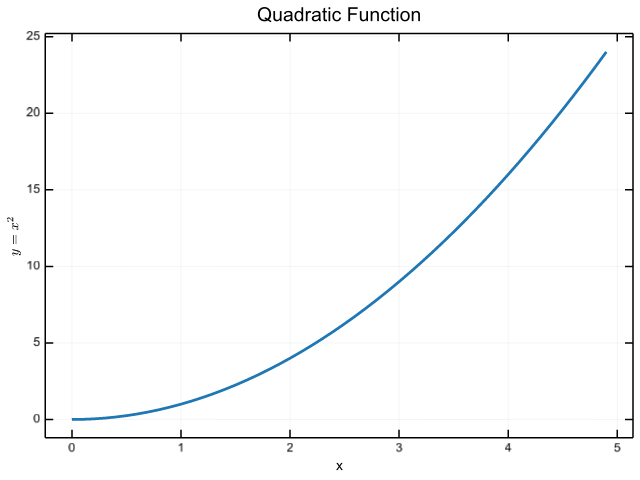
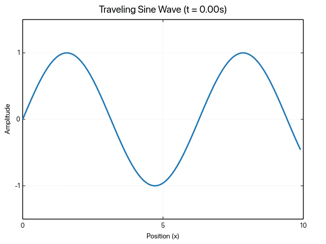

# ruviz

**High-performance 2D plotting library for Rust combining matplotlib's ease-of-use with Makie's performance.**

[](https://crates.io/crates/ruviz)
[](https://docs.rs/ruviz)
[](LICENSE)
[](https://github.com/Ameyanagi/ruviz/actions/workflows/ci.yml)

## Release Notes

- [Changelog](CHANGELOG.md)
- [Release Notes Index](docs/releases/README.md)
- [Latest Release Notes (v0.3.5)](docs/releases/v0.3.5.md)

## Quick Start

```rust
use ruviz::prelude::*;

let x: Vec<f64> = (0..50).map(|i| i as f64 * 0.1).collect();
let y: Vec<f64> = x.iter().map(|&x| x * x).collect();

Plot::new()
    .line(&x, &y)
    .title("Quadratic Function")
    .xlabel("x")
    .ylabel("y = x^2")
    .save("plot.png")?;
```

Need typeset math labels? See [Typst Text Mode](#typst-text-mode) below.



## Features

### 🛡️ Safety & Quality
- **Zero unsafe** in public API
- Strong type system prevents runtime errors
- Comprehensive error handling with `Result` types
- Memory-safe by design

### 📊 Plot Types
**Basic**: Line, Scatter, Bar, Histogram, Box Plot, Heatmap
**Distribution**: Violin, KDE, ECDF
**Composition**: Pie, Donut
**Continuous**: Contour
**Polar**: Polar Plot, Radar Chart
**Error**: Error Bars (symmetric/asymmetric)

### 🎨 Publication Quality
- **High-DPI export**: 72, 96, 300, 600 DPI for print
- **Multiple formats**: PNG, SVG, and PDF (with the `pdf` feature)
- **Professional themes**: Light, Dark, Publication, Seaborn-style
- **Custom styling**: Colors, fonts, markers, line styles
- **International text**: Full UTF-8 support (Japanese, Chinese, Korean, etc.) with cosmic-text

### ⚡ Advanced Features
- **Simple API**: One-liner functions for quick plotting
- **Parallel rendering**: Multi-threaded for large datasets (rayon)
- **GPU acceleration**: Optional wgpu backend (experimental)
- **Interactive plots**: Optional desktop window integration on Linux, macOS, and Windows
- **Mixed-coordinate insets**: Embed polar, pie, and radar plots inside Cartesian figures
- **Browser runtime**: Experimental `ruviz-web` adapter and `ruviz` npm SDK for `wasm32` canvas rendering
- **Animation**: GIF export with `record!` macro and easing functions
- **Cross-platform**: Linux, macOS, Windows, and experimental browser/wasm targets

## Installation

Add to your `Cargo.toml`:

```toml
[dependencies]
ruviz = "0.3.5"
```

### Feature Flags

Choose features based on your needs:

```toml
[dependencies]
ruviz = { version = "0.3.5", features = ["parallel", "simd"] }
```

| Feature | Description | Use When |
|---------|-------------|----------|
| `default` | ndarray + parallel | General use |
| `parallel` | Multi-threaded rendering | Large datasets |
| `simd` | Vectorized transforms | Performance-critical |
| `animation` | GIF animation export | Animated plots |
| `gpu` | GPU acceleration backend (experimental) | Opt-in GPU rendering |
| `interactive` | winit window support | Interactive plots |
| `ndarray_support` | ndarray types | Scientific computing |
| `nalgebra_support` | nalgebra vectors/matrices | Linear algebra workloads |
| `polars_support` | DataFrame support | Data analysis |
| `pdf` | PDF export | Publication output |
| `typst-math` | Typst text engine for all plot text | Math-heavy publication plots |
| `full` | Most bundled features (excludes HQ GIF/video extras) | Power users |

For minimal builds: `default-features = false`

Benchmark note: the current Rust feature-impact study in
[docs/benchmarks/rust-feature-impact.md](docs/benchmarks/rust-feature-impact.md) shows
`parallel` is the main default performance feature to care about, `simd` is situational, and
`gpu` should remain opt-in rather than a default build choice.

### Experimental WASM Support

The core crate now compiles for `wasm32-unknown-unknown` with in-memory output helpers such as
`Plot::render_png_bytes()`, `Plot::render_to_svg()`, and `Image::encode_png()`.

For browser interactivity, use the companion Rust bridge crate in
[`crates/ruviz-web`](crates/ruviz-web) and the public JS/TS SDK package
[`ruviz`](packages/ruviz-web). The reference browser demo lives in
[`demo/web`](demo/web). Native file-path export helpers remain desktop-only.

Note:
- `ruviz` automatically registers a bundled browser fallback font for canvas sessions.
- Custom browser fonts can still be added explicitly via `ruviz::render::register_font_bytes(...)`.
- The current browser adapter provides main-thread canvas and OffscreenCanvas worker sessions, plus
  `web_runtime_capabilities()` for feature diagnostics.
- The Vite demo includes direct wasm export, main-thread interactivity, worker interactivity, and
  temporal signal playback plus Observable-driven updates.
- The JS workspace is Bun-first. Use `bun install`, `bun run build:web`, and `bun run test:web`
  from the repo root for browser package and demo work.

### Python Bindings

The repo now includes a mixed Python package in [`python`](python) built with `uv`, `maturin`,
and `pyO3`.

```sh
cd python
uv sync
uv run maturin develop
```

The Python package exposes a fluent `ruviz.plot()` builder for static export and uses the browser
runtime for notebook widgets. Outside Jupyter, `plot.show()` uses the native interactive window.
Standalone MkDocs docs and runnable examples live under [`python/docs`](python/docs) and
[`python/examples`](python/examples).

### Web SDK Docs

The browser-first JS/TS SDK in [`packages/ruviz-web`](packages/ruviz-web) now ships with
runtime examples under [`packages/ruviz-web/examples`](packages/ruviz-web/examples) and a
standalone VitePress docs site under [`packages/ruviz-web/docs`](packages/ruviz-web/docs).

### Typst Text Mode

Enable Typst text rendering:

```toml
[dependencies]
ruviz = { version = "0.3.5", features = ["typst-math"] }
```

Use `.typst(true)` on a plot to render all static text surfaces (titles, axis labels, ticks,
legend labels, and annotations) through Typst:

```rust
use ruviz::prelude::*;

let x: Vec<f64> = (0..50).map(|i| i as f64 * 0.1).collect();
let y: Vec<f64> = x.iter().map(|&v| (-v).exp()).collect();

Plot::new()
    .line(&x, &y)
    .title("$f(x) = e^(-x)$")
    .xlabel("$x$")
    .ylabel("$f(x)$")
    .typst(true)
    .save("typst_plot.png")?;
```

Notes:
- Invalid Typst snippets fail render/export with a `TypstError`.
- `.typst(true)` is only available when `typst-math` is enabled at compile time.
- Without `typst-math`, the compiler reports:

```text
error[E0599]: no method named `typst` found for struct `ruviz::core::Plot` in the current scope
```

- If you select the text engine directly, `TextEngineMode::Typst` is also unavailable without
  `typst-math`, and the compiler reports:

```text
error[E0599]: no variant or associated item named `Typst` found for enum `TextEngineMode` in the current scope
```

- If Typst is optional in your own crate, define and forward a local feature first:

```toml
[dependencies]
ruviz = { version = "0.3.5", default-features = false }

[features]
default = []
typst-math = ["ruviz/typst-math"]
```

- Then guard the call with your crate feature:

```rust
use ruviz::prelude::*;

let mut plot = Plot::new()
    .line(&x, &y)
    .title("$f(x) = e^(-x)$")
    .xlabel("$x$")
    .ylabel("$f(x)$");

#[cfg(feature = "typst-math")]
{
    plot = plot.typst(true);
}

plot.save("typst_plot.png")?;
```

- Migration: `.latex(true)` has been removed; use `.typst(true)` instead.
- Typst text in PNG output is rasterized at native output scale (1x).
- For maximum text sharpness, prefer higher DPI (for example `.dpi(300)`) or vector export (`.export_svg(...)` / `.save_pdf(...)`).
- DPI changes output density, not the intended physical size of fonts, strokes, markers, or layout spacing.
- Prefer `.size(width_in, height_in)` when you care about physical figure size. `.size_px(width, height)` is a convenience that maps pixels through the 100-DPI reference size before final output DPI is applied.
- Ticks are enabled by default and render inward on all four sides. Use `.ticks(false)` to hide tick marks and tick labels while keeping the frame and axis titles.
- Migration: if you want the older bottom/left-only tick appearance, call `.ticks_bottom_left()`.
- Migration: if you previously relied on high-DPI exports making lines, markers, or text look larger, set those sizes explicitly instead of relying on DPI.

Tick customization:

```rust
use ruviz::prelude::*;

Plot::new()
    .line(&x, &y)
    .tick_direction_inout()
    .ticks_bottom_left()
    .show_top_ticks(true)
    .show_right_ticks(true)
    .save("custom_ticks.png")?;
```

## Examples

### Basic Line Plot

```rust
use ruviz::prelude::*;

let x = vec![0.0, 1.0, 2.0, 3.0, 4.0];
let y = vec![0.0, 1.0, 4.0, 9.0, 16.0];

Plot::new()
    .line(&x, &y)
    .title("My First Plot")
    .save("output.png")?;
```

### Multi-Series with Styling

```rust
use ruviz::prelude::*;

let x = vec![0.0, 1.0, 2.0, 3.0, 4.0];

Plot::new()
    .line(&x, &x.iter().map(|&x| x).collect::<Vec<_>>())
    .label("Linear")
    .line(&x, &x.iter().map(|&x| x * x).collect::<Vec<_>>())
    .label("Quadratic")
    .line(&x, &x.iter().map(|&x| x.powi(3)).collect::<Vec<_>>())
    .label("Cubic")
    .title("Polynomial Functions")
    .xlabel("x")
    .ylabel("y")
    .theme(Theme::publication())
    .save("polynomials.png")?;
```

### Grouped Series with Shared Styling

```rust
use ruviz::prelude::*;

let x = vec![0.0, 1.0, 2.0, 3.0];
let a = vec![0.0, 1.0, 2.0, 3.0];
let b = vec![0.0, 1.5, 3.0, 4.5];
let baseline = vec![0.2, 1.2, 2.2, 3.2];

Plot::new()
    .group(|g| {
        g.group_label("Sensors")
            .line_style(LineStyle::Dashed)
            .line_width(2.0)
            .color(Color::from_hex("#1E88E5").unwrap())
            .line(&x, &a)
            .line(&x, &b)
    })
    .line(&x, &baseline)
    .label("Baseline")
    .legend(Position::TopRight)
    .save("grouped_series.png")?;
```

### Subplots

```rust
use ruviz::prelude::*;

let plot1 = Plot::new().line(&x, &y).title("Line").end_series();
let plot2 = Plot::new().scatter(&x, &y).title("Scatter").end_series();
let plot3 = Plot::new().bar(&["A", "B", "C"], &[1.0, 2.0, 3.0]).title("Bar").end_series();
let data = vec![0.5, 1.0, 1.5, 2.0, 2.5];
let plot4 = Plot::new()
    .histogram(&data, None)
    .title("Histogram")
    .end_series();

subplots(2, 2, 800, 600)?
    .suptitle("Scientific Analysis")
    .subplot(0, 0, plot1)?
    .subplot(0, 1, plot2)?
    .subplot(1, 0, plot3)?
    .subplot(1, 1, plot4)?
    .save("subplots.png")?;
```

### Large Dataset

```rust
use ruviz::prelude::*;

// 100,000-point PNG export
let x: Vec<f64> = (0..100_000).map(|i| i as f64).collect();
let y: Vec<f64> = x.iter().map(|&x| x.sin()).collect();

Plot::new()
    .line(&x, &y)
    .title("Large Dataset")
    .save("large.png")?;
```

### Animation

Enable the `animation` feature for this example:

```toml
[dependencies]
ruviz = { version = "0.3.5", features = ["animation"] }
```

```rust
use ruviz::prelude::*;
use ruviz::animation::RecordConfig;
use ruviz::record;

let x: Vec<f64> = (0..100).map(|i| i as f64 * 0.1).collect();
let config = RecordConfig::new().max_resolution(800, 600).framerate(30);

record!(
    "wave.gif",
    2 secs,
    config: config,
    |t| {
        let phase = t.time * 2.0 * std::f64::consts::PI;
        let y: Vec<f64> = x.iter().map(|&xi| (xi + phase).sin()).collect();
        Plot::new()
            .line(&x, &y)
            .title(format!("Wave Animation (t={:.2}s)", t.time))
            .xlim(0.0, 10.0)
            .ylim(-1.5, 1.5)
    }
)?;
```



### Interactive And Animation Example Catalog

Interactive window examples:

```bash
cargo run --features interactive --example basic_interaction
cargo run --features interactive --example interactive_multi_series
cargo run --features interactive --example interactive_scatter_clusters
cargo run --features interactive --example interactive_heatmap
cargo run --features interactive --example data_brushing
cargo run --features interactive --example real_time_performance
```

Default interactive window controls:

- `Mouse wheel`: zoom in/out under the cursor
- `Left click + drag`: pan
- `Right click`: open the context menu
- `Right click + drag`: box zoom
- `Escape`: close the menu or reset the view
- `Cmd/Ctrl+S`: save the current view as PNG
- `Cmd/Ctrl+C`: copy the current view as an image

The standalone interactive window and the `ruviz-gpui` adapter are supported on
Linux, macOS, and Windows. On Windows, the recommended CI/native target is
`x86_64-pc-windows-msvc`.

The built-in context menu includes `Reset View`, `Set Current View As Home`,
`Go To Home View`, `Save PNG...`, `Copy Image`, `Copy Cursor Coordinates`, and
`Copy Visible Bounds`. You can extend it with custom items through
`InteractiveWindowBuilder::context_menu(...)` and
`InteractiveWindowBuilder::on_context_menu_action(...)`.

Animation export examples:

```bash
cargo run --features animation --example animation_basic
cargo run --features animation --example animation_simple
cargo run --features animation --example animation_wave
cargo run --features animation --example animation_easing
cargo run --features animation --example animation_reactive
cargo run --features animation --example generate_animation_gallery
```

Use the interactive examples when you want zoom/pan exploration in a window. Use the
animation examples when you want rendered GIF output with the `record!` macro and easing
helpers.

### Typst Text Example

Run:

```bash
cargo run --example doc_typst_text --features typst-math
```

## Documentation

- **[User Guide](docs/guide/README.md)** - Comprehensive tutorials and examples
- **[API Documentation](https://docs.rs/ruviz)** - Complete API reference
- **[Gallery](docs/gallery/README.md)** - Visual examples showcase
- **[Migration from matplotlib](docs/migration/matplotlib.md)** - For Python users
- **[Migration from seaborn](docs/migration/seaborn.md)** - Statistical plots
- **[Performance Guide](docs/PERFORMANCE_GUIDE.md)** - Optimization techniques
- **[Large Dataset Benchmarks](docs/benchmarks/large-dataset-plotting.md)** - Cross-runtime PNG rendering results for Rust, Python, wasm, and matplotlib
- **[Rust Feature Impact Benchmarks](docs/benchmarks/rust-feature-impact.md)** - Rust-only feature-flag study for render and save backend performance

## Why ruviz?

Rust's plotting ecosystem has several options, but each has trade-offs:

| Library | Approach | Limitation |
|---------|----------|------------|
| [plotters](https://github.com/plotters-rs/plotters) | Low-level drawing API | Verbose, requires boilerplate for common plots |
| [plotly.rs](https://github.com/plotly/plotly.rs) | JavaScript bindings | Requires JS runtime, web-focused |
| [plotpy](https://github.com/cpmech/plotpy) | Python/matplotlib wrapper | Requires Python installed |

**ruviz fills the gap** with:
- **High-level API**: matplotlib-style `Plot::new().line().title().save()` - no boilerplate
- **Pure Rust**: No Python, JavaScript, or external runtime needed
- **Built-in plot types**: 15+ plot types out of the box (violin, KDE, radar, etc.)
- **Publication quality**: Professional themes and high-DPI export

```rust
// plotters: ~30 lines for a simple line plot
// ruviz: 4 lines
Plot::new()
    .line(&x, &y)
    .title("My Plot")
    .save("plot.png")?;
```

## Contributing

Contributions welcome! See [CONTRIBUTING.md](CONTRIBUTING.md) for setup, testing, and pull request guidelines.

### Development

```bash
# Clone repository
git clone https://github.com/Ameyanagi/ruviz.git
cd ruviz

bun install

# Setup pre-commit hooks (recommended)
make setup-hooks

# Run code quality checks
make check

# Run tests
cargo test --all-features

# Run examples
cargo run --example basic_example --release

# Run benchmarks
cargo bench --all-features
```

The pre-commit hooks will automatically run `cargo fmt --check`, `cargo clippy`, `oxfmt --check`, and `oxlint --deny-warnings` before each commit.

## Roadmap

- [x] Core plot types (line, scatter, bar, histogram, boxplot, heatmap)
- [x] Parallel rendering
- [x] SIMD optimization
- [x] GPU acceleration (experimental)
- [x] Professional themes
- [x] Subplots and multi-panel figures
- [x] Distribution plots: Violin, KDE, ECDF
- [x] Composition plots: Pie, Donut
- [x] Continuous plots: Contour
- [x] Polar plots: Polar, Radar
- [x] Error bars
- [x] SVG export
- [x] Experimental interactive window support
- [ ] High-level APIs for area, hexbin, step, and stem plots
- [ ] High-level APIs for regression and composite plots
- [ ] Stabilize the interactive zoom/pan workflow
- [ ] 3D plotting (v1.0+)

## License

Licensed under either of:

- Apache License, Version 2.0 ([LICENSE](LICENSE) or http://www.apache.org/licenses/LICENSE-2.0)
- MIT license ([LICENSE](LICENSE) or http://opensource.org/licenses/MIT)

at your option.

## Acknowledgments

- Inspired by [matplotlib](https://matplotlib.org/), [seaborn](https://seaborn.pydata.org/), and [Makie.jl](https://makie.juliaplots.org/)
- Built with [tiny-skia](https://github.com/RazrFalcon/tiny-skia) for rendering
- Text rendering by [cosmic-text](https://github.com/pop-os/cosmic-text)
- Thanks to the Rust community for excellent crates and feedback

---

**Status**: v0.3.5 - Early development, API may change. Production use at your own risk.

**Support**: [Open an issue](https://github.com/Ameyanagi/ruviz/issues) or [start a discussion](https://github.com/Ameyanagi/ruviz/discussions)
