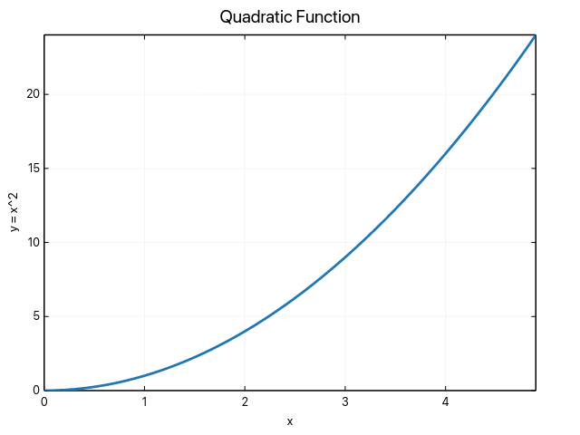

# ruviz

High-performance 2D plotting library for Rust.

[](https://crates.io/crates/ruviz)
[](https://docs.rs/ruviz)
[](LICENSE)
[](https://github.com/Ameyanagi/ruviz/actions/workflows/ci.yml)

## Visual Examples

Click any plot to open its runnable Rust source. See the [complete gallery](docs/gallery/README.md)
for more plot types, themes, publication layouts, and international text examples.

| Line plot | Scatter plot | Heatmap |
|:---:|:---:|:---:|
| [](examples/doc_line_plot.rs) | [](examples/doc_scatter_plot.rs) | [](examples/doc_heatmap.rs) |

| Violin plot | Radar chart | Multi-panel figure |
|:---:|:---:|:---:|
| [](examples/doc_violin.rs) | [](examples/doc_radar.rs) | [](examples/scientific_showcase.rs) |

## Quick Start

Add the crate:

```toml
[dependencies]
ruviz = "0.5.0"
```

Create and save a PNG:

```rust,check
use ruviz::prelude::*;

fn main() -> Result<()> {
    let x: Vec<f64> = (0..100).map(|i| i as f64 * 0.1).collect();
    let y: Vec<f64> = x.iter().map(|&v| v.sin()).collect();

    Plot::new()
        .line(&x, &y)
        .title("Sine Wave")
        .xlabel("x")
        .ylabel("sin(x)")
        .save("sine.png")?;

    Ok(())
}
```

Run with:

```bash
cargo run --release
```



## Common API

The main API is the fluent `Plot` builder. Series are finalized automatically when
you render, save, or start another series.

```rust,check
use ruviz::prelude::*;

fn main() -> Result<()> {
    let x = vec![0.0, 1.0, 2.0, 3.0, 4.0];
    let linear = x.clone();
    let quadratic: Vec<f64> = x.iter().map(|&v| v * v).collect();

    Plot::new()
        .line(&x, &linear)
        .label("Linear")
        .line(&x, &quadratic)
        .label("Quadratic")
        .legend(Position::TopLeft)
        .theme(Theme::publication())
        .save("series.png")?;

    Ok(())
}
```

Top-level helpers are available for line, scatter, and bar plots:

```rust,check
use ruviz::prelude::*;

fn main() -> Result<()> {
    let x = vec![0.0, 1.0, 2.0];
    let y = vec![0.0, 1.0, 4.0];

    line(&x, &y)
        .title("Line")
        .save("line.png")?;

    Ok(())
}
```

The `ruviz::simple` module also provides file-oriented helper functions such as
`line_plot`, `scatter_plot`, `bar_chart`, and `histogram`.

## Plot Types

The root `Plot` builder currently exposes:

- Basic: line, scatter, bar, histogram, box plot, heatmap
- Distribution: KDE, ECDF, violin, boxen
- Composition and polar: pie, donut styling, radar, polar line
- Continuous, discrete, and error plots: contour, area, step, stem, symmetric/asymmetric error bars
- Vector: quiver
- Layout helpers: subplots, legends, grid/tick controls, annotations, insets

Some lower-level modules contain additional experimental plot implementations
that do not yet have a high-level `Plot::new().type(...)` builder method.

## Export

- `save("plot.png")` writes PNG files on native targets.
- `render()` returns an in-memory `Image`.
- `render_png_bytes()` returns PNG bytes.
- `export_svg("plot.svg")` writes SVG files on native targets.
- `render_to_svg()` returns an SVG string.
- `save_pdf("plot.pdf")` is available with the `pdf` feature.

For browser/wasm targets, use in-memory helpers such as `render_png_bytes()`,
`render_to_svg()`, and `Image::encode_png()` instead of native file-path export
helpers.

## Feature Flags

Default features are `ndarray_support` and `parallel`.

| Feature | Description |
|---------|-------------|
| `ndarray_support` | ndarray data support (canonical) |
| `ndarray` | compatibility alias for `ndarray_support` |
| `polars_support` | polars data support |
| `nalgebra_support` | nalgebra data support |
| `parallel` | enables the internal parallel renderer and backend metadata |
| `simd` | SIMD support used by performance-oriented paths |
| `performance` | shorthand for `parallel` + `simd` |
| `gpu` | enables GPU types and `.gpu(true)` metadata |
| `window` | desktop window dependencies |
| `interactive` | standalone interactive window support |
| `interactive-gpu` | `interactive` + `gpu` |
| `serde` | serialize themes/configuration types |
| `pdf` | PDF export via SVG-to-PDF |
| `typst-math` | Typst-backed text rendering |
| `animation` | GIF recording support |
| `full` | broad feature set for native builds |

SVG export is available without enabling the legacy `svg` feature.

## Backend Notes

`.backend(...)`, `.auto_optimize()`, and `.get_backend_name()` store or report
backend preference metadata. `auto_optimize()` conservatively selects Skia rather
than advertising a backend that cannot execute across every public raster path.
Use `.resolved_backend_name()` for the native `Plot` PNG path, or
`.backend_resolution(...)` to inspect the requested backend, actual backend, and
any explicit Skia fallback reason for a raster operation. Supported scatter
workloads resolve to DataShader only when that backend is explicitly configured.

Use release builds and benchmark your actual workload before adding optional
performance features. See [Backend Selection](docs/guide/07_backends.md) and
[Performance Optimization](docs/guide/08_performance.md).

## Typst Text Mode

Enable Typst-backed text rendering with:

```toml
[dependencies]
ruviz = { version = "0.5.0", features = ["typst-math"] }
```

Then call `.typst(true)`. The configured family is passed to plain raster,
plain SVG, and Typst text. Named-font consistency depends on that font being
available to each renderer or SVG viewer; otherwise backend-specific fallback
or substitution may occur. Typst resolves `serif`, `sans-serif`, and `monospace`
to available concrete families. Because Typst has no generic cursive or fantasy
selector, those two values use its selected sans-serif fallback:

```rust,check,features=typst-math
use ruviz::prelude::*;

fn main() -> Result<()> {
    let x: Vec<f64> = (0..50).map(|i| i as f64 * 0.1).collect();
    let y: Vec<f64> = x.iter().map(|&v| (-v).exp()).collect();

    Plot::new()
        .line(&x, &y)
        .title("$f(x) = e^(-x)$")
        .xlabel("$x$")
        .ylabel("$f(x)$")
        .font_family("New Computer Modern Sans")
        .typst(true)
        .save("typst_plot.png")?;

    Ok(())
}
```

Without `typst-math`, `.typst(true)` and `TextEngineMode::Typst` are not
compiled. If Typst is optional in your crate, forward and guard your own feature:

```toml
[dependencies]
ruviz = { version = "0.5.0", default-features = false }

[features]
default = []
typst-math = ["ruviz/typst-math"]
```

```rust,check
use ruviz::prelude::*;

fn main() -> Result<()> {
    let x: Vec<f64> = (0..50).map(|i| i as f64 * 0.1).collect();
    let y: Vec<f64> = x.iter().map(|&v| (-v).exp()).collect();

    let mut plot = Plot::new()
        .line(&x, &y)
        .title("$f(x) = e^(-x)$");

    #[cfg(feature = "typst-math")]
    {
        plot = plot.typst(true);
    }

    plot.save("typst_plot.png")?;
    Ok(())
}
```

## Examples

Rust documentation examples are in `examples/doc_*.rs`.

```bash
cargo run --example doc_line_plot
cargo run --example doc_scatter_plot
cargo run --example doc_typst_text --features typst-math
```

Interactive examples require the `interactive` feature:

```bash
cargo run --features interactive --example basic_interaction
cargo run --features interactive --example interactive_multi_series
```

Animation examples require the `animation` feature:

```bash
cargo run --features animation --example animation_basic
cargo run --features animation --example animation_wave
```

## Documentation

- [Quick Start](docs/QUICKSTART.md)
- [User Guide](docs/guide/README.md)
- [API Documentation](https://docs.rs/ruviz)
- [Gallery](docs/gallery/README.md)

## Development

```bash
cargo test
cargo test --doc
cargo run --example basic_example --release
```

The workspace also contains companion crates and bindings, but this README
focuses on the root Rust crate. See the subdirectory READMEs for those package
surfaces.

## License

Licensed under either of:

- Apache License, Version 2.0 ([LICENSE](LICENSE) or http://www.apache.org/licenses/LICENSE-2.0)
- MIT license ([LICENSE](LICENSE) or http://opensource.org/licenses/MIT)

at your option.
