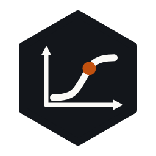

# ruviz

High-performance 2D and 3D plotting for Rust. One builder, ~30 plot types,
PNG / SVG / PDF output.

[](https://crates.io/crates/ruviz)
[](https://docs.rs/ruviz)
[](LICENSE)
[](https://github.com/Ameyanagi/ruviz/actions/workflows/ci.yml)

## Install

```toml
[dependencies]
ruviz = "0.7.0"
```

## Hello, plot

```rust,check
use ruviz::prelude::*;

fn main() -> PlotResult<()> {
    let x: Vec<f64> = (0..100).map(|i| i as f64 * 0.1).collect();
    let y: Vec<f64> = x.iter().map(|&v| v.sin()).collect();

    Plot::new()
        .line(&x, &y)
        .title("Sine Wave")
        .xlabel("x")
        .ylabel("sin(x)")
        .save("sine.png")?;

    Ok(())
}
```


## The one pattern

**`Plot::new()` → series method(s) → setters → `.save(path)`.** That is the whole
API. There is no separate figure or axes object.

- Every call returns the builder, so the chain never branches.
- A setter placed after a series method styles *that* series (`.label`, `.color`,
  `.line_width`, `.marker`). Plot-level setters (`.title`, `.legend`, `.theme`,
  `.xlim`) apply to the whole plot, wherever you put them.
- Starting another series — or calling `.save()` / `.render()` — finishes the
  previous series for you. Nothing to close.

```rust,check
use ruviz::prelude::*;

fn main() -> PlotResult<()> {
    let x = vec![0.0, 1.0, 2.0, 3.0, 4.0];
    let quadratic: Vec<f64> = x.iter().map(|&v| v * v).collect();

    Plot::new()
        .line(&x, &x)
        .label("Linear")
        .color(Color::from_palette(0))
        .line(&x, &quadratic)
        .label("Quadratic")
        .line_style(LineStyle::Dashed)
        .legend(LegendPosition::UpperLeft)
        .theme(Theme::seaborn())
        .save("series.png")?;

    Ok(())
}
```

## Series methods

The complete list. `&x` / `&data` accept any numeric slice or `Vec` (`&[f64]`,
`&Vec<f64>`, and ndarray / polars / nalgebra types with the matching feature).
Grid data differs by plot: `heatmap` takes nested rows (`&Vec<Vec<f64>>`), while
`contour` takes a **flat row-major** `&Vec<f64>` of `x.len() * y.len()` values.

| Call | Draws |
|---|---|
| `.line(&x, &y)` | line plot |
| `.scatter(&x, &y)` | scatter plot |
| `.bar(&["A", "B"], &values)` | bar chart |
| `.histogram(&data)` | histogram |
| `.boxplot(&data)` | box plot |
| `.heatmap(&data_2d)` | heatmap |
| `.kde(&data)` | kernel density estimate |
| `.ecdf(&data)` | empirical CDF |
| `.violin(&data)` | violin plot |
| `.boxen(&data)` | letter-value (boxen) plot |
| `.rug(&data)` | rug marks |
| `.strip(&categories, &values)` | categorical strip plot |
| `.swarm(&categories, &values)` | non-overlapping swarm plot |
| `.grouped_bar(&cats, &[("Q1", &q1), ("Q2", &q2)])` | bars side by side per category |
| `.stacked_bar(&cats, &[("Q1", &q1), ("Q2", &q2)])` | bars stacked per category |
| `.stacked_area(&x, &[("solar", &s), ("wind", &w)])` | stacked areas over numeric x |
| `.pie(&values).labels(&["A", "B"])` | pie chart |
| `.donut(&values)` | donut chart |
| `.radar(&labels).add_series("P1", &values)` | radar chart (repeat `add_series`) |
| `.polar_line(&r, &theta)` | polar line |
| `.contour(&x, &y, &z_flat)` | contour lines |
| `.area(&x, &y, baseline)` | filled area |
| `.hexbin(&x, &y)` | hexagonal binning |
| `.step(&x, &y, StepWhere::Pre)` | step plot (`Pre` / `Post` / `Mid`) |
| `.stem(&x, &y, baseline)` | stem plot |
| `.error_bars(&x, &y, &err)` | symmetric error bars |
| `.error_bars_xy(&x, &y, &xerr, &yerr)` | error bars on both axes |
| `.quiver(&x, &y, &u, &v)` | vector field |
| `.dendrogram(&linkage)` | hierarchical clustering tree |

Every one of them takes the same chain shape:
`.<series>(..).label(..).color(..).legend_best().save(..)`.

## Styling

| Scope | Setters |
|---|---|
| Series | `.label("name")` `.color(c)` `.alpha(0.5)` `.line_width(2.0)` `.line_style(LineStyle::Dashed)` |
| Point series | `.marker(MarkerStyle::Circle)` `.marker_size(6.0)` |
| Plot | `.title(..)` `.xlabel(..)` `.ylabel(..)` `.grid(true)` `.xlim(0.0, 10.0)` `.ylim(..)` |
| Plot | `.xscale(AxisScale::Log)` `.yscale(..)` `.size(w, h)` `.size_px(w, h)` `.dpi(300)` `.font_family("Arial")` |
| Legend | `.legend(LegendPosition::UpperLeft)` or `.legend_best()` |
| Annotations | `.text(x, y, "note")` `.arrow(x1, y1, x2, y2)` `.hline(y)` `.vline(x)` `.fill_between(&x, &y1, &y2)` |

**Colors:** `Color::BLUE` (and `RED`, `GREEN`, `BLACK`, `WHITE`, `ORANGE`, …),
`Color::from_rgb(31, 119, 180)`, `Color::from_hex("#1f77b4")?`,
`Color::from_palette(0)` for the theme's cycle.

**Markers:** `Circle`, `Square`, `Triangle`, `TriangleDown`, `Diamond`, `Plus`,
`Cross`, `Star`.

**Themes** for `.theme(..)`: `Theme::light()` (default), `dark()`, `seaborn()`,
`publication()`, `minimal()`, `presentation()`, `ieee()`, `nature()`,
`paul_tol()`, `colorblind_friendly()`. `Theme::seaborn()` reproduces
`seaborn.set_theme()`, and `Theme::builder()` customizes any of them.
See [styling guide](docs/guide/05_styling.md).

**Math and CJK text:** enable the `typst-math` feature and call `.typst(true)`;
titles and labels then accept Typst math such as `"$f(x) = e^(-x)$"`.
See [QUICKSTART](docs/QUICKSTART.md).

## Output

| Call | Result |
|---|---|
| `.save("plot.png")` | PNG file |
| `.export_svg("plot.svg")` | SVG file (no feature flag needed) |
| `.save_pdf("plot.pdf")` | PDF file (`pdf` feature) |
| `.render()` | in-memory `Image` |
| `.render_png_bytes()` | `Vec<u8>` of PNG bytes |
| `.render_to_svg()` | SVG `String` |

On wasm targets use the in-memory calls (`render_png_bytes`, `render_to_svg`)
rather than the file-path ones.

## Subplots

`subplots(rows, cols, width, height)` returns a `SubplotFigure`. Convert each
plot with `.into()` and place it by index:

```rust,check
use ruviz::prelude::*;

fn main() -> PlotResult<()> {
    let x: Vec<f64> = (0..50).map(|i| i as f64 * 0.2).collect();
    let sin: Vec<f64> = x.iter().map(|v| v.sin()).collect();
    let cos: Vec<f64> = x.iter().map(|v| v.cos()).collect();

    subplots(1, 2, 800, 400)?
        .suptitle("Trig")
        .subplot_at(0, Plot::new().line(&x, &sin).title("sin").into())?
        .subplot_at(1, Plot::new().line(&x, &cos).title("cos").into())?
        .save("subplots.png")?;

    Ok(())
}
```

`plots::composite::jointplot(&x, &y, w, h)` and `pairplot(&columns, w, h)`
also return a `SubplotFigure`.

## 3D (`3d` feature)

3D plots start from free functions — **there is no `Plot3D` type**:
`scatter3d(&x, &y, &z)`, `line3d(..)`, `surface(&x, &y, &z_2d)`,
`wireframe(..)`. They take `.title()`, `.xlabel()`, `.zlabel()` and `.save()`
like a 2D plot.

```rust,check,features=3d
use ruviz::prelude::*;

fn main() -> PlotResult<()> {
    let x = [-1.0, 0.0, 1.0, 2.0];
    let y = [-1.0, 0.0, 1.0];
    let z = [
        [-0.4, 0.4, 0.4, -0.4],
        [0.1, 1.0, 1.0, 0.1],
        [-0.4, 0.4, 0.4, -0.4],
    ];

    surface(&x, &y, &z)
        .title("3D surface")
        .zlabel("z")
        .save("surface.png")
}
```

## Gotchas

- **No `Plot3D`.** Use the free functions above.
- **`fill_between` is an annotation, not a series.** It returns the plot, so it
  takes plot-level setters (`.title`), not series ones (`.label`).
- **Not available at all:** 2D KDE, regression and residual plots have no
  builder method; Sankey diagrams and streamplots are not implemented. Anything
  outside the series table cannot be drawn.
- The top-level `line()` / `scatter()` / `bar()` functions and the
  `ruviz::simple` module are **deprecated** — use the `Plot` chain
  ([migration note](docs/migration/0.6-builder-api.md)).
- Build with `--release`; debug builds are far slower.

## Feature flags

Defaults: `ndarray_support`, `parallel`.

| Feature | Adds |
|---|---|
| `3d` | 3D scatter, line, surface, wireframe |
| `ndarray_support` / `polars_support` / `nalgebra_support` | data-type support (aliases: `ndarray`, `polars`, `nalgebra`) |
| `pdf` | PDF export |
| `typst-math` | Typst text and math rendering |
| `interactive` | interactive window (alias: `window`); `interactive-gpu` adds GPU |
| `animation` | GIF recording |
| `gpu` | GPU types and `.gpu(true)` |
| `parallel` / `simd` / `performance` | threaded 3D rasterization, SIMD paths |
| `serde` | serializable themes and config |
| `full` | broad native feature set |

SVG export is always compiled in; the `svg` feature gates nothing. `parallel`
affects the software 3D rasterizer, not the 2D raster path — measure before
enabling `performance` ([benchmarks](docs/benchmarks/rust-feature-impact.md)).

## Beyond the Rust crate

| | |
|---|---|
| GUI adapters | [egui](adapters/gui/ruviz-egui/README.md) · [Iced](adapters/gui/ruviz-iced/README.md) · [Slint](adapters/gui/ruviz-slint/README.md) · [GPUI](adapters/gpui/README.md) |
| Bindings | [Python](bindings/python/README.md) · [WebAssembly](bindings/wasm/README.md) · [JS/TS package](packages/ruviz/README.md) |

## Documentation

- [Quick Start](docs/QUICKSTART.md) · [User Guide](docs/guide/README.md) · [API docs](https://docs.rs/ruviz)
- [Gallery](docs/gallery/README.md) — every plot type with runnable source
- Migrating from [matplotlib](docs/migration/matplotlib.md) or [seaborn](docs/migration/seaborn.md)
- Examples: `cargo run --release --example doc_line_plot` (see `examples/`)
- [Demo video](https://youtu.be/6MT_hu8xpjo) — 77-second tour of the library

## License

Licensed under either of [Apache-2.0](LICENSE) or [MIT](LICENSE), at your option.
