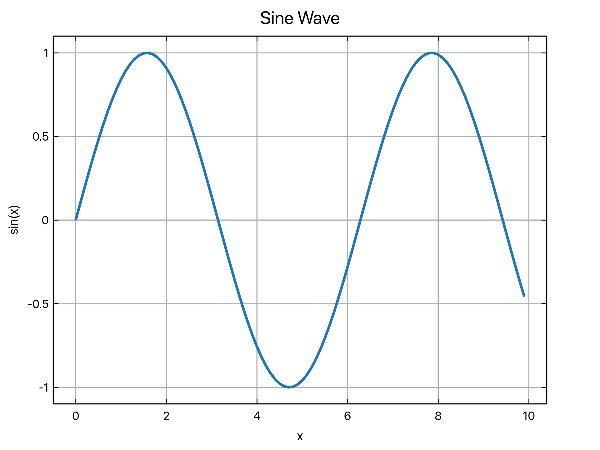
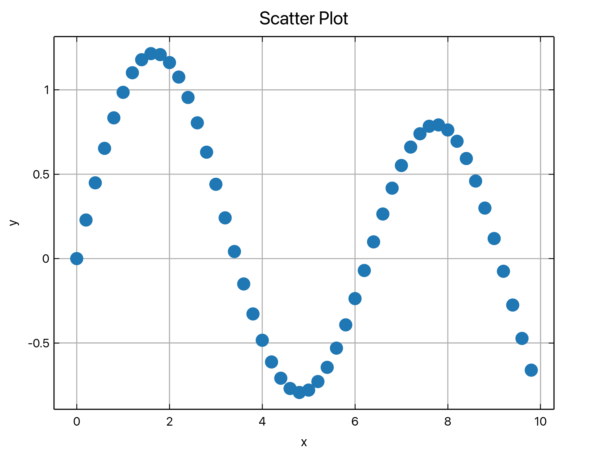
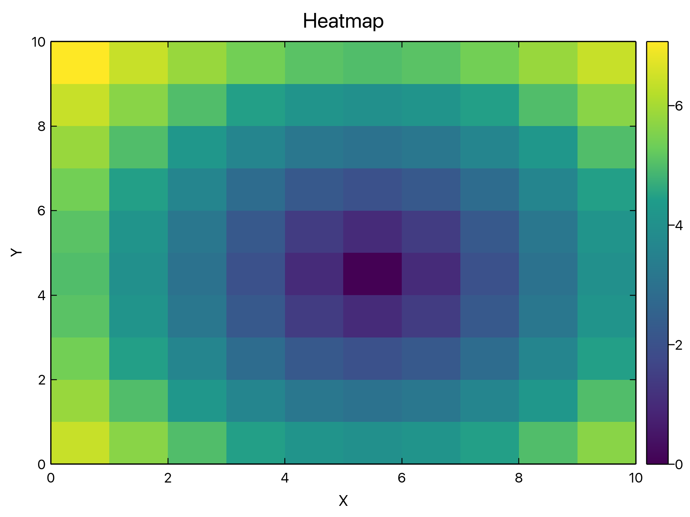
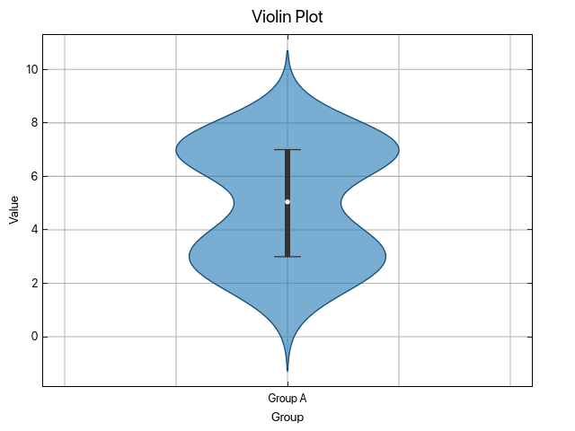
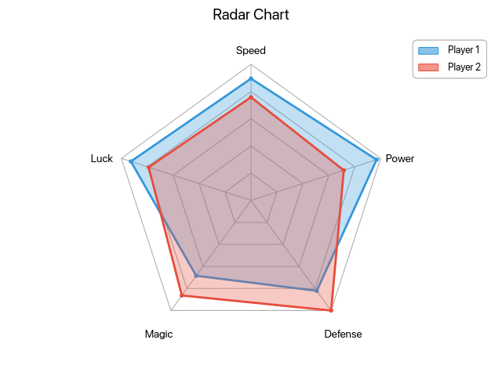
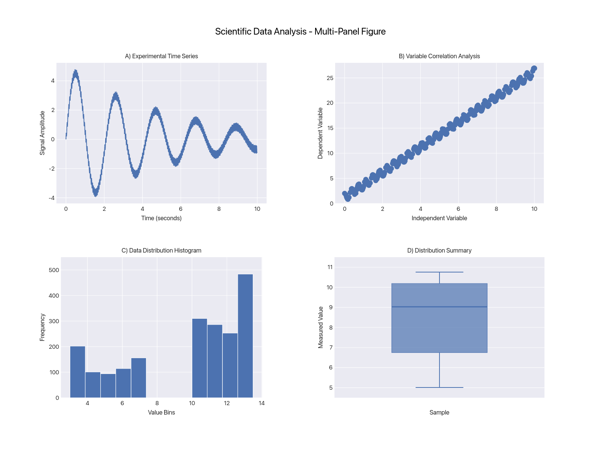
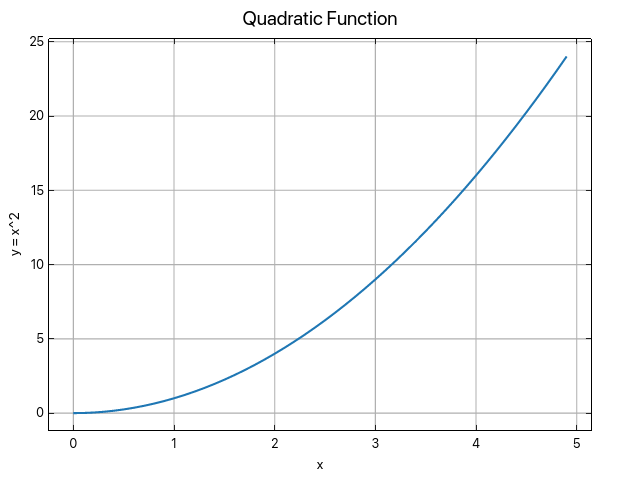

# ruviz

High-performance 2D plotting library for Rust.

[](https://crates.io/crates/ruviz)
[](https://docs.rs/ruviz)
[](LICENSE)
[](https://github.com/Ameyanagi/ruviz/actions/workflows/ci.yml)

## Visual Examples

Click any plot to open its runnable Rust source. See the [complete gallery](docs/gallery/README.md)
for more plot types, themes, publication layouts, and international text examples.

| Line plot | Scatter plot | Heatmap |
|:---:|:---:|:---:|
| [](examples/doc_line_plot.rs) | [](examples/doc_scatter_plot.rs) | [](examples/doc_heatmap.rs) |

| Violin plot | Radar chart | Multi-panel figure |
|:---:|:---:|:---:|
| [](examples/doc_violin.rs) | [](examples/doc_radar.rs) | [](examples/scientific_showcase.rs) |

## Quick Start

Add the crate:

```toml
[dependencies]
ruviz = "0.6.0"
```

Create and save a PNG:

```rust,check
use ruviz::prelude::*;

fn main() -> PlotResult<()> {
    let x: Vec<f64> = (0..100).map(|i| i as f64 * 0.1).collect();
    let y: Vec<f64> = x.iter().map(|&v| v.sin()).collect();

    Plot::new()
        .line(&x, &y)
        .title("Sine Wave")
        .xlabel("x")
        .ylabel("sin(x)")
        .save("sine.png")?;

    Ok(())
}
```

Run with:

```bash
cargo run --release
```



## Common API

The main API is the fluent `Plot` builder. Series are finalized automatically when
you render, save, or start another series.

```rust,check
use ruviz::prelude::*;

fn main() -> PlotResult<()> {
    let x = vec![0.0, 1.0, 2.0, 3.0, 4.0];
    let linear = x.clone();
    let quadratic: Vec<f64> = x.iter().map(|&v| v * v).collect();

    Plot::new()
        .line(&x, &linear)
        .label("Linear")
        .line(&x, &quadratic)
        .label("Quadratic")
        .legend(LegendPosition::UpperLeft)
        .theme(Theme::publication())
        .save("series.png")?;

    Ok(())
}
```

Every plot is built the same way — `Plot::new()`, a series method, setters,
`save`. There is no second entry point to learn:

```rust,check
use ruviz::prelude::*;

fn main() -> PlotResult<()> {
    let x = vec![0.0, 1.0, 2.0];
    let y = vec![0.0, 1.0, 4.0];

    Plot::new()
        .line(&x, &y)
        .title("Line")
        .save("line.png")?;

    Ok(())
}
```

The top-level `line`/`scatter`/`bar` functions and the `ruviz::simple` module are
deprecated in favour of that chain; see
[docs/migration/0.6-builder-api.md](docs/migration/0.6-builder-api.md).

## Plot Types

The root `Plot` builder exposes 29 plot types, and that list is complete:

- Basic: line, scatter, bar, histogram, box plot, heatmap
- Distribution: KDE, ECDF, violin, boxen, rug
- Categorical: strip, swarm, grouped bar, stacked bar
- Composition and polar: pie, donut styling, radar, polar line
- Continuous, discrete, and error plots: contour, area, stacked area, fill between, hexbin, step, stem, symmetric/asymmetric error bars
- Hierarchical: dendrogram
- Vector: quiver
- Layout helpers: subplots, legends, grid/tick controls, annotations, insets

With the `3d` feature, `Plot3D` adds four more: 3D scatter, 3D line, surface
and wireframe.

All of them except `fill_between` are *series* methods that take the same shape —
`Plot::new()`, a series method, setters, a terminal call — so
`.<series>(..).label(..).color(..).legend_best().save(..)` compiles for every one
of them. `fill_between` is an annotation rather than a series: it returns the
plot itself, so it takes plot-level setters (`.title(..)`, `.xlabel(..)`) rather
than series-level ones.

Grouped bar, stacked bar and stacked area take N named value columns over one
shared axis — `.grouped_bar(&categories, &[("Q1", &q1), ("Q2", &q2)])` — and
push one ordinary series per column, so each column gets its own palette colour,
its own legend entry, and the same `.color()`/`.label()` rules as a line.

Joint plots and pair plots are *figures*, not series: `plots::composite::{jointplot,
pairplot}` return a `SubplotFigure`, the same type `subplots` returns, so they are
composed with `.suptitle(..).save(..)` rather than with the series chain.

Anything not in that list has no builder method and cannot be drawn with that
chain, even though the source tree contains implementations of it. Specifically,
**2D KDE, regression plot and residual plot have no `Plot` builder**, and Sankey
diagrams and streamplots are not implemented at all.
The [ruviz::plots module docs](https://docs.rs/ruviz/latest/ruviz/plots/) list
which is which, and a test keeps that list in step with the builder.

## Export

- `save("plot.png")` writes PNG files on native targets.
- `render()` returns an in-memory `Image`.
- `render_png_bytes()` returns PNG bytes.
- `export_svg("plot.svg")` writes SVG files on native targets.
- `render_to_svg()` returns an SVG string.
- `save_pdf("plot.pdf")` is available with the `pdf` feature.

For browser/wasm targets, use in-memory helpers such as `render_png_bytes()`,
`render_to_svg()`, and `Image::encode_png()` instead of native file-path export
helpers.

## Feature Flags

Default features are `ndarray_support` and `parallel`.

| Feature | Description |
|---------|-------------|
| `3d` | `Plot3D`: 3D scatter, line, surface and wireframe |
| `ndarray_support` | ndarray data support (canonical) |
| `ndarray` | compatibility alias for `ndarray_support` |
| `polars_support` | polars data support (canonical) |
| `polars` | compatibility alias for `polars_support` |
| `nalgebra_support` | nalgebra data support (canonical) |
| `nalgebra` | compatibility alias for `nalgebra_support` |
| `parallel` | multi-threaded tile rasterization for the software 3D backend |
| `simd` | SIMD support used by performance-oriented paths |
| `performance` | shorthand for `parallel` + `simd` |
| `gpu` | enables GPU types and `.gpu(true)` metadata |
| `interactive` | standalone interactive window support (canonical) |
| `window` | compatibility alias for `interactive` |
| `interactive-gpu` | `interactive` + `gpu` |
| `serde` | serialize themes/configuration types |
| `pdf` | PDF export via SVG-to-PDF |
| `typst-math` | Typst-backed text rendering |
| `animation` | GIF recording support |
| `animation-video` | `animation` + AV1 video encoding |
| `svg` | no-op, retained for compatibility (see below) |
| `full` | broad feature set for native builds |

SVG export is always compiled in: `render_to_svg()` and `export_svg()` need no
feature flag, and the `svg` feature gates nothing.

`parallel` is enabled by default because the software 3D rasterizer renders its
tiles across a rayon pool. It does **not** currently affect the 2D raster path,
and the crate's own measurements put it between 0.94x and 1.05x on 2D workloads
— see [docs/benchmarks/rust-feature-impact.md](docs/benchmarks/rust-feature-impact.md).
Measure your own workload before turning on `performance`.

## Backend Notes

`.backend(...)`, `.auto_optimize()`, and `.get_backend_name()` store or report
backend preference metadata. `auto_optimize()` conservatively selects Skia rather
than advertising a backend that cannot execute across every public raster path.
Use `.resolved_backend_name()` for the native `Plot` PNG path, or
`.backend_resolution(...)` to inspect the requested backend, actual backend, and
any explicit Skia fallback reason for a raster operation. Supported scatter
workloads resolve to DataShader only when that backend is explicitly configured.

Use release builds and benchmark your actual workload before adding optional
performance features. See [Backend Selection](docs/guide/07_backends.md) and
[Performance Optimization](docs/guide/08_performance.md).

## Native GUI Integration

Ruviz provides image-backed adapters for the major native Rust GUI frameworks.
Each adapter supports static and interactive 2D plots, and forwards the `3d`,
`gpu`, and `3d-gpu` feature surfaces without selecting an application shell:

| Framework | Crate and guide |
|-----------|-----------------|
| egui | [`ruviz-egui`](crates/gui-adapters/ruviz-egui/README.md) |
| Iced | [`ruviz-iced`](crates/gui-adapters/ruviz-iced/README.md) |
| Slint | [`ruviz-slint`](crates/gui-adapters/ruviz-slint/README.md) |
| GPUI | [`ruviz-gpui`](crates/ruviz-gpui/README.md) |

The adapters retain the last successful image while rendering newer requests
in the background. GPU presentation remains image-backed: `3d-gpu` renders on
the GPU and reads the completed frame back for the GUI framework to upload.

## Typst Text Mode

Enable Typst-backed text rendering with:

```toml
[dependencies]
ruviz = { version = "0.6.0", features = ["typst-math"] }
```

Then call `.typst(true)`. The configured family is passed to plain raster,
plain SVG, and Typst text. Named-font consistency depends on that font being
available to each renderer or SVG viewer; otherwise backend-specific fallback
or substitution may occur. Typst resolves `serif`, `sans-serif`, and `monospace`
to available concrete families. Because Typst has no generic cursive or fantasy
selector, those two values use its selected sans-serif fallback:

```rust,check,features=typst-math
use ruviz::prelude::*;

fn main() -> PlotResult<()> {
    let x: Vec<f64> = (0..50).map(|i| i as f64 * 0.1).collect();
    let y: Vec<f64> = x.iter().map(|&v| (-v).exp()).collect();

    Plot::new()
        .line(&x, &y)
        .title("$f(x) = e^(-x)$")
        .xlabel("$x$")
        .ylabel("$f(x)$")
        .font_family("New Computer Modern Sans")
        .typst(true)
        .save("typst_plot.png")?;

    Ok(())
}
```

Without `typst-math`, `.typst(true)` and `TextEngineMode::Typst` are not
compiled. If Typst is optional in your crate, forward and guard your own feature:

```toml
[dependencies]
ruviz = { version = "0.6.0", default-features = false }

[features]
default = []
typst-math = ["ruviz/typst-math"]
```

```rust,check
use ruviz::prelude::*;

fn main() -> PlotResult<()> {
    let x: Vec<f64> = (0..50).map(|i| i as f64 * 0.1).collect();
    let y: Vec<f64> = x.iter().map(|&v| (-v).exp()).collect();

    let mut plot = Plot::new()
        .line(&x, &y)
        .title("$f(x) = e^(-x)$");

    #[cfg(feature = "typst-math")]
    {
        plot = plot.typst(true);
    }

    plot.save("typst_plot.png")?;
    Ok(())
}
```

## Examples

Rust documentation examples are in `examples/doc_*.rs`.

```bash
cargo run --example doc_line_plot
cargo run --example doc_scatter_plot
cargo run --example doc_typst_text --features typst-math
```

Interactive examples require the `interactive` feature:

```bash
cargo run --features interactive --example basic_interaction
cargo run --features interactive --example interactive_multi_series
```

Animation examples require the `animation` feature:

```bash
cargo run --features animation --example animation_basic
cargo run --features animation --example animation_wave
```

## Documentation

- [Quick Start](docs/QUICKSTART.md)
- [User Guide](docs/guide/README.md)
- [API Documentation](https://docs.rs/ruviz)
- [Gallery](docs/gallery/README.md)
- [Native GUI Adapters](crates/gui-adapters/README.md)

## Development

```bash
cargo test
cargo test --doc
cargo run --example basic_example --release
```

The workspace also contains companion crates and bindings, but this README
focuses on the root Rust crate. See the subdirectory READMEs for those package
surfaces.

## License

Licensed under either of:

- Apache License, Version 2.0 ([LICENSE](LICENSE) or http://www.apache.org/licenses/LICENSE-2.0)
- MIT license ([LICENSE](LICENSE) or http://opensource.org/licenses/MIT)

at your option.
