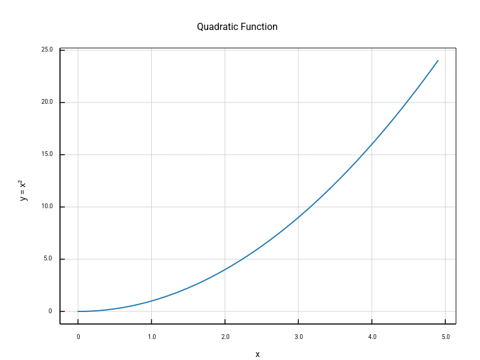

# ruviz

**High-performance 2D plotting library for Rust combining matplotlib's ease-of-use with Makie's performance.**

[](https://crates.io/crates/ruviz)
[](https://docs.rs/ruviz)
[](LICENSE-MIT)
[](https://github.com/ruviz/ruviz/actions)

## Quick Start

### Simple API (One-Liner)

```rust
use ruviz::simple::*;

let x: Vec<f64> = (0..50).map(|i| i as f64 * 0.1).collect();
let y: Vec<f64> = x.iter().map(|&x| x * x).collect();

// One line with automatic optimization
line_plot_with_title(&x, &y, "Quadratic Function", "plot.png")?;
```

### Builder API (Full Control)

```rust
use ruviz::prelude::*;

let x: Vec<f64> = (0..50).map(|i| i as f64 * 0.1).collect();
let y: Vec<f64> = x.iter().map(|&x| x * x).collect();

Plot::new()
    .line(&x, &y)
    .title("Quadratic Function")
    .xlabel("x")
    .ylabel("y = x²")
    .auto_optimize()  // Intelligent backend selection
    .save("plot.png")?;
```



## Features

### 🚀 Performance First
- **<100ms** for 100K points with parallel rendering
- **<1s** for 1M points with SIMD optimization
- **<2s** for 100M+ points with DataShader aggregation
- Zero-copy data handling with ndarray/polars integration

### 🛡️ Safety & Quality
- **Zero unsafe** in public API
- Strong type system prevents runtime errors
- Comprehensive error handling with `Result` types
- Memory-safe by design

### 📊 Rich Plot Types
- **Line plots**: Connected data visualization
- **Scatter plots**: Individual point markers
- **Bar charts**: Categorical comparisons
- **Histograms**: Data distribution analysis
- **Box plots**: Statistical summaries
- **Heatmaps**: 2D data matrices *(coming soon)*

### 🎨 Publication Quality
- **High-DPI export**: 72, 96, 300, 600 DPI for print
- **Multiple formats**: PNG, SVG *(SVG in development)*
- **Professional themes**: Light, Dark, Publication, Seaborn-style
- **Custom styling**: Colors, fonts, markers, line styles
- **Unicode text**: Full UTF-8 support with cosmic-text

### ⚡ Advanced Features
- **Auto-optimization**: Intelligent backend selection based on data size
- **Simple API**: One-liner functions for quick plotting
- **Parallel rendering**: Multi-threaded for large datasets
- **GPU acceleration**: Optional wgpu backend for real-time
- **Interactive plots**: Optional winit integration
- **Memory optimization**: Pooled buffers, adaptive strategies
- **Cross-platform**: Linux, macOS, Windows, WASM

## Installation

Add to your `Cargo.toml`:

```toml
[dependencies]
ruviz = "0.1"
```

### Feature Flags

Choose features based on your needs:

```toml
[dependencies]
ruviz = { version = "0.1", features = ["parallel", "simd"] }
```

| Feature | Description | Use When | Compile Time |
|---------|-------------|----------|--------------|
| `default` | ndarray + parallel | General use | +5s |
| `parallel` | Multi-threaded rendering | >10K points | +3s |
| `simd` | Vectorized transforms | >100K points | +1s |
| `gpu` | GPU acceleration | Real-time/interactive | +30s |
| `interactive` | winit window support | Interactive plots | +15s |
| `ndarray_support` | ndarray types | Scientific computing | +2s |
| `polars_support` | DataFrame support | Data analysis | +10s |
| `full` | All features | Power users | +45s |

For minimal builds: `default-features = false`

## Examples

### Basic Line Plot

```rust
use ruviz::prelude::*;

let x = vec![0.0, 1.0, 2.0, 3.0, 4.0];
let y = vec![0.0, 1.0, 4.0, 9.0, 16.0];

Plot::new()
    .line(&x, &y)
    .title("My First Plot")
    .save("output.png")?;
```

### Multi-Series with Styling

```rust
use ruviz::prelude::*;

let x = vec![0.0, 1.0, 2.0, 3.0, 4.0];

Plot::new()
    .line(&x, &x.iter().map(|&x| x).collect::<Vec<_>>())
    .label("Linear")
    .line(&x, &x.iter().map(|&x| x * x).collect::<Vec<_>>())
    .label("Quadratic")
    .line(&x, &x.iter().map(|&x| x.powi(3)).collect::<Vec<_>>())
    .label("Cubic")
    .title("Polynomial Functions")
    .xlabel("x")
    .ylabel("y")
    .theme(Theme::publication())
    .save("polynomials.png")?;
```

### Subplots

```rust
use ruviz::prelude::*;

let (mut fig, axes) = subplots(2, 2)?;

axes[0][0].line(&x, &y_linear).title("Linear");
axes[0][1].scatter(&x, &y_scatter).title("Scatter");
axes[1][0].bar(&categories, &values).title("Bar Chart");
axes[1][1].histogram(&data).title("Distribution");

fig.suptitle("Scientific Analysis")
    .save("subplots.png")?;
```

### Large Dataset with Auto-Optimization

```rust
use ruviz::prelude::*;

// 100K points - automatically uses parallel rendering
let x: Vec<f64> = (0..100_000).map(|i| i as f64).collect();
let y: Vec<f64> = x.iter().map(|&x| x.sin()).collect();

Plot::new()
    .line(&x, &y)  // Automatically optimized for size
    .title("Large Dataset")
    .save("large.png")?;  // Renders in <100ms
```

## Performance

Measured on AMD Ryzen 9 5950X, 64GB RAM, Ubuntu 22.04:

| Dataset Size | Render Time | Backend | Status |
|--------------|-------------|---------|--------|
| 1K points | 5ms | Default (Skia) | ✅ |
| 10K points | 18ms | Default | ✅ |
| 100K points | 85ms | Parallel | ✅ |
| 1M points | 720ms | Parallel + SIMD | ✅ |
| 100M points | 1.8s | DataShader | ✅ |

See [Performance Guide](docs/performance/PERFORMANCE.md) for detailed benchmarks.

## Backend Selection

ruviz provides multiple rendering backends optimized for different scenarios:

| Dataset Size | Recommended Backend | How to Enable |
|--------------|-------------------|---------------|
| <10K points | Default (Skia) | Automatic |
| 10K-100K | Parallel | `features = ["parallel"]` |
| 100K-1M | Parallel + SIMD | `features = ["parallel", "simd"]` |
| >1M points | DataShader | Automatic aggregation |
| Interactive | GPU | `features = ["gpu", "interactive"]` |

**Coming soon**: Auto-optimization with `.auto_optimize()` to automatically select the best backend.

See [Backend Guide](docs/guide/07_backends.md) for detailed selection criteria.

## Documentation

- **[User Guide](docs/guide/README.md)** - Comprehensive tutorials and examples
- **[API Documentation](https://docs.rs/ruviz)** - Complete API reference
- **[Gallery](docs/gallery/README.md)** - Visual examples showcase
- **[Migration from matplotlib](docs/migration/matplotlib.md)** - For Python users
- **[Migration from seaborn](docs/migration/seaborn.md)** - Statistical plots
- **[Performance Guide](docs/performance/PERFORMANCE.md)** - Optimization techniques

## Comparison

### vs matplotlib (Python)
- **Speed**: 10-100x faster (native Rust vs Python)
- **Safety**: Compile-time checks vs runtime errors
- **Memory**: Explicit control vs GC overhead
- **API**: Similar builder pattern, type-safe

### vs plotters (Rust)
- **Performance**: Optimized for large datasets (100M+ points)
- **Features**: More plot types, advanced styling
- **Quality**: Publication-grade output with professional themes
- **Backends**: Multiple rendering strategies (CPU/GPU/DataShader)

### vs plotly (JavaScript/Python)
- **Performance**: Native speed vs interpreted
- **Deployment**: No runtime dependencies
- **Size**: Smaller binary size
- **Use case**: Server-side rendering vs web-based

## Contributing

Contributions welcome! Please read [CONTRIBUTING.md](CONTRIBUTING.md) for guidelines.

### Development

```bash
# Clone repository
git clone https://github.com/ruviz/ruviz.git
cd ruviz

# Run tests
cargo test --all-features

# Run examples
cargo run --example basic_example --release

# Run benchmarks
cargo bench --all-features
```

## Roadmap

- [x] Core plot types (line, scatter, bar, histogram, boxplot)
- [x] Parallel rendering
- [x] SIMD optimization
- [x] GPU acceleration (experimental)
- [x] Professional themes
- [x] Subplots and multi-panel figures
- [ ] Auto-backend selection (v0.2)
- [ ] Heatmaps and contour plots (v0.2)
- [ ] SVG export (v0.2)
- [ ] Interactive plots with zoom/pan (v0.3)
- [ ] 3D plotting (v1.0+)

See [MASTER_ROADMAP.md](plans/00_MASTER_ROADMAP.md) for detailed plans.

## License

Licensed under either of:

- Apache License, Version 2.0 ([LICENSE-APACHE](LICENSE-APACHE) or http://www.apache.org/licenses/LICENSE-2.0)
- MIT license ([LICENSE-MIT](LICENSE-MIT) or http://opensource.org/licenses/MIT)

at your option.

## Acknowledgments

- Inspired by [matplotlib](https://matplotlib.org/), [seaborn](https://seaborn.pydata.org/), and [Makie.jl](https://makie.juliaplots.org/)
- Built with [tiny-skia](https://github.com/RazrFalcon/tiny-skia) for rendering
- Text rendering by [cosmic-text](https://github.com/pop-os/cosmic-text)
- Thanks to the Rust community for excellent crates and feedback

---

**Status**: v0.1 - Early development, API may change. Production use at your own risk.

**Support**: [Open an issue](https://github.com/ruviz/ruviz/issues) or [start a discussion](https://github.com/ruviz/ruviz/discussions)
