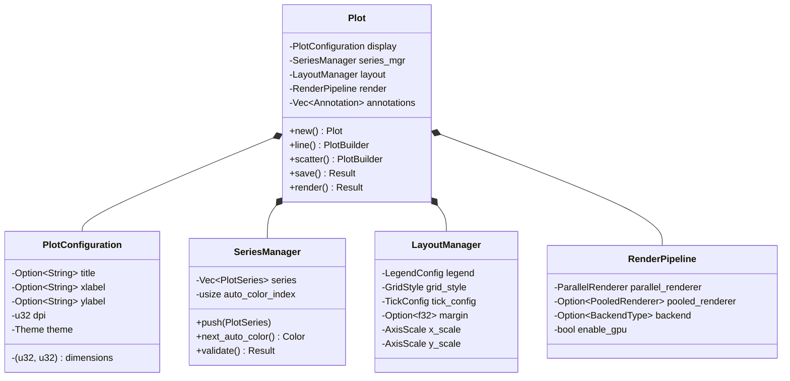
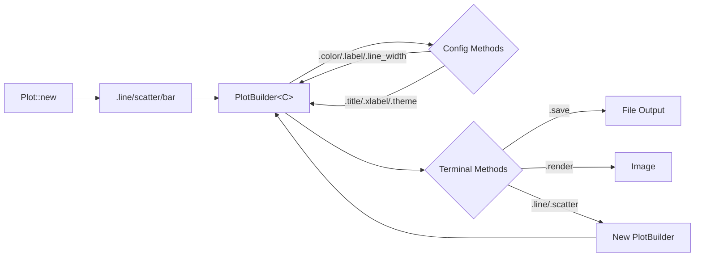
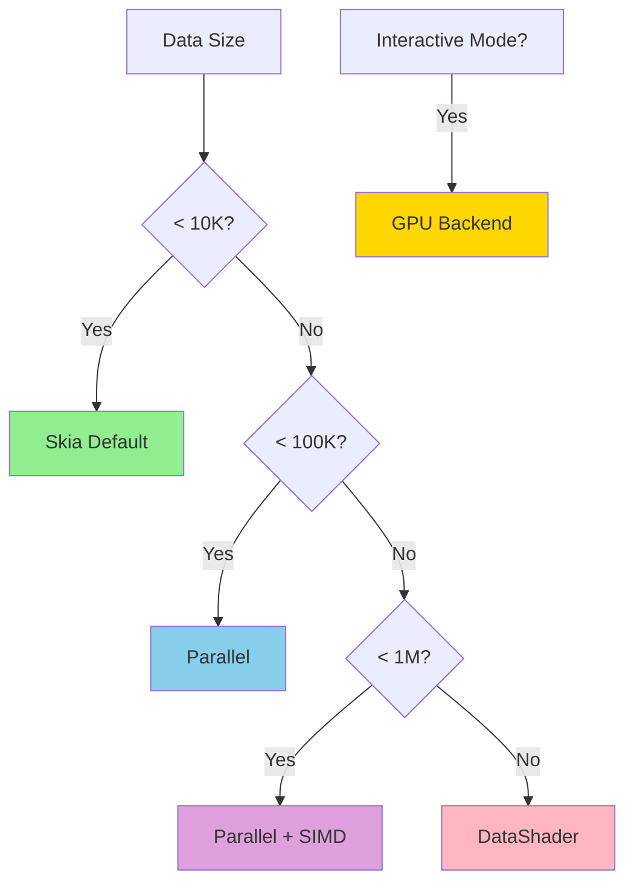
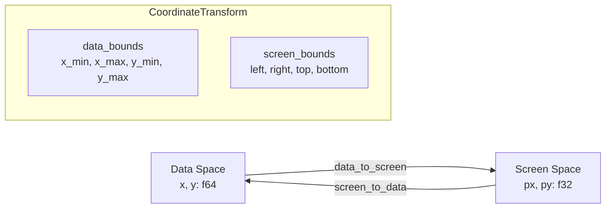
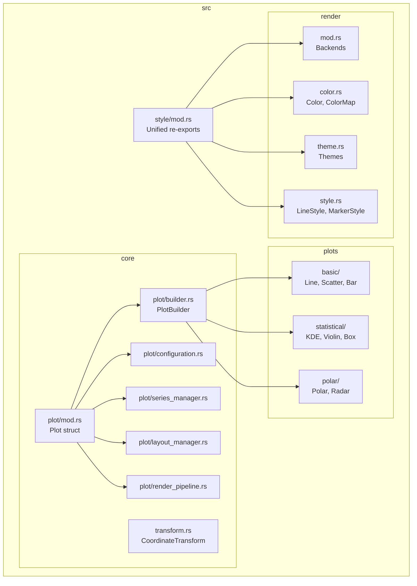
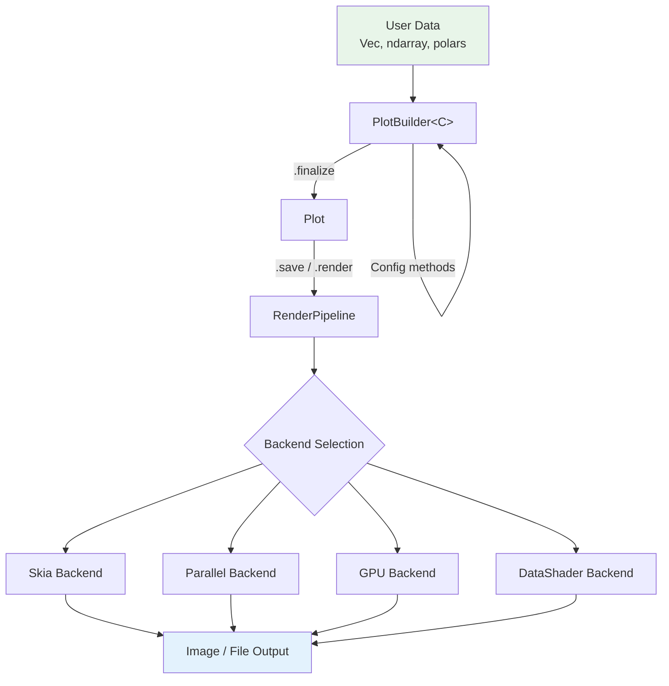
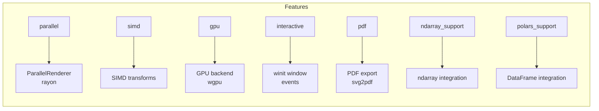

# Architecture Overview

This document describes the internal architecture of ruviz.

## Core Components

### Plot Structure

The `Plot` struct is the main entry point for creating visualizations. It has been decomposed into focused component managers:



### Component Responsibilities

| Component | File | Purpose |
|-----------|------|---------|
| `PlotConfiguration` | `src/core/plot/configuration.rs` | Display settings (title, xlabel, ylabel, dimensions, dpi, theme) |
| `SeriesManager` | `src/core/plot/series_manager.rs` | Stores data series, handles auto-color assignment |
| `LayoutManager` | `src/core/plot/layout_manager.rs` | Legend config, grid style, tick marks, margins, axis limits/scales |
| `RenderPipeline` | `src/core/plot/render_pipeline.rs` | Backend selection, parallel/pooled rendering, GPU settings |

## Builder Pattern

### PlotBuilder Flow



### PlotBuilder<C>

The generic `PlotBuilder<C>` provides a fluent API for configuring plots:

```rust
Plot::new()
    .line(&x, &y)           // Returns PlotBuilder<LineConfig>
    .color(Color::RED)      // Series-specific method
    .line_width(2.0)        // Series-specific method
    .title("My Plot")       // Forwards to Plot
    .save("plot.png")?;     // Terminal method
```

Key features:
- **Ownership-based transitions**: Series methods consume Plot and return PlotBuilder
- **Auto-finalization**: No explicit `.end()` needed - series finalize on save/render
- **Method forwarding**: Plot-level methods (title, xlabel, theme) forward to inner Plot

### Terminal Methods Macro

The `impl_terminal_methods!` macro generates common terminal methods for all config types:

```rust
impl_terminal_methods!(LineConfig);
impl_terminal_methods!(ScatterConfig);
impl_terminal_methods!(BarConfig);
// ... etc
```

Generated methods: `save()`, `render()`, `render_to_svg()`, `export_svg()`, `save_pdf()`, `save_with_size()`

## Rendering Pipeline

### Backend Selection



| Data Size | Backend | Features Required |
|-----------|---------|-------------------|
| < 10K points | Skia (default) | none |
| 10K - 100K | Parallel | `parallel` |
| 100K - 1M | Parallel + SIMD | `parallel`, `simd` |
| > 1M | DataShader | automatic |
| Interactive | GPU | `gpu`, `interactive` |

### Coordinate Transforms

The `CoordinateTransform` struct (in `src/core/transform.rs`) handles all coordinate conversions:



```rust
pub struct CoordinateTransform {
    data_bounds: (f64, f64, f64, f64),   // x_min, x_max, y_min, y_max
    screen_bounds: (f32, f32, f32, f32), // left, right, top, bottom
}

impl CoordinateTransform {
    pub fn data_to_screen(&self, x: f64, y: f64) -> (f32, f32);
    pub fn screen_to_data(&self, px: f32, py: f32) -> (f64, f64);
}
```

## Module Organization



## Style System

The `ruviz::style` module provides unified access to all styling types:

```rust
use ruviz::style::{Color, Theme, LineStyle, MarkerStyle, GridStyle};
```

This re-exports from:
- `ruviz::render` - Color, Theme, LineStyle, MarkerStyle
- `ruviz::core` - GridStyle, PlotStyle, StyleResolver

## Data Flow



## Error Handling

All fallible operations return `Result<T, PlotError>`:

```rust
pub type Result<T> = std::result::Result<T, PlotError>;

pub enum PlotError {
    InvalidData(String),
    RenderError(String),
    IoError(std::io::Error),
    // ...
}
```

## Feature Flags



| Feature | Components Enabled |
|---------|-------------------|
| `parallel` | ParallelRenderer, rayon integration |
| `simd` | SIMD coordinate transforms |
| `gpu` | GPU backend, wgpu integration |
| `interactive` | winit window, event handling |
| `pdf` | PDF export via svg2pdf |
| `ndarray_support` | ndarray data integration |
| `polars_support` | polars DataFrame integration |
