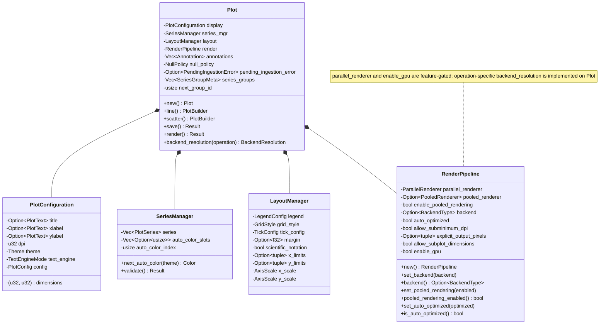
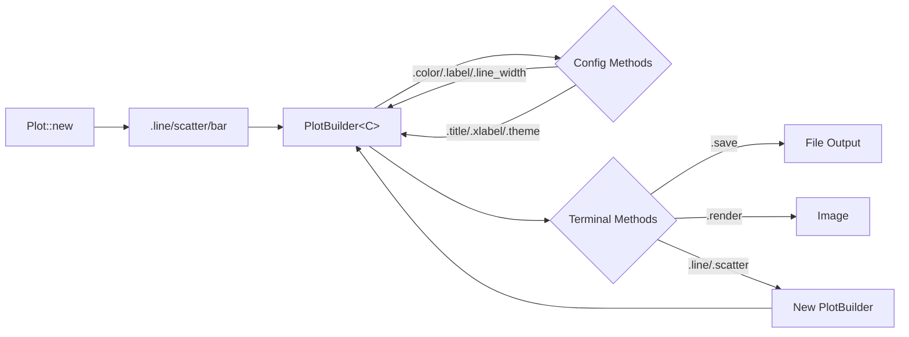
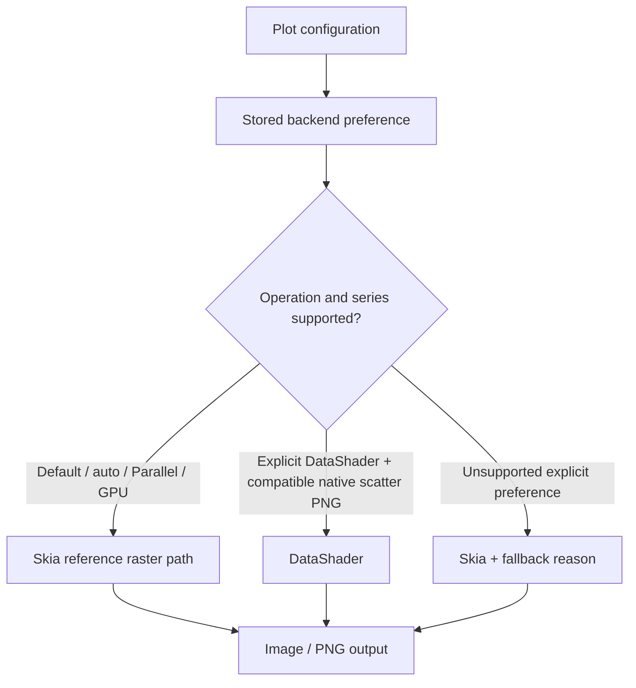
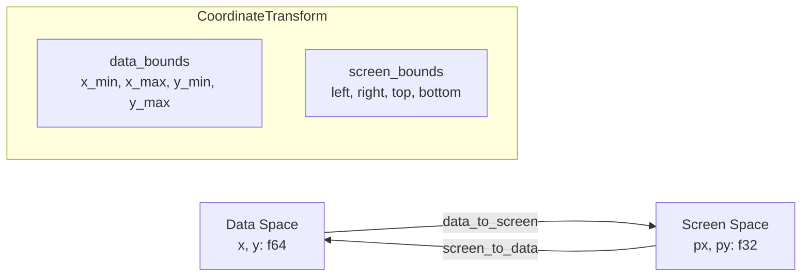
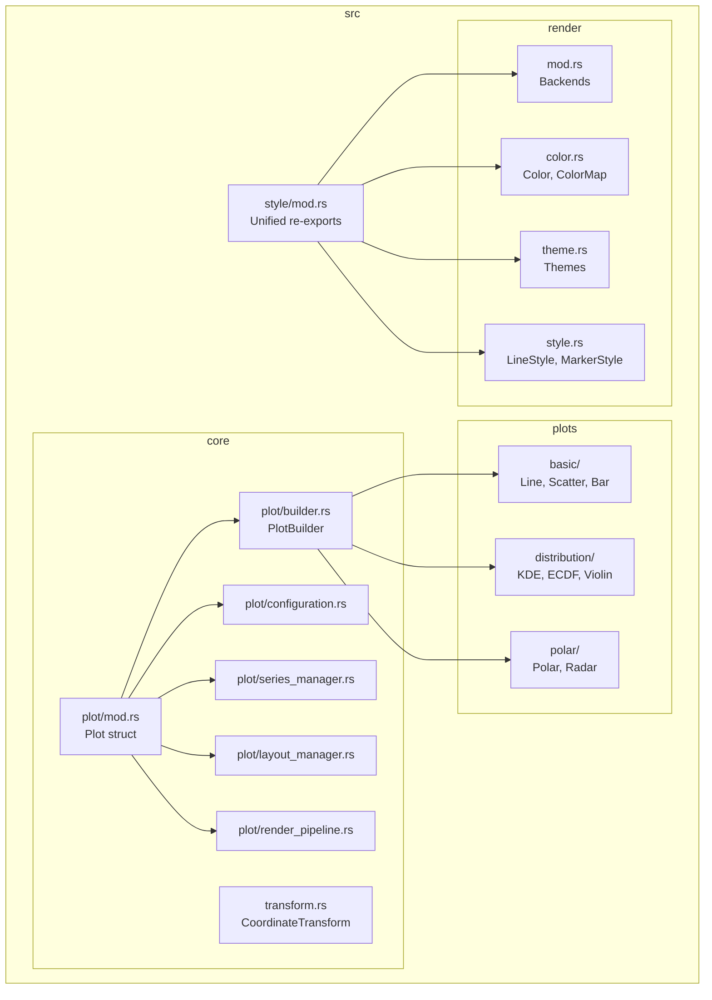
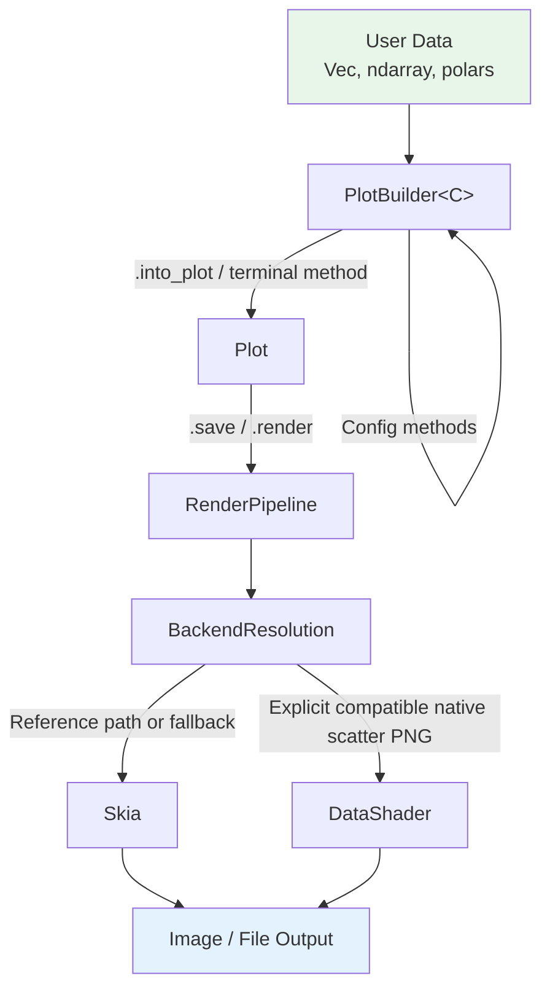
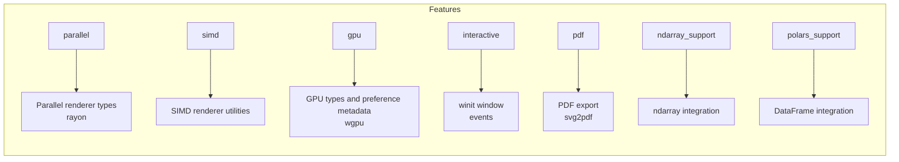

# Architecture Overview

This document describes the internal architecture of ruviz.

## Core Components

### Plot Structure

The `Plot` struct is the main entry point for creating visualizations. It has been decomposed into focused component managers. The Mermaid diagram is an abridged structural sketch: every identifier shown below exists in the implementation, while less relevant private fields and helper methods are intentionally omitted. Feature-gated members are labeled explicitly.


```mermaid
classDiagram
    class Plot {
        -PlotConfiguration display
        -SeriesManager series_mgr
        -LayoutManager layout
        -RenderPipeline render
        -Vec~Annotation~ annotations
        -NullPolicy null_policy
        -Option~PendingIngestionError~ pending_ingestion_error
        -Vec~SeriesGroupMeta~ series_groups
        -usize next_group_id
        +new() Plot
        +line() PlotBuilder
        +scatter() PlotBuilder
        +save() Result
        +render() Result
        +backend_resolution(operation) BackendResolution
    }

    class PlotConfiguration {
        -Option~PlotText~ title
        -Option~PlotText~ xlabel
        -Option~PlotText~ ylabel
        -(u32, u32) dimensions
        -u32 dpi
        -Theme theme
        -TextEngineMode text_engine
        -PlotConfig config
    }

    class SeriesManager {
        -Vec~PlotSeries~ series
        -Vec~Option~usize~~ auto_color_slots
        -usize auto_color_index
        +next_auto_color(theme) Color
        +validate() Result
    }

    class LayoutManager {
        -LegendConfig legend
        -GridStyle grid_style
        -TickConfig tick_config
        -Option~f32~ margin
        -bool scientific_notation
        -Option~tuple~ x_limits
        -Option~tuple~ y_limits
        -AxisScale x_scale
        -AxisScale y_scale
    }

    class RenderPipeline {
        -ParallelRenderer parallel_renderer
        -Option~PooledRenderer~ pooled_renderer
        -bool enable_pooled_rendering
        -Option~BackendType~ backend
        -bool auto_optimized
        -bool allow_subminimum_dpi
        -Option~tuple~ explicit_output_pixels
        -bool allow_subplot_dimensions
        -bool enable_gpu
        +new() RenderPipeline
        +set_backend(backend)
        +backend() Option~BackendType~
        +set_pooled_rendering(enabled)
        +pooled_rendering_enabled() bool
        +set_auto_optimized(optimized)
        +is_auto_optimized() bool
    }

    note for RenderPipeline "parallel_renderer and enable_gpu are feature-gated; operation-specific backend_resolution is implemented on Plot"

    Plot *-- PlotConfiguration
    Plot *-- SeriesManager
    Plot *-- LayoutManager
    Plot *-- RenderPipeline
```

### Component Responsibilities

| Component | File | Purpose |
|-----------|------|---------|
| `PlotConfiguration` | `src/core/plot/configuration.rs` | Display settings (title, xlabel, ylabel, dimensions, dpi, theme) |
| `SeriesManager` | `src/core/plot/series_manager.rs` | Stores data series, handles auto-color assignment |
| `LayoutManager` | `src/core/plot/layout_manager.rs` | Legend config, grid style, tick marks, margins, axis limits/scales |
| `RenderPipeline` | `src/core/plot/render_pipeline.rs` | Backend preference and renderer configuration; operation-specific resolution diagnostics are methods on `Plot` |

## Builder Pattern

### PlotBuilder Flow


```mermaid
flowchart LR
    A[Plot::new] --> B[.line/scatter/bar]
    B --> C[PlotBuilder&lt;C&gt;]
    C --> D{Config Methods}
    D --> |.color/.label/.line_width| C
    D --> |.title/.xlabel/.theme| C
    C --> E{Terminal Methods}
    E --> |.save| F[File Output]
    E --> |.render| G[Image]
    E --> |.line/.scatter| H[New PlotBuilder]
    H --> C
```

### PlotBuilder<C>

The generic `PlotBuilder<C>` provides a fluent API for configuring plots:

```rust
Plot::new()
    .line(&x, &y)           // Returns PlotBuilder<LineConfig>
    .color(Color::RED)      // Series-specific method
    .line_width(2.0)        // Series-specific method
    .title("My Plot")       // Forwards to Plot
    .save("plot.png")?;     // Terminal method
```

Key features:
- **Ownership-based transitions**: Series methods consume Plot and return PlotBuilder
- **Auto-finalization**: No explicit `.end()` needed - series finalize on save/render
- **Method forwarding**: Plot-level methods (title, xlabel, theme) forward to inner Plot

### Terminal Methods Macro

The `impl_terminal_methods!` macro generates common terminal methods for all config types:

```rust
impl_terminal_methods!(LineConfig);
impl_terminal_methods!(ScatterConfig);
impl_terminal_methods!(BarConfig);
// ... etc
```

Generated methods: `save()`, `render()`, `render_to_svg()`, `export_svg()`, `save_pdf()`, `save_with_size()`

## Rendering Pipeline

### Backend Resolution

Public raster routing distinguishes the configured preference from the backend that
can execute a specific operation. Point count alone does not activate Parallel,
GPU, or DataShader.


```mermaid
flowchart TD
    A[Plot configuration] --> B[Stored backend preference]
    B --> C{Operation and series supported?}
    C --> |Default / auto / Parallel / GPU| D[Skia reference raster path]
    C --> |Explicit DataShader + compatible native scatter PNG| E[DataShader]
    C --> |Unsupported explicit preference| F[Skia + fallback reason]
    D --> G[Image / PNG output]
    E --> G
    F --> G
```

- `.auto_optimize()` stores Skia unless an explicit preference already exists.
- Parallel and GPU preferences currently resolve to Skia for public raster operations.
- Explicit DataShader can execute only for supported native scatter PNG workloads.
- `get_backend_name()` reports the preference; `resolved_backend_name()` and
  `backend_resolution(...)` report actual execution and any fallback reason.

### Coordinate Transforms

The `CoordinateTransform` struct (in `src/core/transform.rs`) handles all coordinate conversions:


```mermaid
flowchart LR
    A[Data Space<br/>x, y: f64] --> |data_to_screen| B[Screen Space<br/>px, py: f32]
    B --> |screen_to_data| A

    subgraph CoordinateTransform
        C[data_bounds<br/>x_min, x_max, y_min, y_max]
        D[screen_bounds<br/>left, right, top, bottom]
    end
```

The following abridged signature sketch uses the real public field and method names; constructors and scale-aware helpers are omitted:

```rust,ignore,reason=abridged-api-sketch
use std::ops::Range;

pub struct CoordinateTransform {
    pub data_x: Range<f64>,
    pub data_y: Range<f64>,
    pub screen_x: Range<f32>,
    pub screen_y: Range<f32>,
    pub y_inverted: bool,
}

impl CoordinateTransform {
    pub fn data_to_screen(&self, data_x: f64, data_y: f64) -> (f32, f32);
    pub fn screen_to_data(&self, screen_x: f32, screen_y: f32) -> (f64, f64);
    // Other real methods omitted from this abridged sketch.
}
```

## Module Organization


```mermaid
graph TD
    subgraph src
        subgraph core
            A[plot/mod.rs<br/>Plot struct]
            B[plot/builder.rs<br/>PlotBuilder]
            C[plot/configuration.rs]
            D[plot/series_manager.rs]
            E[plot/layout_manager.rs]
            F[plot/render_pipeline.rs]
            G[transform.rs<br/>CoordinateTransform]
        end

        subgraph plots
            H[basic/<br/>Line, Scatter, Bar]
            I[distribution/<br/>KDE, ECDF, Violin]
            J[polar/<br/>Polar, Radar]
        end

        subgraph render
            K[mod.rs<br/>Backends]
            L[color.rs<br/>Color, ColorMap]
            M[theme.rs<br/>Themes]
            N[style.rs<br/>LineStyle, MarkerStyle]
        end

        O[style/mod.rs<br/>Unified re-exports]
    end

    A --> B
    A --> C
    A --> D
    A --> E
    A --> F
    B --> H
    B --> I
    B --> J
    O --> K
    O --> L
    O --> M
    O --> N
```

## Style System

The `ruviz::style` module provides unified access to all styling types:

```rust
use ruviz::style::{Color, Theme, LineStyle, MarkerStyle, GridStyle};
```

This re-exports from:
- `ruviz::render` - Color, Theme, LineStyle, MarkerStyle
- `ruviz::core` - GridStyle, PlotStyle, StyleResolver

## Data Flow


```mermaid
flowchart TB
    A[User Data<br/>Vec, ndarray, polars] --> B[PlotBuilder&lt;C&gt;]
    B --> |.into_plot / terminal method| C[Plot]
    B --> |Config methods| B
    C --> |.save / .render| D[RenderPipeline]

    D --> E[BackendResolution]
    E --> |Reference path or fallback| F[Skia]
    E --> |Explicit compatible native scatter PNG| G[DataShader]

    F --> H[Image / File Output]
    G --> H

    style A fill:#E8F5E9
    style H fill:#E3F2FD
```

## Error Handling

Fallible plotting operations use `PlottingError` through the crate's `Result<T>` alias. The following is explicitly an abridged API sketch; see `src/core/error.rs` for the complete enum:

```rust,ignore,reason=abridged-api-sketch
pub type Result<T> = std::result::Result<T, PlottingError>;

pub enum PlottingError {
    InvalidData {
        message: String,
        position: Option<usize>,
    },
    RenderError(String),
    IoError(std::io::Error),
    // Other real variants omitted from this abridged sketch.
}
```

## Feature Flags


```mermaid
graph LR
    subgraph Features
        A[parallel] --> B[Parallel renderer types<br/>rayon]
        C[simd] --> D[SIMD renderer utilities]
        E[gpu] --> F[GPU types and preference metadata<br/>wgpu]
        G[interactive] --> H[winit window<br/>events]
        I[pdf] --> J[PDF export<br/>svg2pdf]
        K[ndarray_support] --> L[ndarray integration]
        M[polars_support] --> N[DataFrame integration]
    end
```

| Feature | Components Enabled |
|---------|-------------------|
| `parallel` | Parallel renderer types and rayon integration; not a public raster routing guarantee |
| `simd` | SIMD renderer utilities; not a public raster routing guarantee |
| `gpu` | GPU types and preference metadata; static public raster output currently resolves to Skia |
| `interactive` | winit window, event handling |
| `pdf` | PDF export via svg2pdf |
| `ndarray_support` | ndarray data integration |
| `polars_support` | polars DataFrame integration |
