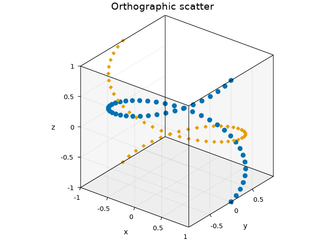
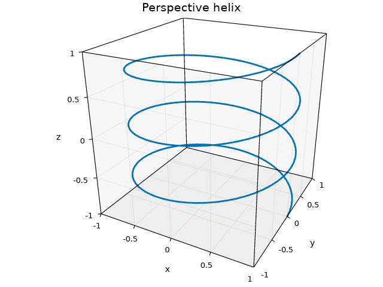
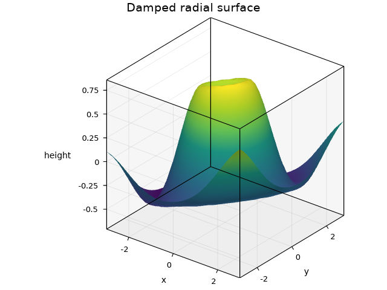
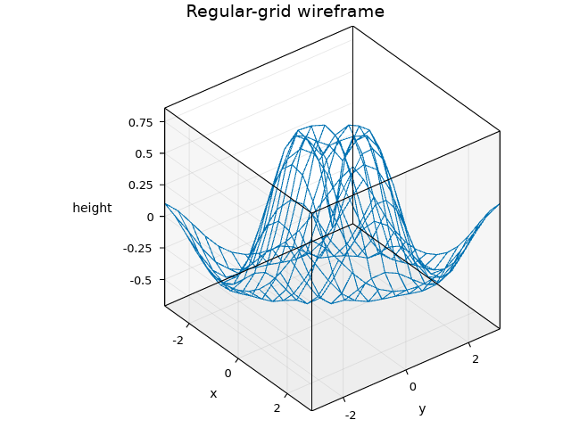
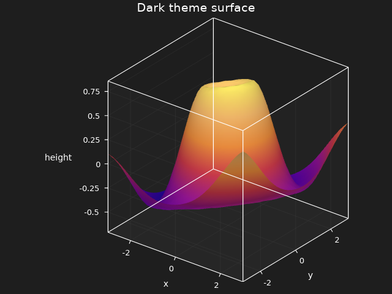
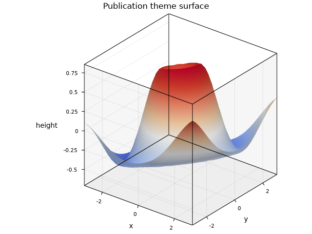
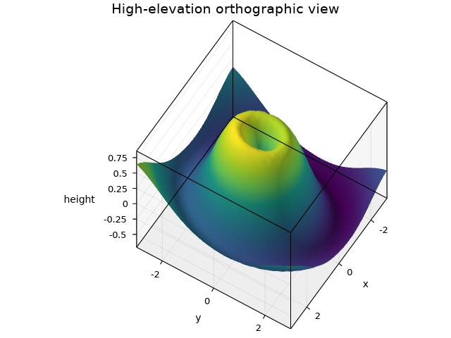
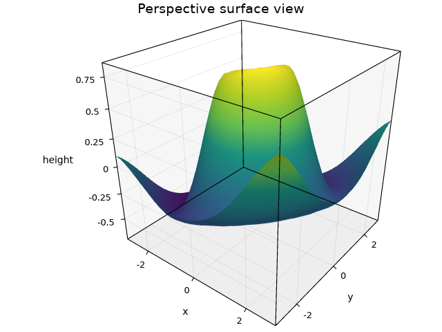

# 3D Plots

Fixed-camera scatter, line, surface, wireframe, theme, and projection examples.

## Examples

### Orthographic Scatter

Two deterministic point spirals rendered with an equal-axis orthographic camera.

Source: [examples/generate_3d_gallery.rs](../../../examples/generate_3d_gallery.rs)

### Perspective Helix

A fixed perspective view of a three-dimensional helix.

Source: [examples/generate_3d_gallery.rs](../../../examples/generate_3d_gallery.rs)

### Smooth Surface

A full-resolution regular grid with smooth shading and a viridis colormap.

Source: [examples/generate_3d_gallery.rs](../../../examples/generate_3d_gallery.rs)

### Wireframe

A sampled regular-grid wireframe rendered from a fixed orthographic view.

Source: [examples/generate_3d_gallery.rs](../../../examples/generate_3d_gallery.rs)

### Dark Theme Surface

The same fixed surface geometry under the dark theme and plasma colormap.

Source: [examples/generate_3d_gallery.rs](../../../examples/generate_3d_gallery.rs)

### Publication Theme Surface

A high-contrast publication theme with deterministic bundled typography.

Source: [examples/generate_3d_gallery.rs](../../../examples/generate_3d_gallery.rs)

### High-Elevation View

An alternate orthographic camera that exercises projected Axis3 placement.

Source: [examples/generate_3d_gallery.rs](../../../examples/generate_3d_gallery.rs)

### Perspective Surface

The canonical surface rendered through an explicit 40-degree perspective camera.

Source: [examples/generate_3d_gallery.rs](../../../examples/generate_3d_gallery.rs)

### Animated Surface Orbit

A publication-themed surface completing a deterministic 360-degree orthographic orbit.

Source: [examples/doc_surface3d_animation.rs](../../../examples/doc_surface3d_animation.rs)

Guide: [3D plots](../../guide/12_3d.md)

[← Back to Gallery](../README.md)
