# Styling Comparison Gallery

This gallery compares ruviz output with matplotlib/seaborn reference implementations to demonstrate styling parity.

## Overview

ruviz aims to produce visually similar output to matplotlib and seaborn while providing a Rust-native API. This comparison shows how key plot types render in both libraries.

## Distribution Plots

### Histogram

| matplotlib | ruviz |
|------------|-------|
|  | 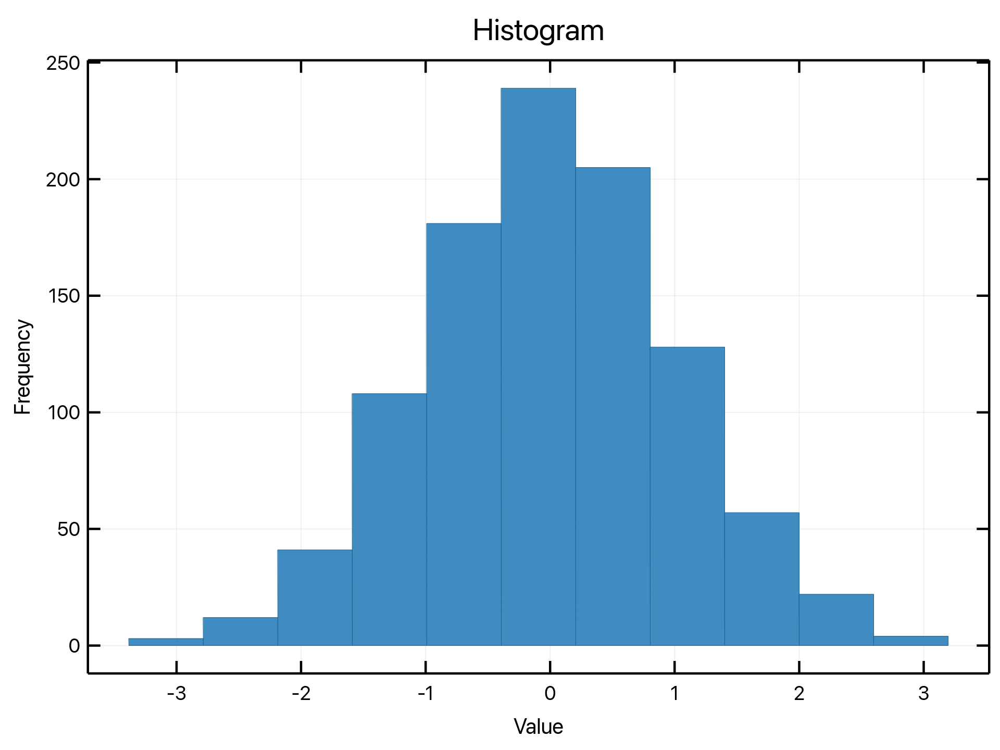 |

**Key styling elements:**
- Fill alpha: 0.7 (70% opacity)
- Edge color: Darker version of fill
- Edge width: 0.8pt
- Bar width: 80% of bin width

### Box Plot

| matplotlib | ruviz |
|------------|-------|
|  | 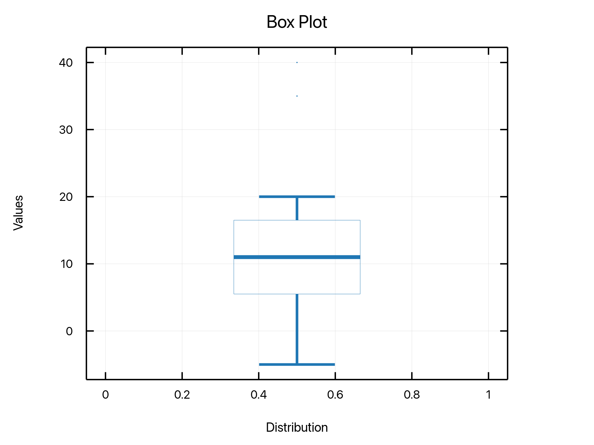 |

**Key styling elements:**
- Box fill with themed colors
- Median line: 1.5pt width
- Whiskers: Solid lines with caps
- Outliers: Small circles

### Violin Plot

| matplotlib | ruviz |
|------------|-------|
|  | 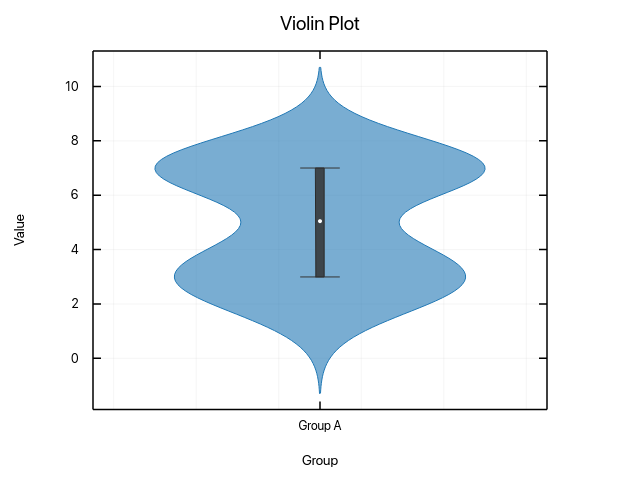 |

**Key styling elements:**
- KDE curve for distribution shape
- Fill alpha: 0.7
- Inner box plot with quartile markers
- Median line visible

### KDE (Kernel Density Estimation)

| matplotlib | ruviz |
|------------|-------|
|  | 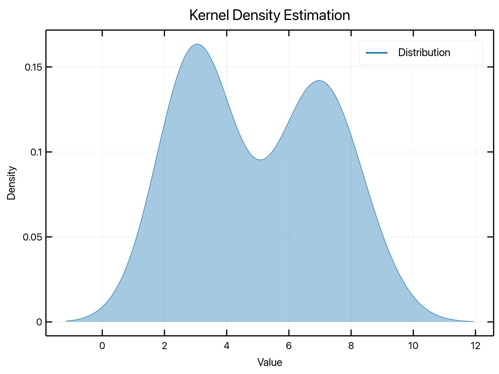 |

**Key styling elements:**
- Smooth density curve
- Optional fill under curve (alpha: 0.25)
- Line width: 1.5pt
- Scott's rule for bandwidth selection

## Continuous Plots

### Contour Plot

| matplotlib | ruviz |
|------------|-------|
|  | 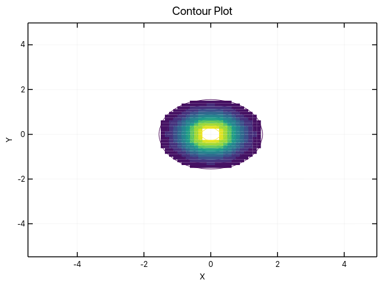 |

**Key styling elements:**
- 20 contour levels by default
- Line contours with optional fill
- Colorbar for value mapping
- White contour lines over filled regions

### Heatmap

| matplotlib | ruviz |
|------------|-------|
|  | 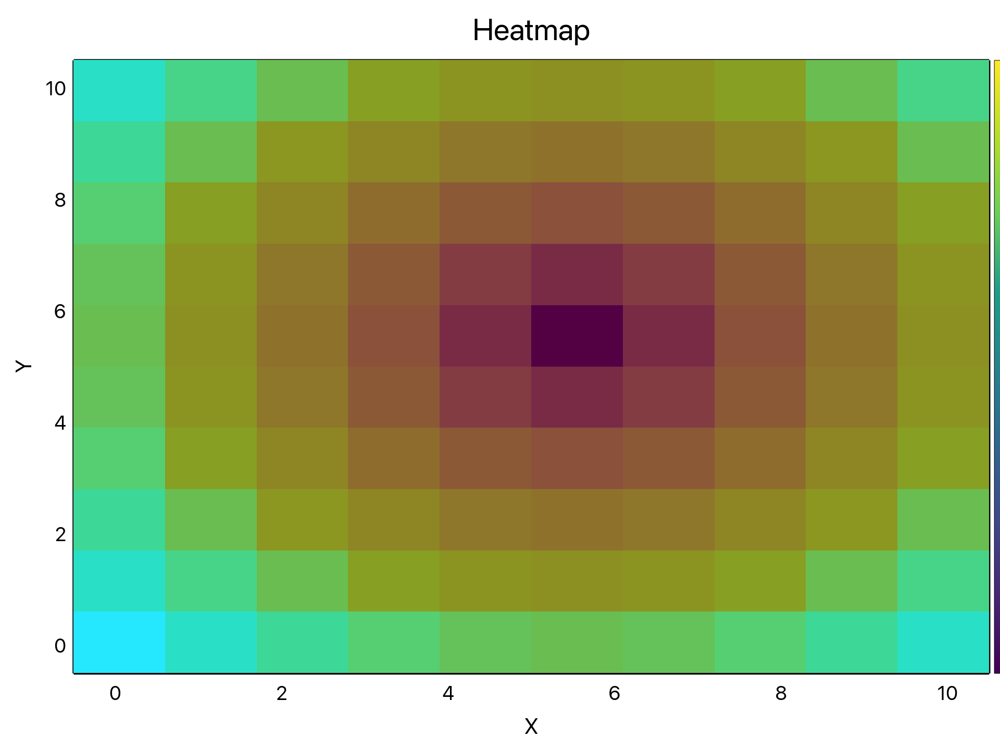 |

**Key styling elements:**
- Color-mapped cells
- Optional cell grid lines
- Colorbar for value reference
- Optional value annotations

## Statistical Plots

### ECDF (Empirical CDF)

| matplotlib | ruviz |
|------------|-------|
|  | 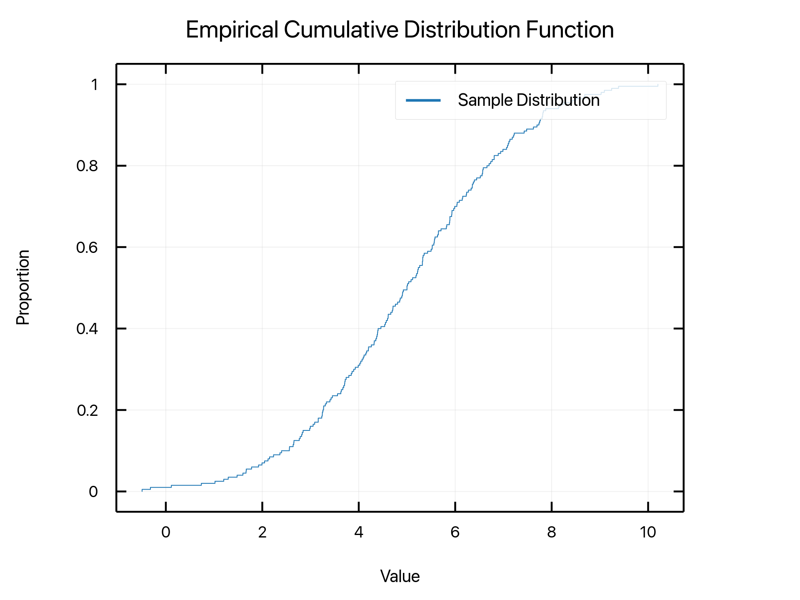 |

**Key styling elements:**
- Step function rendering
- Line width: 1.5pt
- Grid for readability

### Error Bars

| matplotlib | ruviz |
|------------|-------|
|  | 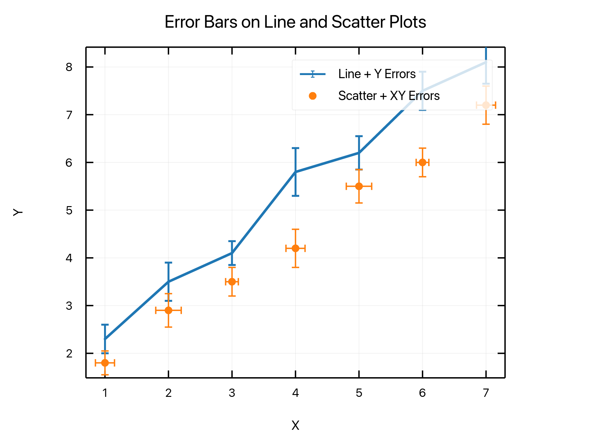 |

**Key styling elements:**
- Cap width proportional to data
- Line connecting points
- Marker at each point

## Polar Plots

### Radar Chart

| matplotlib | ruviz |
|------------|-------|
|  | 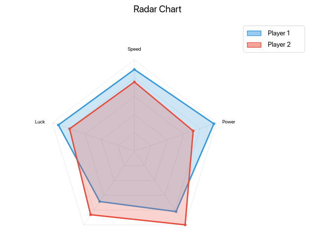 |

**Key styling elements:**
- Filled polygon with alpha: 0.25
- Perimeter line: 2pt width
- Vertex markers
- Radial grid lines

## Styling Features

### SpineConfig (Despine)

ruviz supports seaborn's despine() functionality:

```rust
use ruviz::core::SpineConfig;

// Seaborn-style (hide top and right)
let spines = SpineConfig::despine();

// All visible (matplotlib default)
let spines = SpineConfig::all();

// No spines
let spines = SpineConfig::none();
```

### StyleResolver

Centralized styling resolution for consistent output:

```rust
use ruviz::core::StyleResolver;

let resolver = StyleResolver::new(&theme);
let line_width = resolver.line_width(config.width);
let alpha = resolver.fill_alpha(config.alpha);
let edge = resolver.edge_color(fill, config.edge);
```

### StyledShape

Trait for consistent fill+edge rendering:

```rust
impl StyledShape for HistogramBar {
    fn fill_color(&self) -> Color { self.fill }
    fn edge_color(&self) -> Option<Color> { None } // Auto-derive
    fn edge_width(&self) -> f32 { 0.8 }
    fn alpha(&self) -> f32 { 0.7 }
}
```

## Theme Comparisons

### Default Theme

| matplotlib | ruviz |
|------------|-------|
| Default palette and styling | 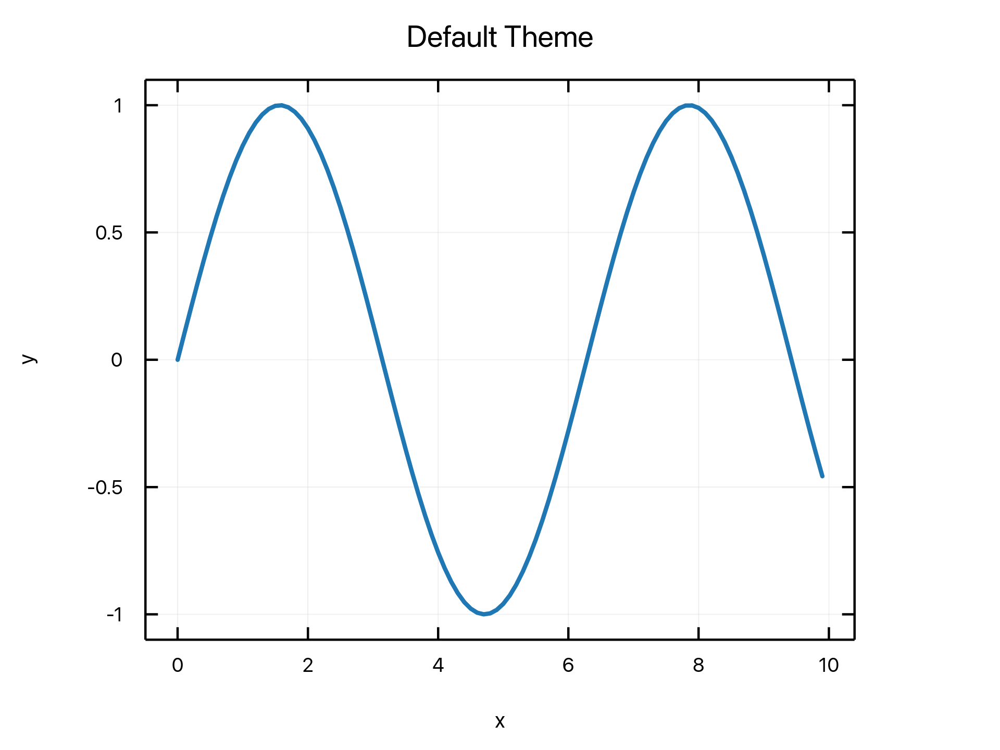 |

### Dark Theme

| matplotlib | ruviz |
|------------|-------|
| Dark background styling | 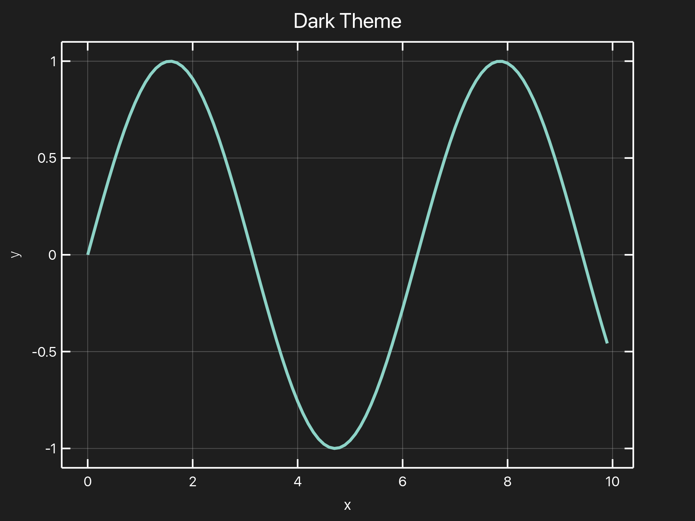 |

### Seaborn Theme

| matplotlib | ruviz |
|------------|-------|
| Seaborn-inspired palette | 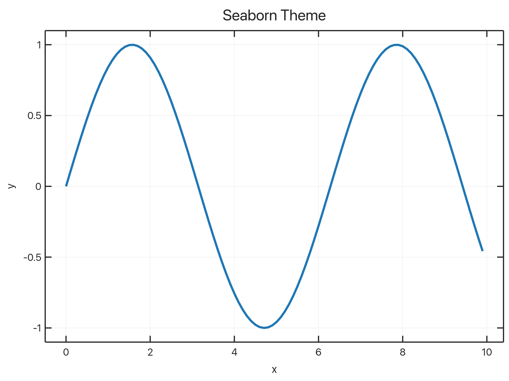 |

### Publication Theme

| matplotlib | ruviz |
|------------|-------|
| Publication-ready styling | 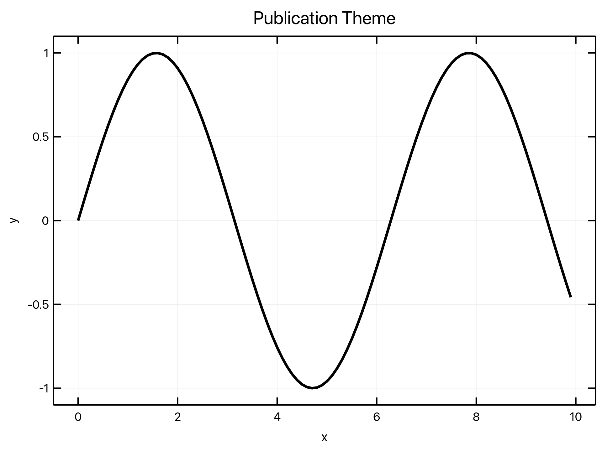 |

## Running Visual Tests

To verify styling parity:

1. Generate matplotlib reference images:
   ```bash
   python scripts/generate_reference.py
   ```

2. Run visual regression tests:
   ```bash
   cargo test --test visual_traits_test -- --ignored
   ```

3. Review any differences in `tests/output/visual_diff/`

## Notes

- Minor differences are expected due to:
  - Font rendering (different text engines)
  - Anti-aliasing algorithms
  - Color space handling

- Key styling metrics are matched:
  - Line widths
  - Fill alphas
  - Color derivation
  - Layout proportions
