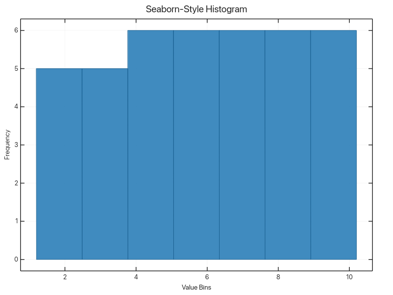

# Advanced Techniques

Styling, polar/radar, and layout-heavy visualizations.

## Examples

### Contour Plot

Contour rendering example with level interpolation.

Source: `examples/doc_contour.rs`

### Radar Chart

Radar chart example demonstrating non-cartesian layout support.

Source: `examples/doc_radar.rs`

### Legend Positions

Reference image covering legend placement options.

Source: `examples/doc_legend_positions.rs`

### Seaborn-Style Histogram

A styling-heavy histogram variant from the Seaborn example set.

Source: `examples/seaborn_style_example.rs`

[← Back to Gallery](../README.md)
