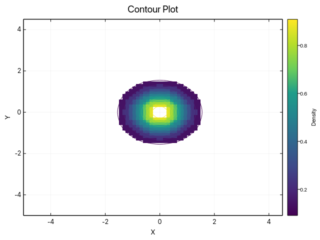
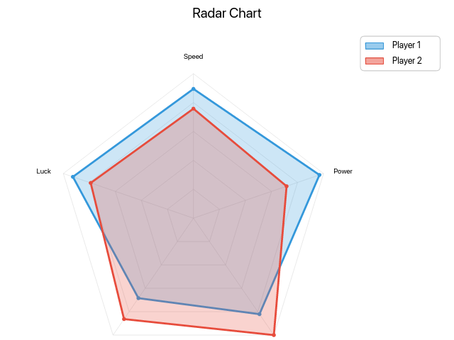
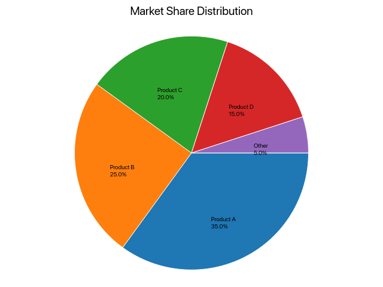
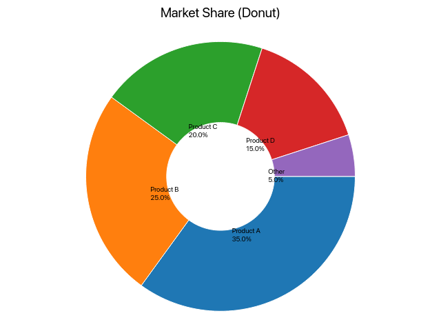
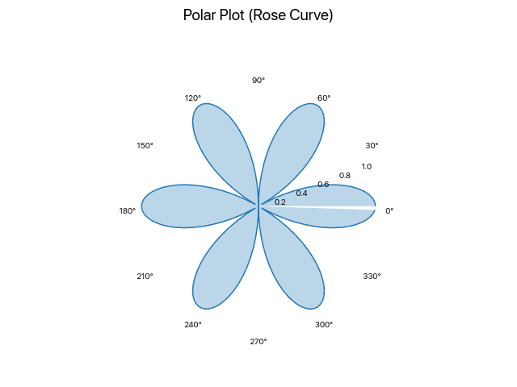
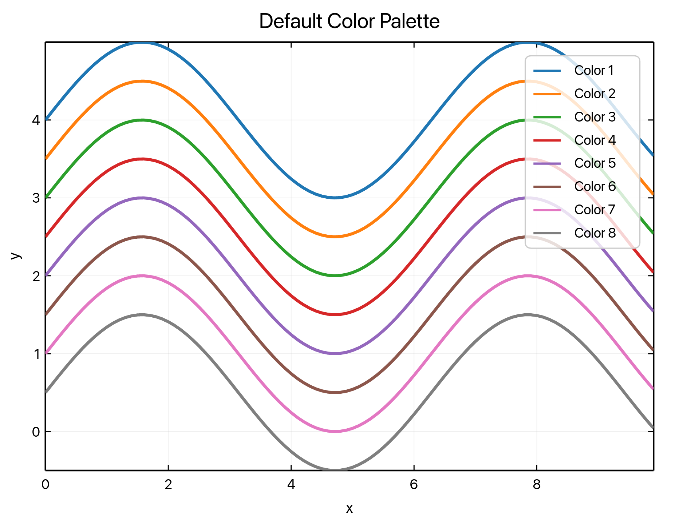
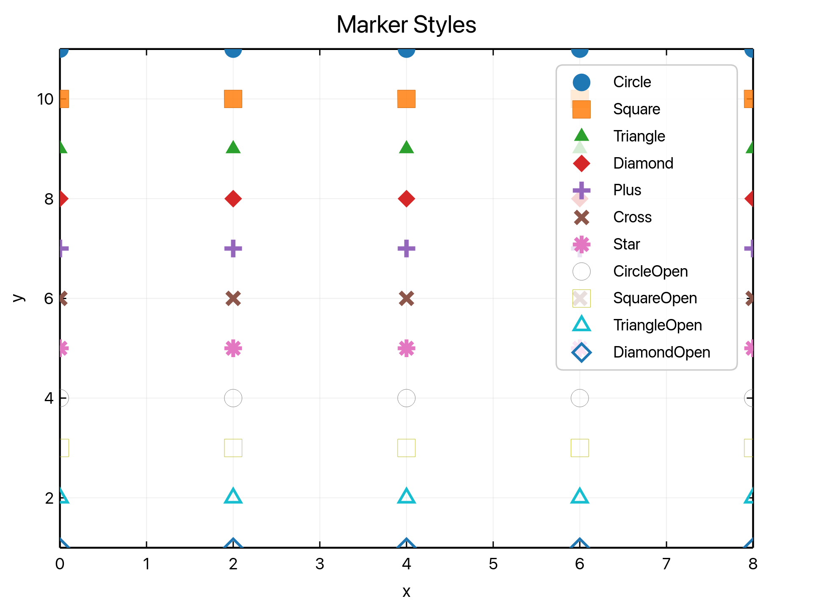
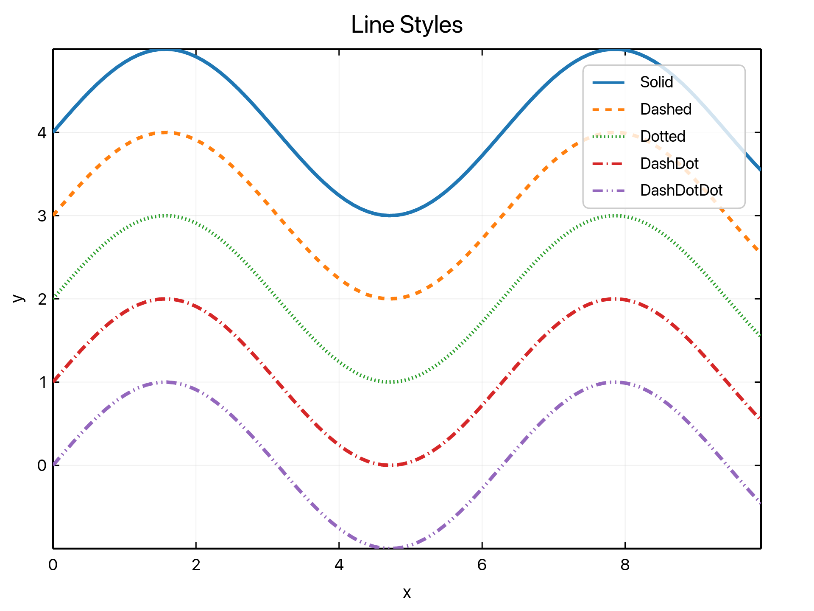
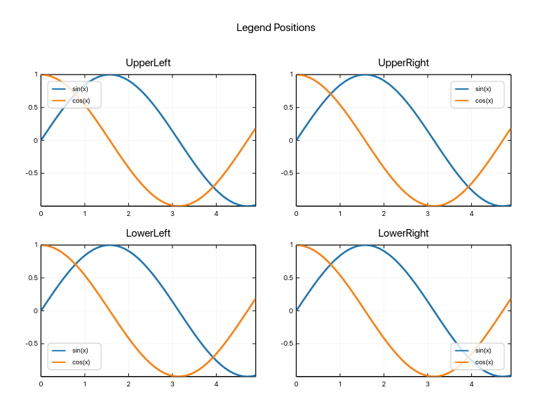

# Advanced Techniques

Styling, polar/radar, and layout-heavy visualizations.

## Examples

### Contour Plot

Contour rendering example with level interpolation.

Source: `examples/doc_contour.rs`

### Radar Chart

Radar chart example demonstrating non-cartesian layout support.

Source: `examples/doc_radar.rs`

### Pie Chart

Composition shares with labels and percentages.

Source: `examples/doc_pie.rs`

### Donut Chart

A pie chart variant with a central cutout.

Source: `examples/doc_pie.rs`

### Polar Rose

A filled polar line plot for non-cartesian data.

Source: `examples/doc_polar.rs`

### Color Palette

Default palette reference across multiple line series.

Source: `examples/doc_colors.rs`

### Marker Styles

Reference image covering filled and open marker variants.

Source: `examples/doc_marker_styles.rs`

### Line Styles

Reference image covering solid, dashed, and dotted lines.

Source: `examples/doc_line_styles.rs`

### Legend Positions

Reference image covering legend placement options.

Source: `examples/doc_legend_positions.rs`

[← Back to Gallery](../README.md)
