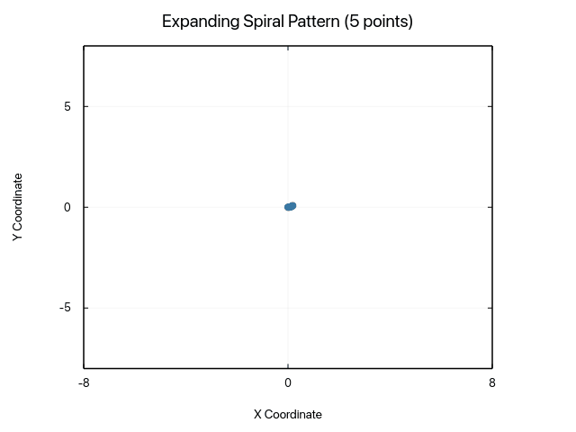
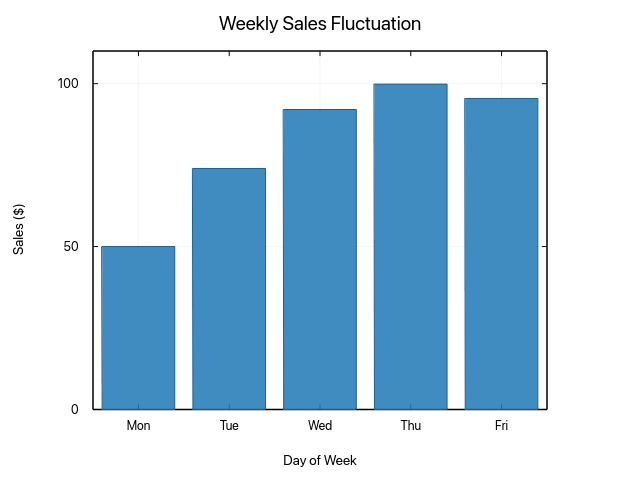
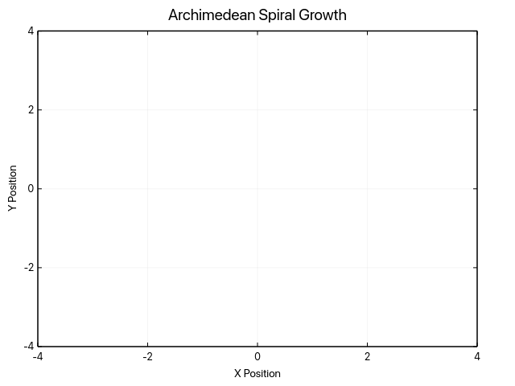
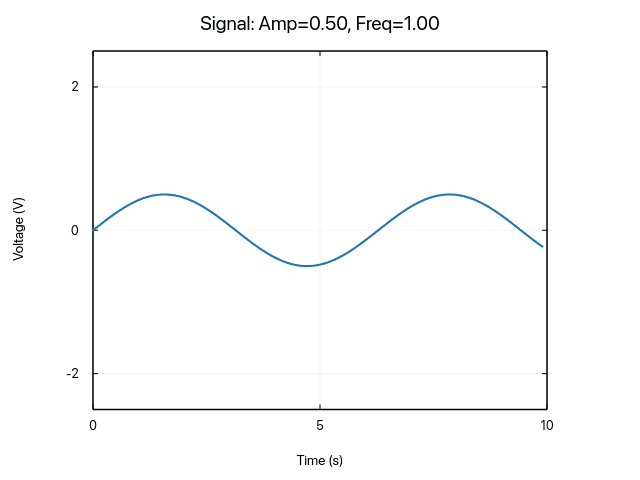
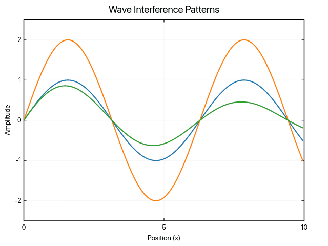
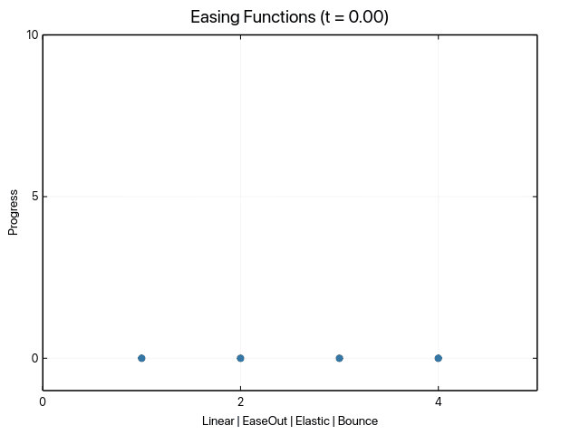

# Animation Gallery

Animated visualizations using the `record!` macro and Signal-based reactive animations.

## Examples

### Traveling Sine Wave


[View source code](https://github.com/Ameyanagi/ruviz/blob/main/examples/generate_animation_gallery.rs#L47-L73)

---

### Expanding Spiral Pattern



[View source code](https://github.com/Ameyanagi/ruviz/blob/main/examples/generate_animation_gallery.rs#L76-L103)

---

### Animated Bar Chart



[View source code](https://github.com/Ameyanagi/ruviz/blob/main/examples/generate_animation_gallery.rs#L106-L138)

---

### Archimedean Spiral Growth



[View source code](https://github.com/Ameyanagi/ruviz/blob/main/examples/generate_animation_gallery.rs#L141-L172)

---

### Signal Composition



Uses `Signal` combinators for reactive amplitude and frequency animation.

[View source code](https://github.com/Ameyanagi/ruviz/blob/main/examples/generate_animation_gallery.rs#L175-L208)

---

### Wave Interference Patterns



Shows traveling wave, standing wave, and damped wave overlaid.

[View source code](https://github.com/Ameyanagi/ruviz/blob/main/examples/generate_animation_gallery.rs#L211-L253)

---

### Easing Functions Demo



Compares linear, ease-out-cubic, elastic, and bounce easing functions.

[View source code](https://github.com/Ameyanagi/ruviz/blob/main/examples/generate_animation_gallery.rs#L256-L297)

---

## Running the Examples

Generate all animation GIFs:

```bash
cargo run --features animation --example generate_animation_gallery
```

[← Back to Gallery](../README.md)
