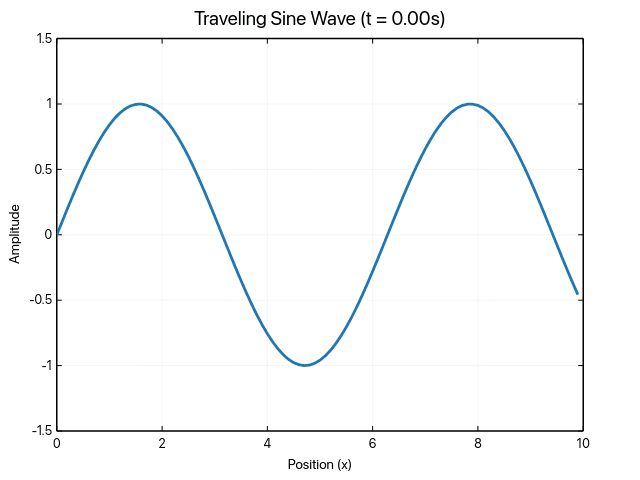
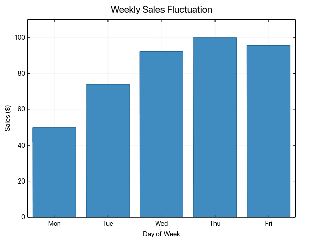
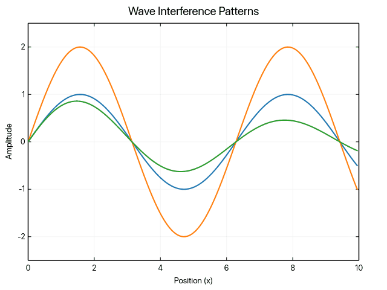

# Animation

GIF examples generated from the animation helpers and `record!` flows.

## Examples

### Traveling Sine Wave

Animated sine wave generated with the `record!` macro.

Source: `examples/generate_animation_gallery.rs`

### Animated Bars

Animated categorical data example rendered as a GIF.

Source: `examples/generate_animation_gallery.rs`

### Wave Interference

Animated wave interference example rendered as a GIF.

Source: `examples/generate_animation_gallery.rs`

[← Back to Gallery](../README.md)
