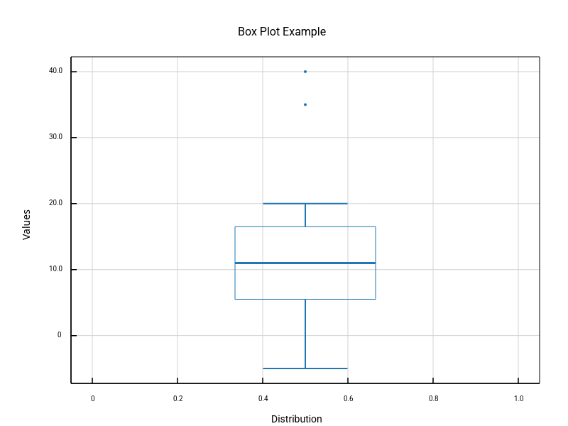
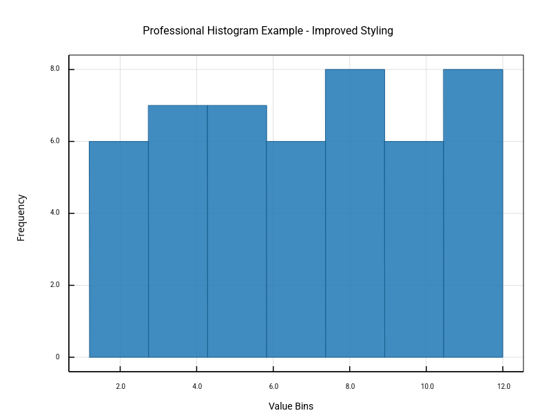
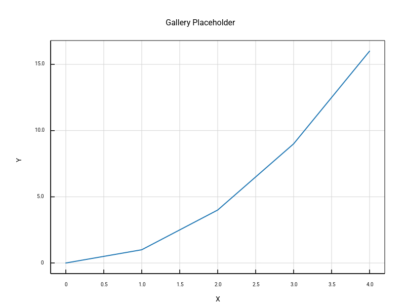

# Basic Plots

Fundamental plot types for everyday data visualization.

## Box Plot Example

Statistical distribution visualization with quartiles, median, and outliers.

## Histogram Example

Data distribution analysis with automatic binning.

## Line Plot

Simple line plot demonstration (placeholder from tests).

[← Back to Gallery](../README.md)
