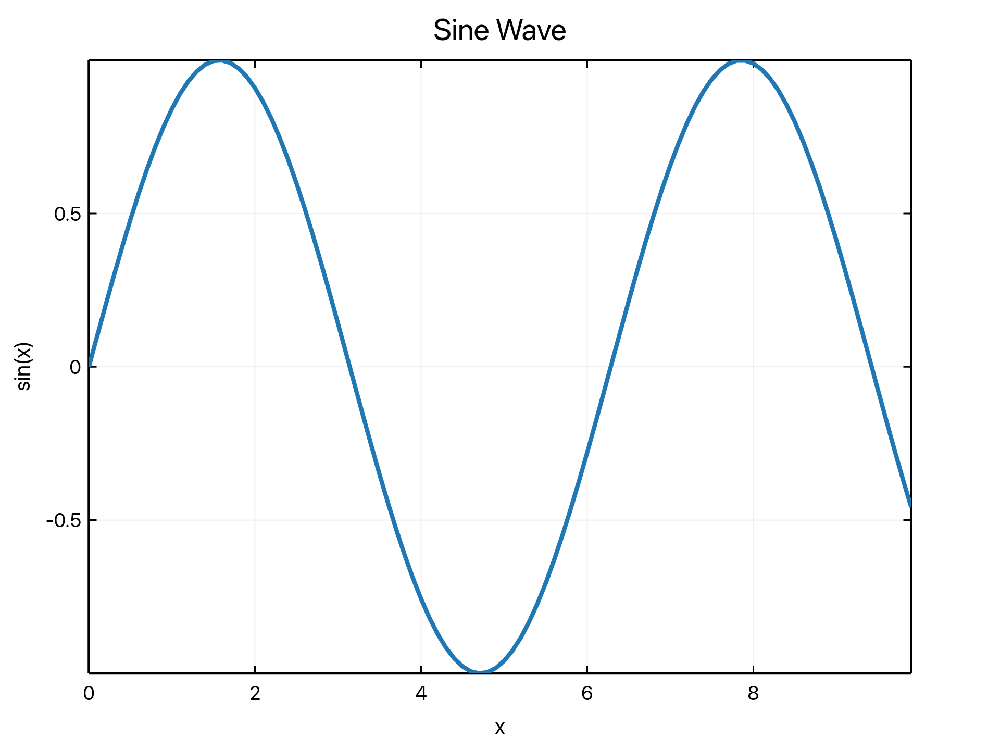
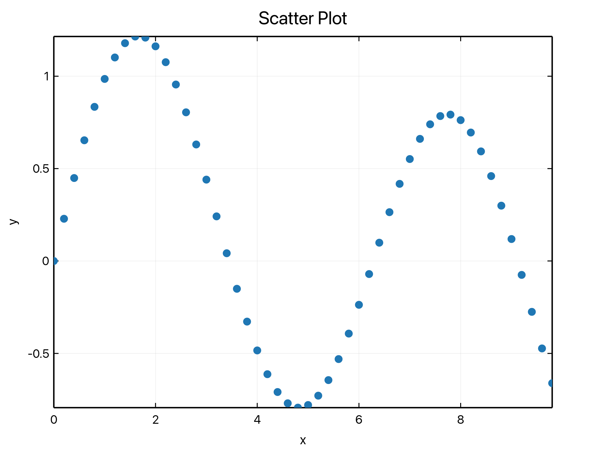
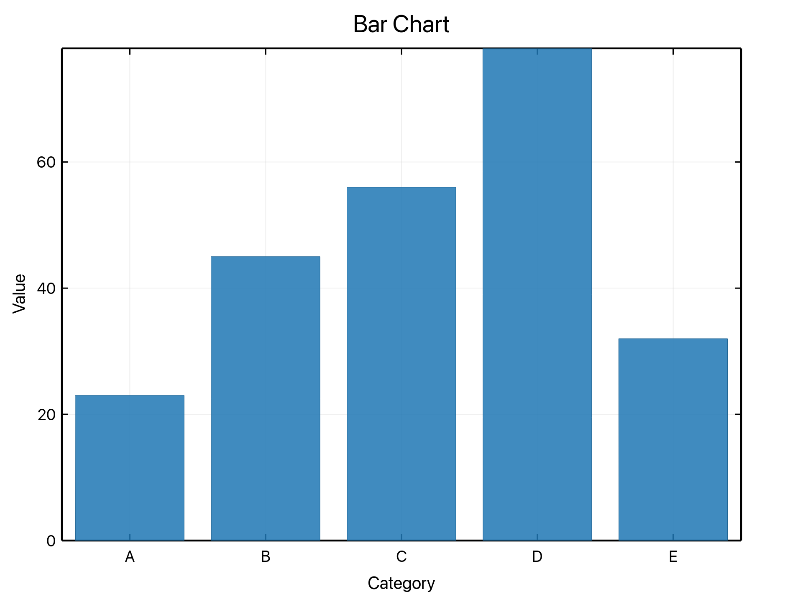
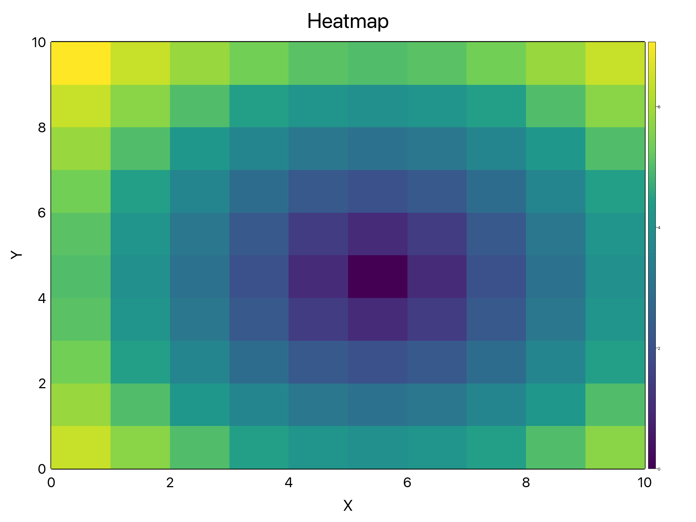

# Basic Plots

Fundamental plot types for everyday visualization and quick starts.

## Examples

### Line Plot

The core line example used across the README and rustdoc.

Source: `examples/doc_line_plot.rs`

### Scatter Plot

A compact point-cloud example for discrete observations.

Source: `examples/doc_scatter_plot.rs`

### Bar Chart

Categorical values rendered as a simple bar chart.

Source: `examples/doc_bar_chart.rs`

### Heatmap

Matrix data shown with a continuous color scale.

Source: `examples/doc_heatmap.rs`

[← Back to Gallery](../README.md)
