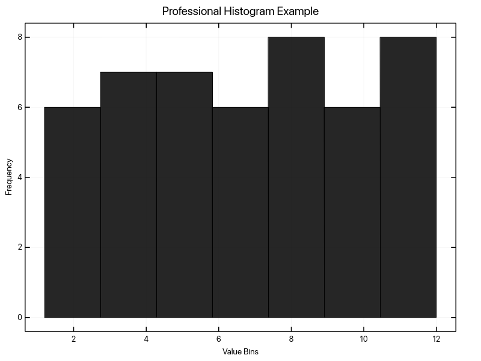
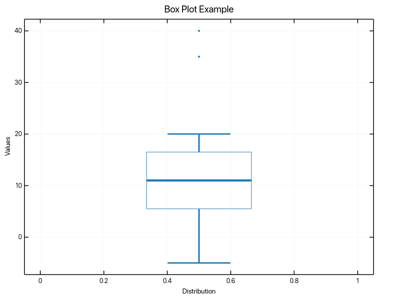

# Basic Plots

Fundamental plot types for everyday visualization and quick starts.

## Examples

### Line Plot

The core line example used across the README and rustdoc.

Source: `examples/doc_line_plot.rs`

### Histogram Example

Standalone histogram example rendered from the example suite.

Source: `examples/histogram_example.rs`

### Boxplot Example

Standalone boxplot example rendered from the example suite.

Source: `examples/boxplot_example.rs`

[← Back to Gallery](../README.md)
