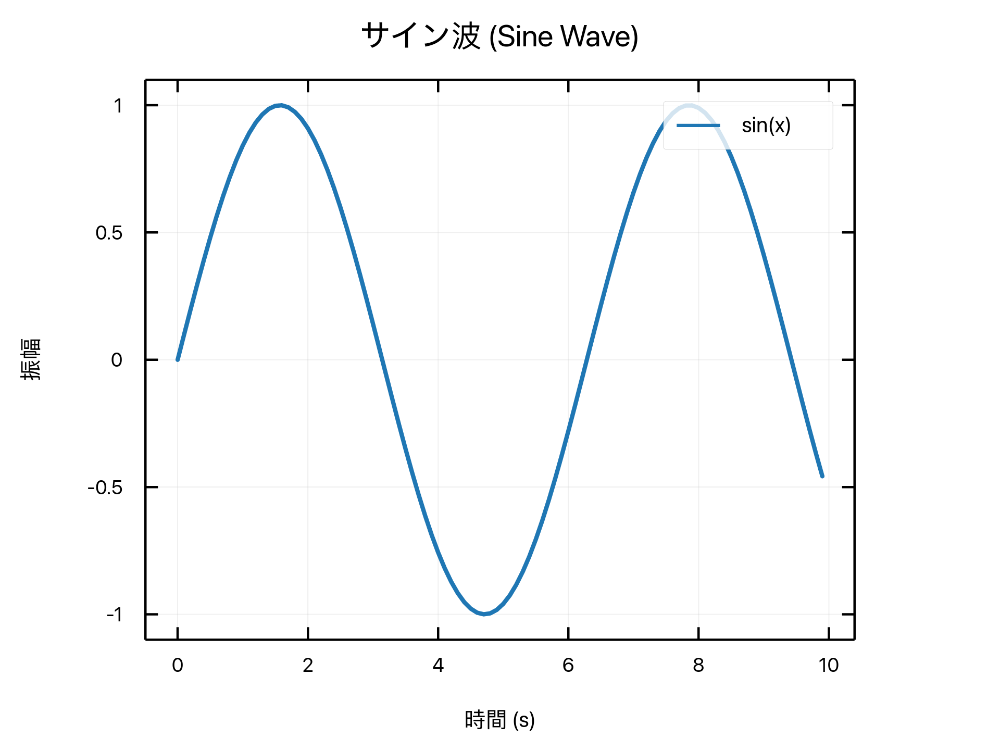
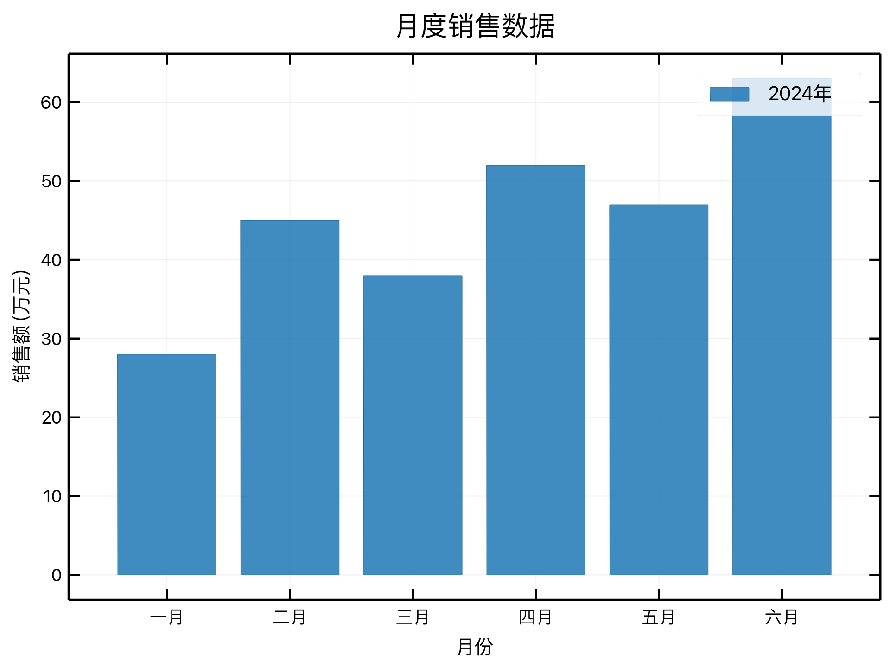
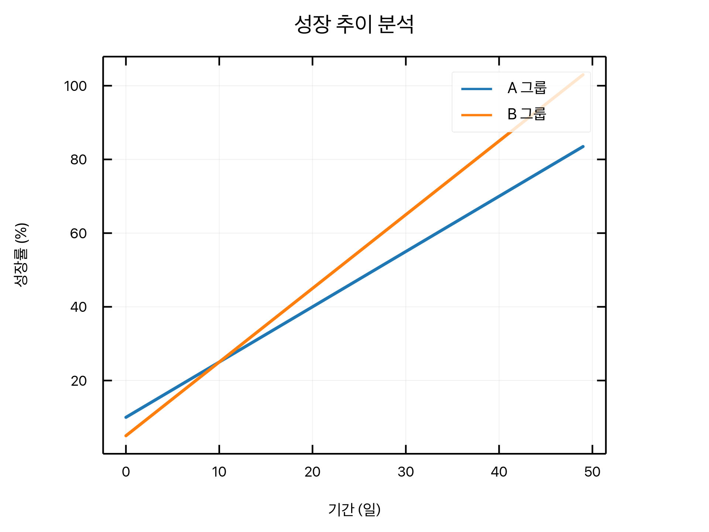
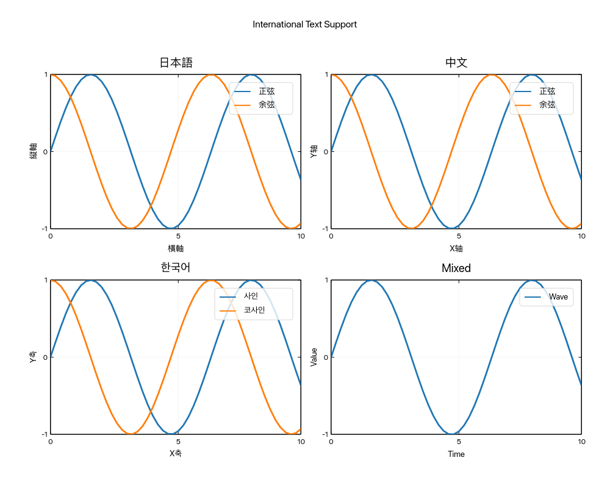

# Internationalization Gallery

Demonstration of ruviz's support for international text rendering including CJK (Chinese, Japanese, Korean) characters.

## Examples

### Japanese Labels



Sine wave plot with Japanese title, axis labels, and legend.

[View source code](https://github.com/Ameyanagi/ruviz/blob/main/examples/doc_international.rs#L28-L44)

---

### Chinese Labels



Bar chart with simplified Chinese text for sales data visualization.

[View source code](https://github.com/Ameyanagi/ruviz/blob/main/examples/doc_international.rs#L47-L63)

---

### Korean Labels



Line plot with Korean labels showing growth trend analysis.

[View source code](https://github.com/Ameyanagi/ruviz/blob/main/examples/doc_international.rs#L66-L85)

---

### Multi-Language Comparison



Subplot grid comparing the same visualization in Japanese, Chinese, Korean, and mixed script text.

[View source code](https://github.com/Ameyanagi/ruviz/blob/main/examples/doc_international.rs#L88-L146)

---

## Running the Examples

Generate all internationalization images:

```bash
cargo run --example doc_international
```

[← Back to Gallery](../README.md)
