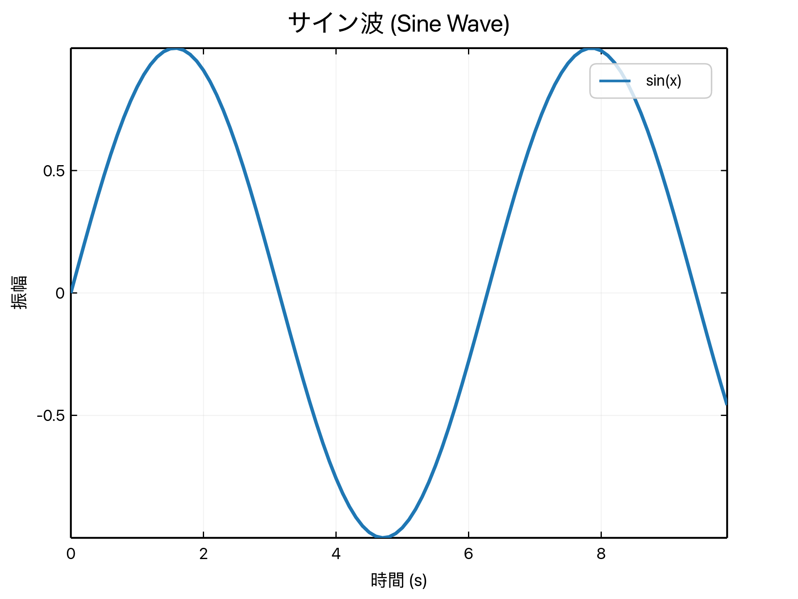
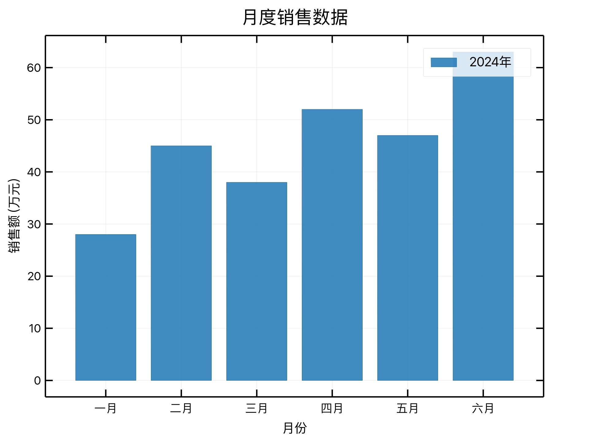
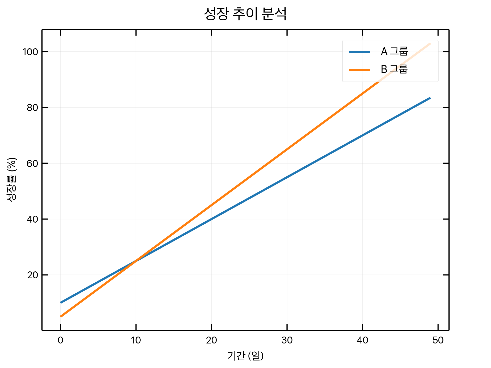
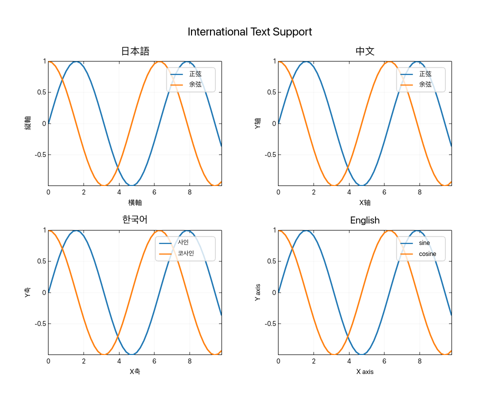

# Internationalization

Examples covering multilingual text layout and CJK rendering.

## Examples

### Japanese Labels

Japanese-language labels rendered with the default browser/document fonts.

Source: `examples/doc_international.rs`

### Chinese Labels

Chinese-language bar chart rendering example.

Source: `examples/doc_international.rs`

### Korean Labels

Korean-language line chart rendering example.

Source: `examples/doc_international.rs`

### Multi-Language Comparison

A four-panel comparison of CJK and mixed-language labels.

Source: `examples/doc_international.rs`

[← Back to Gallery](../README.md)
