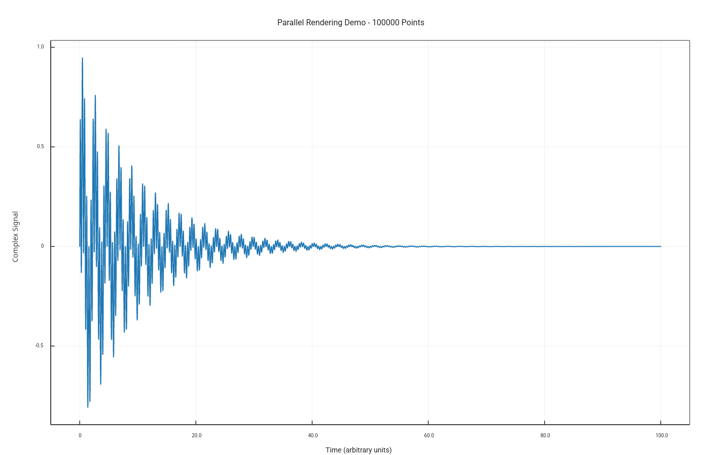
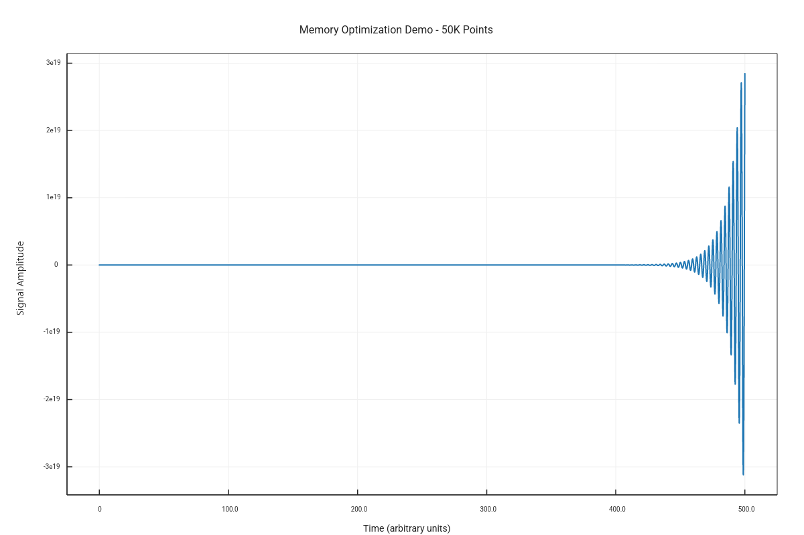

# Performance Demonstrations

Large dataset handling with parallel rendering and optimization.

## Parallel Rendering (100K Points)

High-performance parallel rendering of 100,000 data points.

**Performance:**
- 100K points rendered efficiently
- Multi-threaded parallel backend
- Automatic optimization
- Sub-second rendering time

## Memory Optimization

Efficient memory management for large datasets (50K points).

**Features:**
- Buffer pooling
- Zero-copy operations
- Lazy evaluation
- Minimal memory overhead

[← Back to Gallery](../README.md)
