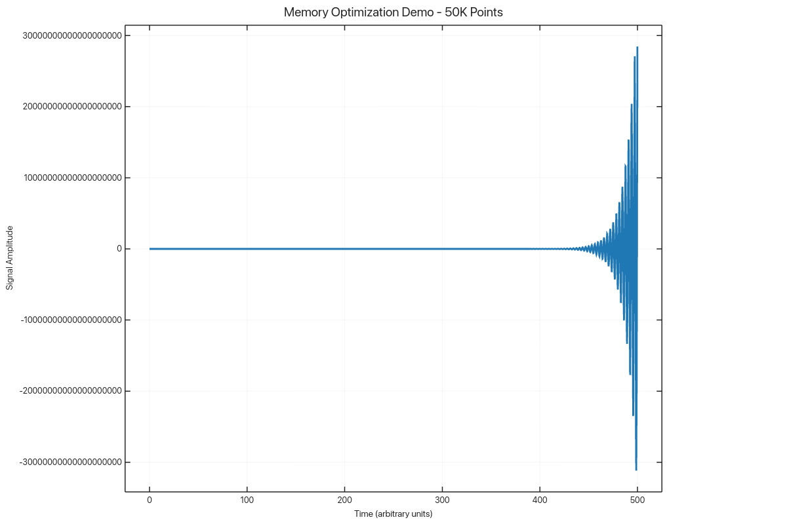
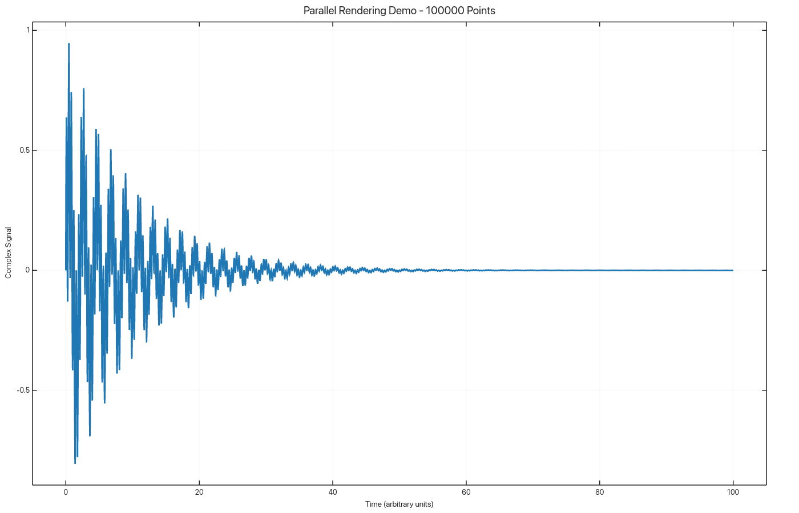

# Performance

Large-dataset examples and optimization-oriented render outputs.

## Examples

### Memory Optimization Demo

Performance-oriented chart generated by the memory optimization example.

Source: `examples/memory_optimization_demo.rs`

### Parallel Demo 100k

Parallel rendering example targeting a large 100k-point dataset.

Source: `examples/parallel_demo.rs`

[← Back to Gallery](../README.md)
