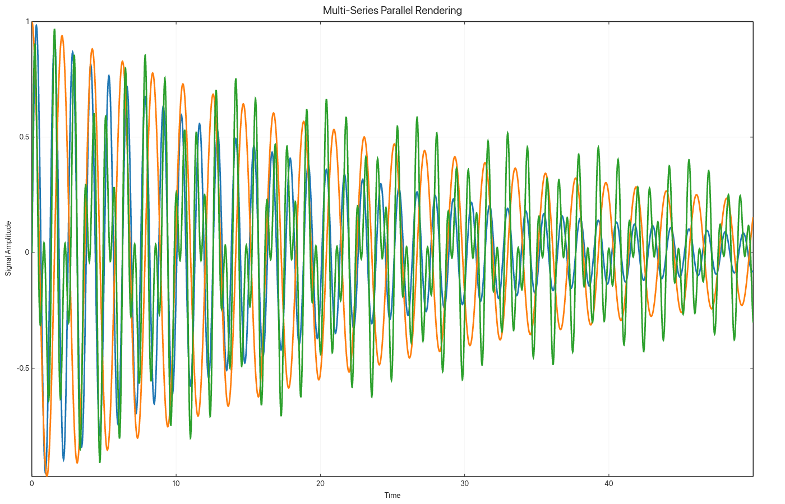

# Performance

Large-dataset examples and optimization-oriented render outputs.

## Examples

### Parallel Multi-Series

A large multi-series render produced by the parallel example suite.

Source: `examples/parallel_demo.rs`

### Memory-Optimized Signal

A dense signal render generated by the memory optimization example.

Source: `examples/memory_optimization_demo.rs`

[← Back to Gallery](../README.md)
