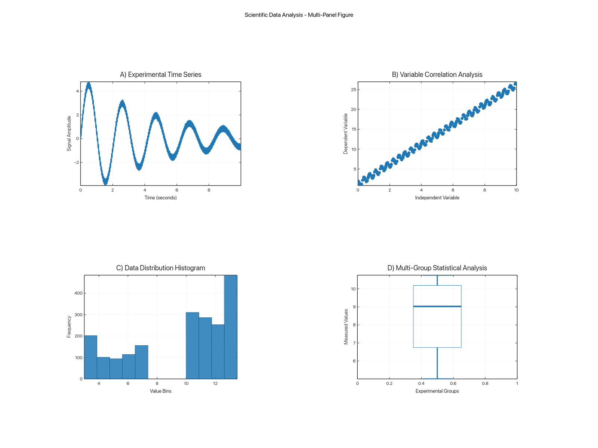
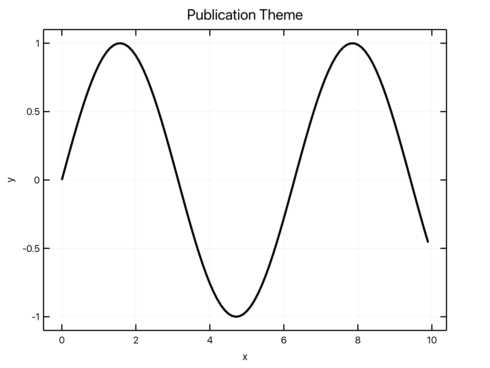
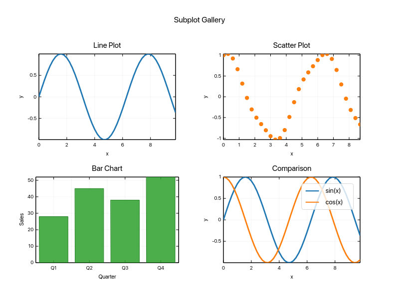

# Publication Quality

Layouts and themes tuned for papers, reports, and slides.

## Examples

### Scientific Analysis Figure

Multi-panel figure assembled for report-style presentation.

Source: `examples/scientific_showcase.rs`

### Publication Theme

Publication-oriented theme reference used by docs and comparisons.

Source: `examples/doc_themes.rs`

### Subplot Layout

A multi-panel subplot layout used for publication-scale figures.

Source: `examples/doc_subplots.rs`

[← Back to Gallery](../README.md)
