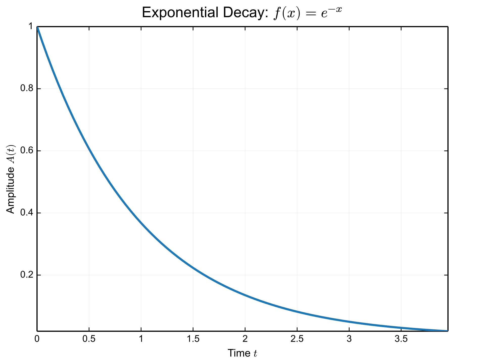

# Publication Quality

Layouts and themes tuned for papers, reports, and slides.

## Examples

### Scientific Analysis Figure

Multi-panel figure assembled for report-style presentation.

Source: [examples/scientific_showcase.rs](../../../examples/scientific_showcase.rs)

Guide: [Subplots & Composition](../../guide/06_subplots.md)

### Publication Theme

Publication-oriented theme reference used by docs and comparisons.

Source: [examples/doc_themes.rs](../../../examples/doc_themes.rs)

### Mixed Plots in a 2×2 Grid

A composition example combining a line plot, scatter plot, bar chart, and multi-series comparison with a legend in a 2×2 grid.

Source: [examples/doc_subplots.rs](../../../examples/doc_subplots.rs)

Guide: [Subplots & Composition](../../guide/06_subplots.md)

### Typst Labels

Publication text rendered through Typst math mode.

Source: [examples/doc_typst_text.rs](../../../examples/doc_typst_text.rs)

[← Back to Gallery](../README.md)
