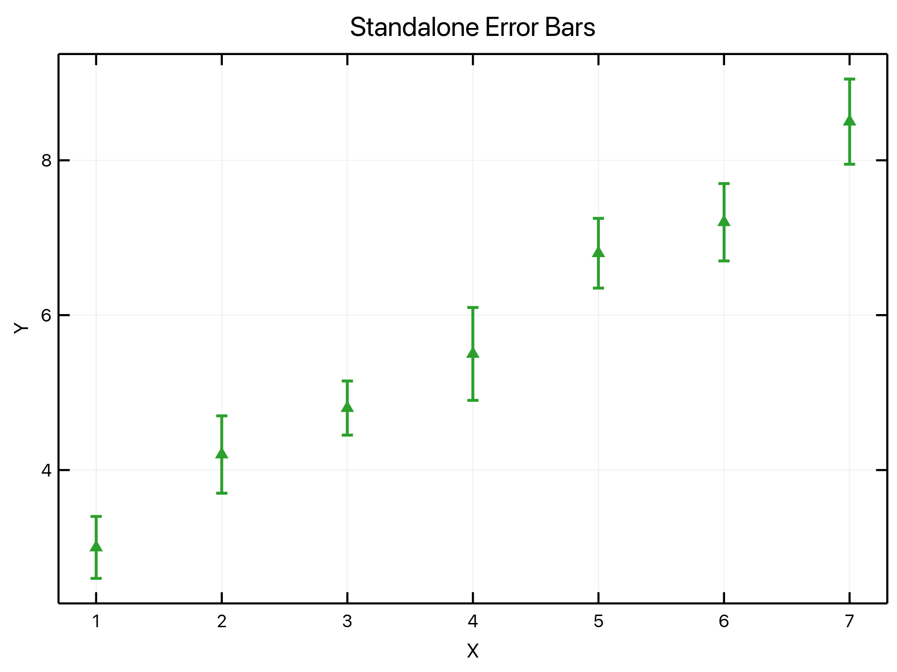
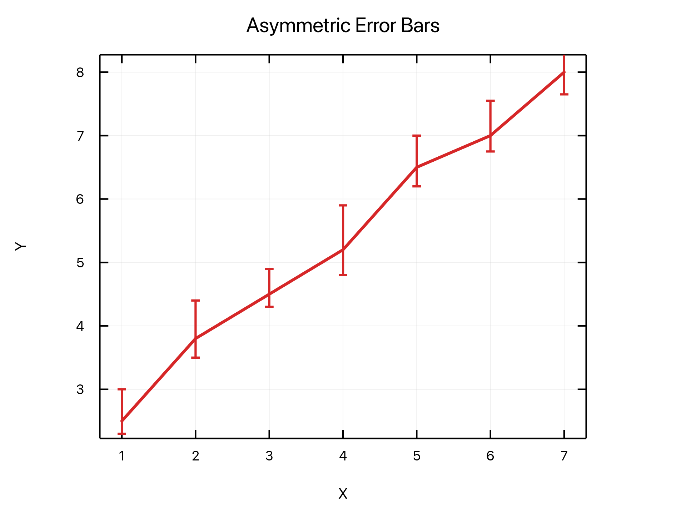
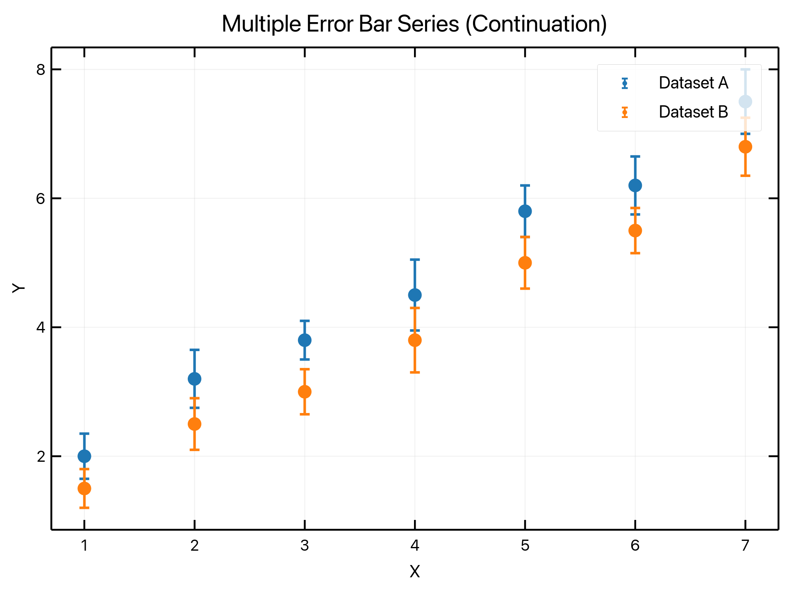

# Statistical Plots

Statistical analysis and distribution visualization.

## Examples

### Histogram

### Error Bars on Line and Scatter Plots

Error bars attached to line and scatter series using the modifier pattern.

### Standalone Error Bars

Dedicated error bar series with markers.

### Asymmetric Error Bars

Error bars with different upper and lower bounds.

### Multiple Error Bar Series

Chaining multiple error bar series using the continuation method.

[← Back to Gallery](../README.md)
