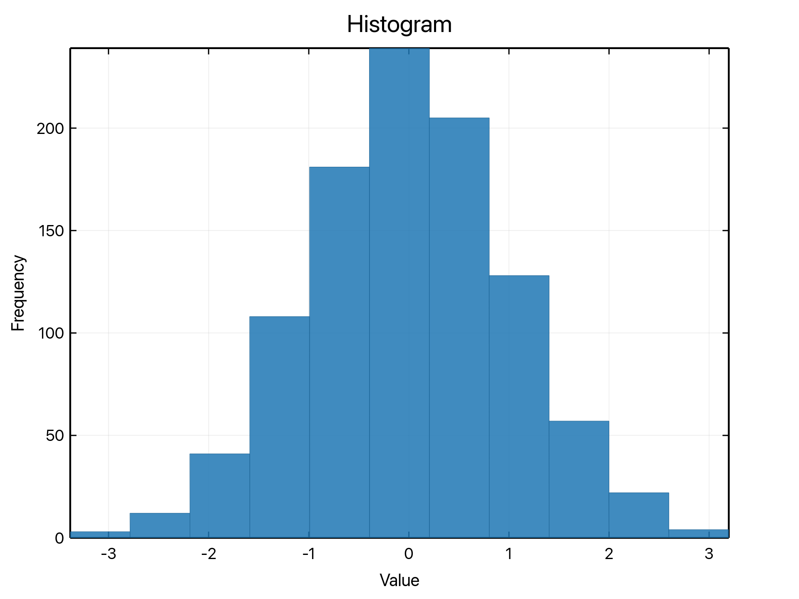
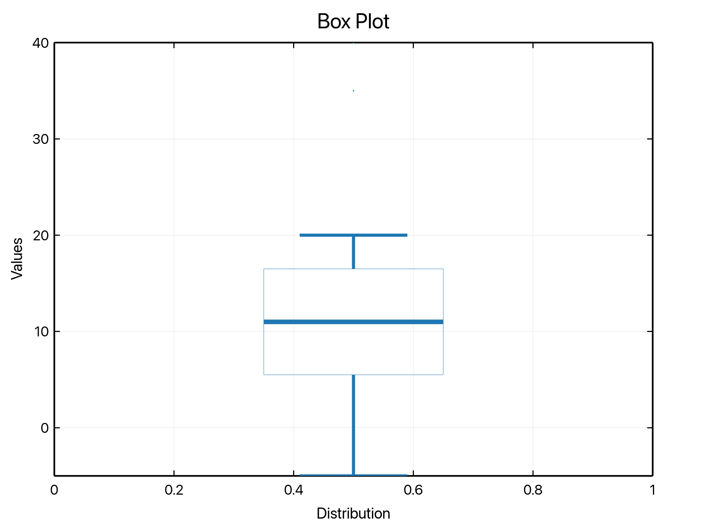
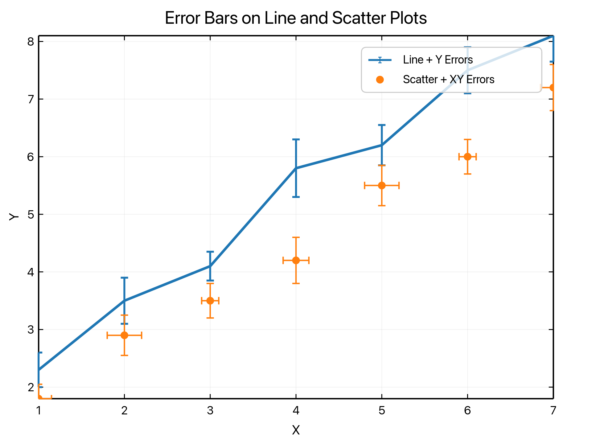

# Statistical Plots

Distribution, density, and uncertainty-focused plot recipes.

## Examples

### Histogram

Distribution counts rendered with the default histogram styling.

Source: `examples/doc_histogram.rs`

### Box Plot

Quartiles, whiskers, and outliers in a compact statistical summary.

Source: `examples/doc_boxplot.rs`

### Kernel Density Estimate

KDE example copied from the rustdoc image set.

Source: `examples/doc_kde.rs`

### ECDF

Empirical CDF example copied from the rustdoc image set.

Source: `examples/doc_ecdf.rs`

### Violin Plot

Distribution plot with quartile-aware styling.

Source: `examples/doc_violin.rs`

### Error Bars

Uncertainty intervals attached to line and scatter series.

Source: `examples/doc_errorbar.rs`

[← Back to Gallery](../README.md)
