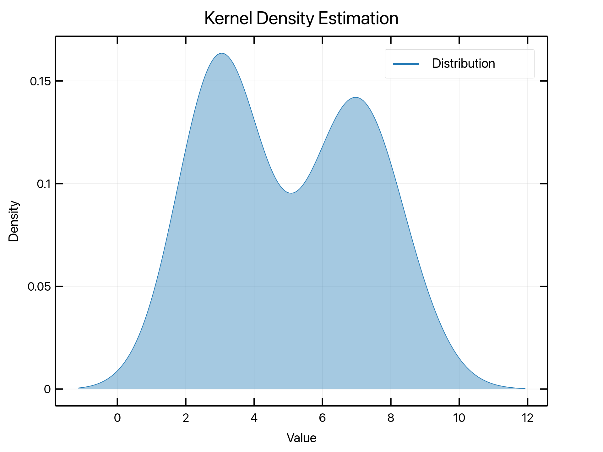
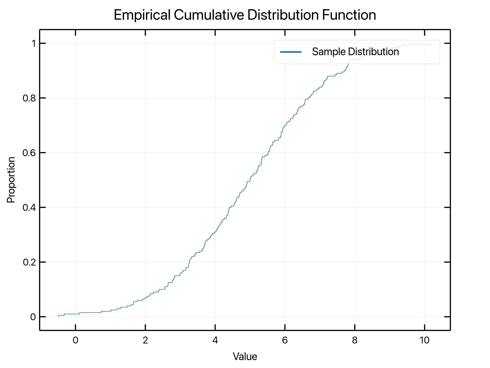
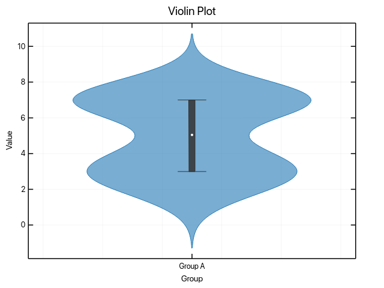
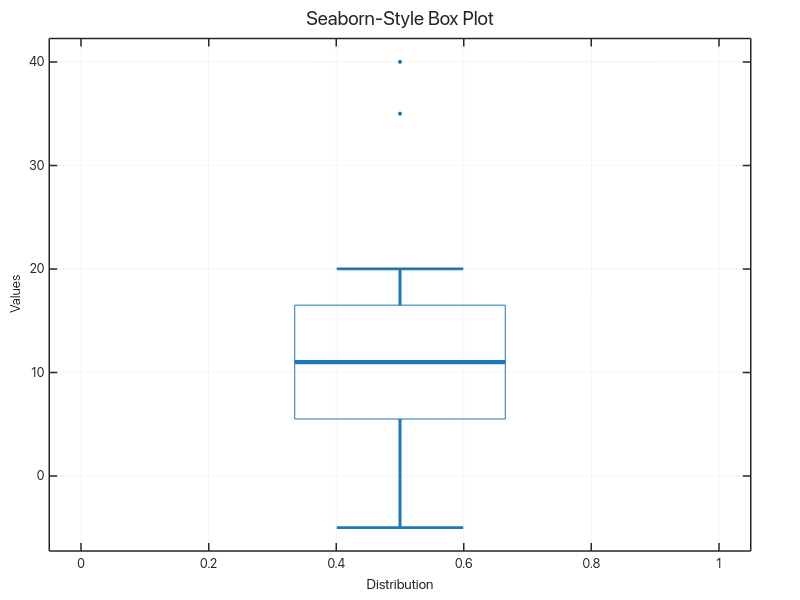

# Statistical Plots

Distribution, density, and uncertainty-focused plot recipes.

## Examples

### Kernel Density Estimate

KDE example copied from the rustdoc image set.

Source: `examples/doc_kde.rs`

### ECDF

Empirical CDF example copied from the rustdoc image set.

Source: `examples/doc_ecdf.rs`

### Violin Plot

Distribution plot with quartile-aware styling.

Source: `examples/doc_violin.rs`

### Seaborn-Style Boxplot

A style-heavy statistical example generated from the example suite.

Source: `examples/seaborn_style_example.rs`

[← Back to Gallery](../README.md)
