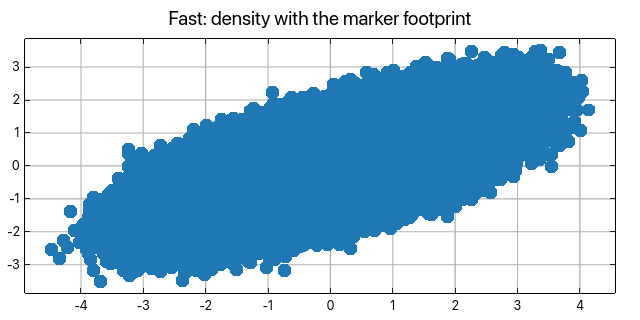
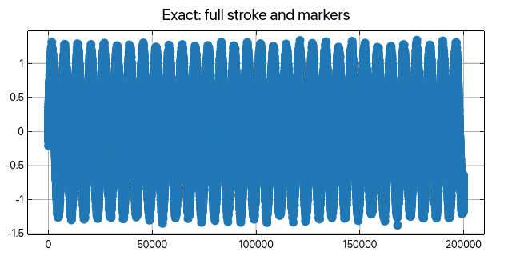

# Performance Optimization

Practical performance guidance for the current `ruviz` implementation.

## Start Here

Use release builds before adding feature flags:

```bash
cargo run --release
```

Recommended release profile:

```toml
[profile.release]
lto = true
codegen-units = 1
opt-level = 3
```

Benchmark with your actual plot content. Marker-heavy scatter plots, text, high
DPI output, and very large canvases stress different parts of the renderer.

## Public Output Paths

The public static-output APIs are conservative today:

- `render()` returns an in-memory `Image`.
- `render_png_bytes()` returns PNG bytes.
- `save()` writes PNG bytes to disk.
- `export_svg()` and `render_to_svg()` use the SVG renderer.
- `save_pdf()` is available with the `pdf` feature and converts SVG to PDF.

For PNG/image output, the current public path uses the reference raster pipeline
for output parity unless `BackendType::DataShader` is explicitly configured for
a supported native `Plot` PNG scatter workload. `.backend(...)` stores an
explicit preference; `.auto_optimize()` conservatively stores Skia instead of
advertising a backend that cannot execute across all public raster operations.
`.resolved_backend_name()` reports the backend that native `Plot` PNG
render/save will actually use for the current plot.

Reactive plots are resolved to a static snapshot first. Plain `render()` and
`save()` sample temporal `Signal` sources at `0.0`; `render_at(t)` samples them
at `t`.

## Feature Flags

```toml
[dependencies]
ruviz = "0.9.0"
```

Useful opt-in features:

- `parallel`: multi-threaded tile rasterization in the software 3D backend. On by default; no effect on 2D.
- `simd`: enables SIMD support used by performance-oriented code paths.
- `performance`: shorthand for `["parallel", "simd"]`.
- `gpu`: enables GPU types and `.gpu(true)` metadata.

These features can increase compile time and dependency surface. Add them when a
measured code path benefits from them.

## Large Datasets

Large plots are still valid through the normal API:

```rust
use ruviz::prelude::*;

let points = 250_000;
let x: Vec<f64> = (0..points).map(|i| i as f64 * 0.001).collect();
let y: Vec<f64> = x.iter().map(|v| v.sin()).collect();

Plot::new()
    .scatter(&x, &y)
    .save("large_scatter.png")?;
```

For dense plots where many data points map to the same pixels, downsampling or
aggregating before plotting is often more useful than enabling a backend flag.

For large scatter plots, `.auto_optimize()` keeps the executable Skia backend
instead of selecting a backend from point count alone:

```rust
use ruviz::prelude::*;

let points = 250_000;
let x: Vec<f64> = (0..points).map(|i| i as f64 * 0.001).collect();
let y: Vec<f64> = x.iter().map(|v| v.sin()).collect();

let plot = Plot::new()
    .scatter(&x, &y)
    .auto_optimize()
    .into_plot();

println!("public PNG backend: {}", plot.resolved_backend_name());
```

Use explicit `BackendType::DataShader` only when you deliberately want density
aggregation instead of per-point scatter markers.

## Density Scatters and Fast Mode

Exact rendering composites every marker, so its cost grows with the point
count. A density scatter instead aggregates points into a plot-area count
grid and colors each pixel once, so its cost grows with the plot's pixel
count — a 10,000,000-point scatter renders in tens of milliseconds instead
of seconds. Ask for it per series:

```rust
use ruviz::prelude::*;

let points = 2_000_000;
let x: Vec<f64> = (0..points).map(|i| (i as f64 * 0.37).sin()).collect();
let y: Vec<f64> = (0..points).map(|i| (i as f64 * 0.91).cos()).collect();

Plot::new()
    .scatter(&x, &y)
    .density(true)
    .save("density_scatter.png")?;
```

Or opt into fast mode, which upgrades any scatter series holding more points
than the plot has pixels — one point per pixel — lets a marked solid line's
stroke take the min/max column reduction a bare solid line always gets (its
markers stay complete), and leaves everything below those thresholds
byte-identical to exact rendering:

```rust
use ruviz::prelude::*;

let points = 2_000_000;
let x: Vec<f64> = (0..points).map(|i| (i as f64 * 0.37).sin()).collect();
let y: Vec<f64> = (0..points).map(|i| (i as f64 * 0.91).cos()).collect();

Plot::new()
    .fast(true)
    .scatter(&x, &y)
    .save("fast_scatter.png")?;
```

In Python the same pair is `scatter(x, y, density=True)` and `plot.fast()`.

### Comparing the output

The pairs below are generated by `examples/doc_fast_mode.rs` from identical
seeded data, so the visual difference shown is exactly what fast mode
trades. One million scatter points (exact 220ms, fast ~14ms warm on an
Apple M4):

| Exact | Fast |
|---|---|
|  |  |

The density frame keeps the silhouette because counts are spread over the
marker footprint; what it loses is per-marker edge antialiasing, visible
only under close inspection at the cloud's fringe.

Two hundred thousand line points with circle markers (exact ~0.8s, fast
~30ms warm):

| Exact | Fast |
|---|---|
|  |  |

The stroke is decimated to its per-column min/max envelope — visually
equivalent for a solid stroke — while every marker stays at its exact
position.

### What density rendering preserves

Each pixel takes the series color at the scatter-equivalent alpha
`1 - (1 - alpha)^covering_markers`, where the count grid is spread over the
series' marker footprint — so the density image keeps the exact render's
silhouette and reads as what the markers converge to, not as a heatmap.
Series z-order, explicit colors, and palette colors all behave as in exact
mode.

The footprint is described row by row, which models a marker exactly when
every row of it is one centered span:

| Marker | Density footprint |
|---|---|
| `circle` | exact (disk profile) |
| `square` | exact (box profile) |
| `diamond` | exact (linear taper) |
| `triangle`, `triangle-down` | exact (asymmetric row profiles) |
| `plus` | exact (narrow arms, full-width crossbar) |
| `cross`, `star` | approximated by their bounding disk — an X splits a row into two spans |
| `circle-open`, `square-open`, `triangle-open`, `diamond-open` | rendered filled — a hollow interior also needs two spans per row |

### The exactness guarantee

Exact rendering is the default and nothing in this section changes it: a
plot that never calls `fast(...)` or `density(...)` renders byte-identically
whether or not these features exist. Fast mode itself is also exact below
its thresholds — a scatter under one point per plot pixel and any line short
enough to skip stroke reduction produce the same bytes with fast mode on or
off. When output must be reproducible to the byte — golden tests, archival
figures, diffing pipelines — stay in exact mode.

### Limitations of density rendering

- Output is close to, but not pixel-identical with, exact rendering: marker
  edge antialiasing and the exact per-marker compositing order are replaced
  by the per-pixel alpha formula.
- `cross` and `star` markers are approximated by their bounding disk, and
  open (outline-only) markers render filled — see the footprint table above.
- Marker rims (`edge_color`/`edge_width`) are not drawn; the footprint is the
  filled shape.
- SVG export reports a clear unsupported error for density series — render to
  PNG, or disable density for vector output.
- Density applies to scatter series only; other plot kinds always render
  exactly.
- An explicit per-series `density(...)` always wins over fast mode's
  automatic threshold, in both directions.

### Limitations in Python and the notebook widget

- The Python extension renders through a thread pool (rayon). A process that
  renders once and then **forks** — Linux `multiprocessing`'s default start
  method — inherits a pool whose worker threads do not exist, and a render in
  the child hangs. Use the `"spawn"` (or `"forkserver"`) start method when
  combining ruviz with `multiprocessing`, or render only in the children.
  This is the same caveat as NumPy/polars and every other pooled native
  library.
- The notebook widget replays snapshots in the browser, which ignores the
  plot-level `fast` flag: a fast plot's widget view renders exactly (slower,
  never wrong). Per-series `density=True` is honored everywhere, including
  the widget.

### Limitations of fast mode on lines

- Fast mode reduces a marked solid line's stroke to its per-column min/max
  envelope. The stroke's bytes change (the envelope is visually equivalent
  for a solid stroke but not pixel-identical); every marker is still drawn
  at its exact position.
- Dashed and dotted lines are never reduced — decimation would scramble the
  dash phase — so a very dense non-solid line stays at full cost in every
  mode. If that cost matters, decimate the data before plotting.

## Benchmark Template

```rust
use ruviz::prelude::*;
use std::time::Instant;

let start = Instant::now();
let image = Plot::new()
    .line(&x, &y)
    .render()?;

println!(
    "Rendered {}x{} in {:?}",
    image.width(),
    image.height(),
    start.elapsed()
);
```

## Recommendations

- Start with plain `save()` or `render()`.
- Use release builds for any timing comparison.
- Prefer smaller canvases and explicit data reduction when visual density is too high.
- Use `.size(width_in, height_in)` plus `.dpi(...)` for print output.
- Use `.resolved_backend_name()` when you need to verify the actual public PNG backend.

## Related Guides

- [Scatter benchmarks](../benchmarks.md) — measured cold/warm comparisons
  against xy and matplotlib, with the reproduction commands.
- [Backend Selection](07_backends.md)
- [Installation](02_installation.md)
- [Advanced Usage](11_advanced.md)
