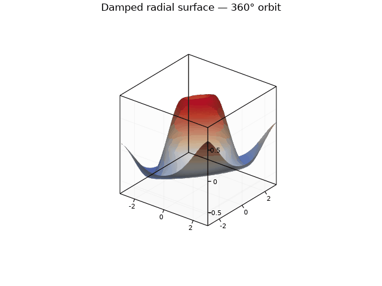

# 3D plots

Ruviz provides scatter, line, surface, and wireframe plots behind the exact
feature name `3d`:

```toml
[dependencies]
ruviz = { version = "0.12.0", features = ["3d"] }
```

The canonical entry points are deliberately small:

```rust,ignore,reason=requires-3d-feature
scatter3d(&x, &y, &z)
line3d(&x, &y, &z)
surface(&x, &y, &z)
wireframe(&x, &y, &z)
```

All four return builders. Add labels, camera settings, and output methods by
chaining calls on the builder.

## Scatter

`x`, `y`, and `z` must have equal lengths.

```rust,ignore,reason=requires-3d-feature
use ruviz::prelude::*;

fn main() -> PlotResult<()> {
    let x = [0.0, 1.0, 2.0, 3.0];
    let y = [0.2, 1.4, 0.8, 2.7];
    let z = [0.5, 1.8, 1.1, 3.2];

    scatter3d(&x, &y, &z)
        .title("Samples")
        .xlabel("x")
        .ylabel("y")
        .zlabel("z")
        .marker_size(8.0)
        .color(Color::BLUE)
        .save("scatter3d.png")
}
```

See the complete
[`doc_scatter3d` example](../../examples/doc_scatter3d.rs).

## Line

`line3d` connects equal-length `x`, `y`, and `z` coordinates in input order.
A `NaN` coordinate creates a gap instead of connecting unrelated segments.

```rust,ignore,reason=requires-3d-feature
use ruviz::prelude::*;

fn main() -> PlotResult<()> {
    let t: Vec<f64> = (0..200).map(|i| f64::from(i) * 0.08).collect();
    let x: Vec<f64> = t.iter().map(|v| v.cos()).collect();
    let y: Vec<f64> = t.iter().map(|v| v.sin()).collect();
    let z: Vec<f64> = t.iter().map(|v| v * 0.08).collect();

    line3d(&x, &y, &z)
        .title("Helix")
        .line_width(2.0)
        .save("line3d.png")
}
```

See the complete [`doc_line3d` example](../../examples/doc_line3d.rs).

## Surface

`surface` takes one-dimensional coordinate vectors and a two-dimensional
height grid. The required shape is:

```text
z.shape() == (y.len(), x.len())
z[y_index][x_index]
```

This convention avoids allocating full `meshgrid`-style `x` and `y` matrices.
Nested arrays and vectors work directly, as do supported two-dimensional data
containers.

```rust,ignore,reason=requires-3d-feature
use ruviz::prelude::*;

fn main() -> PlotResult<()> {
    let x = [-1.5, -0.5, 0.5, 1.5];
    let y = [-1.0, 0.0, 1.0];
    let z = [
        [-0.4, 0.4, 0.4, -0.4],
        [ 0.1, 1.0, 1.0,  0.1],
        [-0.4, 0.4, 0.4, -0.4],
    ];

    surface(&x, &y, &z)
        .cmap(ColorMap::plasma())
        .sampling(SurfaceSampling::MaxGrid {
            rows: 100,
            columns: 100,
        })
        .save("surface3d.png")
}
```

`SurfaceSampling::Auto` is the default and currently preserves the full grid,
as does `Full`. For bounded work on large inputs, select
`MaxGrid { rows, columns }` explicitly; both dimensions must be at least `2`.
`NaN` heights make holes, while infinite values are rejected.

See the complete
[`doc_surface3d` example](../../examples/doc_surface3d.rs).

## Animation

The `3d` and `animation` features can be combined to encode rendered camera
frames directly as a GIF:

```bash
cargo run --no-default-features --features 3d,animation \
  --example doc_surface3d_animation
```

The complete
[`doc_surface3d_animation` example](../../examples/doc_surface3d_animation.rs)
renders a deterministic 360-degree orthographic orbit through the public
`GifEncoder`. An optional first command-line argument selects the output path.
The camera changes on every frame; the surface data, theme, and output
dimensions remain fixed. The showcase omits optional axis labels because the
current alpha layout does not yet reserve stable label protrusions throughout
a full orbit.



## Wireframe

Wireframes use the same grid shape as surfaces:

```rust,ignore,reason=requires-example-data
wireframe(&x, &y, &z)
    .line_width(1.5)
    .color(Color::DARK_GRAY)
    .save("wireframe3d.png")?;
```

Use `MaxGrid { rows, columns }` to cap grid density; `Auto` and `Full`
currently preserve the full grid. See the complete
[`doc_wireframe3d` example](../../examples/doc_wireframe3d.rs).

## Camera and axes

Every 3D builder exposes the same camera and axis methods:

```rust,ignore,reason=requires-example-data
surface(&x, &y, &z)
    .azimuth_deg(-45.0)
    .elevation_deg(25.0)
    .roll_deg(0.0)
    .perspective_deg(45.0)
    .look_at(0.0, 0.0, 0.0)
    .xlim(-2.0, 2.0)
    .ylim(-2.0, 2.0)
    .zlim(-1.0, 1.0)
    .save("camera.png")?;
```

The defaults are azimuth `-60°`, elevation `30°`, roll `0°`, orthographic
projection, automatic `4:4:3` axis aspect, and zoom `1`. Use `.orthographic()`
to switch back from perspective projection. For a reusable configuration,
construct a `Camera3D` and pass it to `.camera(camera)`.

## Multiple series

Start with any 3D builder, then append another 3D series:

```rust,ignore,reason=requires-example-data
scatter3d(&x1, &y1, &z1)
    .label("measurements")
    .line3d(&x2, &y2, &z2)
    .label("model")
    .save("combined.png")?;
```

All series share one camera, three axes, and one depth buffer. This makes
occlusion consistent between unlike series.

## Legends and colorbars

Add `.label(...)` to any series to create an automatic outside-right legend.
Surface colorbars remain opt-in:

```rust,ignore,reason=requires-example-data
surface(&x, &y, &z)
    .label("terrain")
    .colorbar(true)
    .save("terrain.png")?;
```

The CPU, hybrid SVG/PDF, native GPU, and browser WebGPU paths use the same
decoration layout. A fixed-color surface requested with `.colorbar(true)`
shows a solid color mapping rather than a misleading gradient.

## Output and interaction

- `.save("plot.png")` and `.render_png_bytes()` use the CPU renderer.
- `.export_svg("plot.svg")` embeds the depth-tested 3D layer as a raster image
  while retaining vector text and decorations.
- `.render_auto()` opts into direct native GPU rendering when available and
  falls back to CPU; use `.render_auto_with_diagnostics()` to inspect the
  actual backend and fallback reason.
- With `gpu`, `.save_gpu("plot.png")` and `.render_gpu()` use the GPU renderer.
- With `interactive-gpu`, `.show()` opens the interactive viewer. Orbit, pan,
  and zoom update the same camera model used by static rendering.

The `3d` feature alone is sufficient for static PNG and SVG output. Prefer an
explicit `SurfaceSampling::MaxGrid` and contiguous numeric inputs when
throughput or memory use matters.

## Backend capabilities

| API path | Rendering and presentation | Alpha status |
| --- | --- | --- |
| Rust `3d` | Deterministic CPU Image/PNG and hybrid SVG/PDF | Reference output on supported native targets; CPU rendering also compiles for wasm |
| Rust `3d,gpu` | Direct offscreen wgpu, followed by readback for Image/PNG | `render_gpu()` fails if unavailable; `render_auto()` reports any CPU fallback |
| Rust `3d,interactive-gpu` | Direct retained wgpu surface in the native winit viewer | Zero interactive image readback or CPU framebuffer upload |
| `ruviz-web` `3d-gpu` | Main-thread canvas or worker OffscreenCanvas through WebGPU | Direct retained surface; Canvas2D remains the correctness fallback |
| `ruviz-gpui` `3d-gpu` | Retained core with an image-backed GPU-readback adapter | Correctness adapter, not a zero-copy presentation claim |
| npm `ruviz/3d` | High-level WebGPU builder over the browser sessions | One retained series per browser plot in the current alpha |
| Python | Native CPU PNG/hybrid SVG/PDF through `Plot3D` | Static opaque alpha; no interactive/GPU Python session yet |

`RenderDiagnostics3D.actual_backend` is authoritative. `gpu3d`,
`gpu3d-surface`, and `gpu3d-readback-fallback` describe different execution
and presentation paths and should not be treated as interchangeable.

## Alpha limitations and platform evidence

- Rendering is opaque. Transparency, volumes, arbitrary meshes, textures,
  projected contours, advanced lighting, and shadows are not implemented.
- Surfaces use one-dimensional `x` and `y` coordinates plus a regular
  row-major `z[y][x]` grid. Irregular meshgrid matrices are not accepted.
- Axes are linear; mixed 2D and 3D series in one axes and interactive
  multi-subplot sessions are not supported.
- `SurfaceSampling::Auto` currently preserves the complete static grid.
  Choose `MaxGrid` for an explicit geometry and memory bound.
- Picking is CPU based. GPUI presentation remains image backed, and the
  high-level browser builder currently retains one series.
- Local Metal and Chromium WebGPU runs pass. CI defines Vulkan llvmpipe,
  Linux/macOS/Windows, FreeBSD, wasm, and packaged-consumer gates, but real
  fixed-hardware Vulkan/DX12 performance and registry prerelease exercises
  remain scheduled release evidence.

## Validation

Call `.validate()` before rendering when building plots dynamically. Ruviz
reports mismatched coordinate lengths, a surface grid with the wrong shape,
non-finite camera values, and non-ascending manual limits as errors. Empty
inputs and infinite data are rejected; `NaN` is reserved for intentional line
gaps and surface holes.

## Reference models

The API uses familiar concepts from
[Matplotlib's `mplot3d` toolkit](https://matplotlib.org/stable/users/explain/toolkits/mplot3d.html)
and [Makie's `Axis3`](https://docs.makie.org/stable/reference/blocks/axis3.html),
but follows Rust ownership and builder conventions. See the focused
[Matplotlib migration guide](../migration/matplotlib-3d.md) and
[Makie migration guide](../migration/makie-3d.md) for exact mappings.
