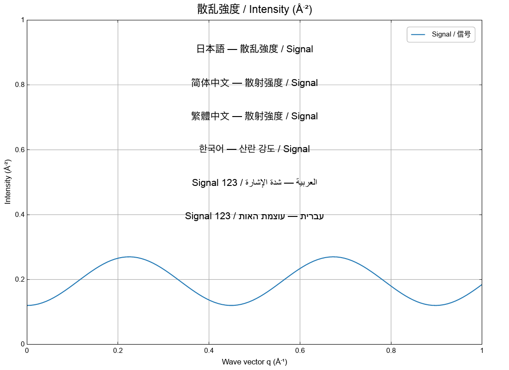
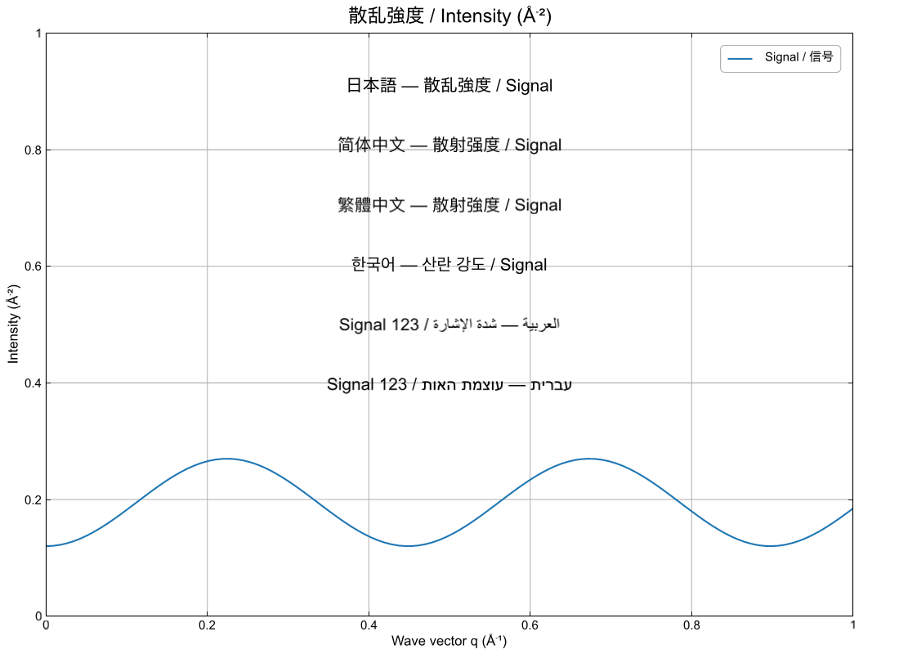

# International and publication typography

Plain and Typst modes share the plot's font family, fallback order, language,
text direction, sizes, and title weight. Switching `.typst(true)` to
`.typst(false)` preserves those settings. Both resolve generic families to the
same installed font: sans-serif starts with Arial, Helvetica, Liberation Sans,
and Noto Sans; serif and monospace have their own shared preferences. Rasterizers
can differ slightly in hinting, spacing, and line bounds.

## Set a primary font and ordered fallbacks

```rust,check,features=typst-math
use ruviz::prelude::*;

fn main() -> PlotResult<()> {
    let x = [0.0, 1.0, 2.0];
    let y = [1.0, 2.0, 1.5];
    let text = TextOptions::new()
        .font_fallbacks(["Helvetica", "Noto Sans CJK JP"])
        .language("ja")
        .require_all_glyphs(true);

    let plot: Plot = Plot::new()
        .font_family("Arial")
        .text_options(text)
        .line(&x, &y)
        .title("散乱強度 / Intensity (Å⁻²)")
        .xlabel("Wave vector q (Å⁻¹)")
        .into();

    plot.clone().typst(false).save("plain.png")?;
    plot.typst(true).save("typst.png")?;
    Ok(())
}
```

The primary font is tried first, followed by your fallback families in order,
language-specific families, and the engine's system fallback. Fallback applies to
shaped text runs, preserving combining marks and joined letters. Up to 32 explicit
fallback families are supported. Fonts are identified by their family names,
not filenames.

Install the necessary fonts or register your application's font bytes with
`ruviz::render::register_font_bytes(std::fs::read("font.otf")?)`. The same
registered bytes supply plain rendering, Typst, and PDF export. Registration
invalidates the affected caches, including fonts added after the first render.

`require_all_glyphs(true)` reports missing characters with a Unicode code point
and a request to install or register a suitable font. It is opt-in for existing
applications and enabled by the publication preset.

## Publication preset

```rust,check
use ruviz::prelude::*;
use ruviz::core::{PlotConfig as FigureConfig, TypographyConfig};

fn main() -> PlotResult<()> {
    let config = FigureConfig::builder()
        .typography(|_| TypographyConfig::publication().base_size(10.0))
        .build();

    Plot::with_config(config)
        .line(&[0.0, 1.0], &[0.0, 1.0])
        .title("Publication figure")
        .save("publication.png")?;
    Ok(())
}
```

This preset requests Arial, followed by Helvetica, Liberation Sans, and Noto
Sans. The system supplies further script fallbacks. It uses the ordinary
10-point typography sizes and enables missing-glyph errors. You can change sizes,
title weight, language, and fallback families through `TypographyConfig` or the
plot setters. Arial and Helvetica are not bundled.

## Language and per-label overrides

Language tags start with a two- or three-letter ISO language code and may include
a script or region, such as `ja`, `zh-Hant-TW`, or `ar`. Tags are normalized;
`zh_TW` and `zh-TW` select the same settings.

| Language | First regional fallback candidates |
| --- | --- |
| `ja` | Noto Sans CJK JP, Noto Sans JP |
| `zh-CN` | Noto Sans CJK SC, Noto Sans SC |
| `zh-TW` / `zh-Hant` | Noto Sans CJK TC, Noto Sans TC |
| `zh-HK` / `zh-MO` | Noto Sans CJK HK, Noto Sans HK |
| `ko` | Noto Sans CJK KR, Noto Sans KR |
| `ar`, `fa`, `ur` | Noto Sans Arabic, Noto Naskh Arabic |
| `he`, `yi` | Noto Sans Hebrew |

Regional platform fonts follow these candidates. Explicitly choosing a CJK font
as the primary family takes priority over language-based fallback. Set the
language when regional Han glyph forms matter. Typst also receives the language,
script, and supported region for its OpenType shaping; the plain engine uses the
language to choose fallback families and paragraph direction.

```rust,check
use ruviz::prelude::*;

fn main() -> PlotResult<()> {
    Plot::new()
        .language("ja")
        .line(&[0.0, 1.0], &[0.0, 1.0])
        .annotate(Annotation::text_styled(
            0.5, 0.5, "العربية / Signal 123",
            TextStyle::new().text_options(
                TextOptions::new().language("ar")
                    .direction(TextDirection::RightToLeft)
            ),
        ))
        .save("annotation.png")?;
    Ok(())
}
```

An annotation inherits unspecified plot settings. An explicit fallback list
replaces the inherited list, including an empty list. Automatic direction uses
the specified script or language; without a language, the plain engine uses the
text's Unicode bidirectional ordering. Set `TextDirection::LeftToRight` or
`RightToLeft` to override the paragraph direction without reversing characters.

## Equation fonts

Text and equations have separate font requirements. An ordinary sans-serif font
may not contain the OpenType MATH table needed for mathematical layout.

```rust,check,features=typst-math
use ruviz::prelude::*;

fn main() -> PlotResult<()> {
    // Register or install Fira Math before using this family.
    Plot::new()
        .font_family("Arial")
        .math_font("Fira Math")
        .line(&[0.0, 1.0], &[1.0, 2.0])
        .xlabel("Wave vector $q (Å^(-1))$")
        .typst(true)
        .save("equation.png")?;
    Ok(())
}
```

The default equation font remains Typst's bundled New Computer Modern Math.
An explicit math family must be available and contain a MATH table; otherwise
rendering returns an error. Enable `require_all_glyphs(true)` to also check the
particular expression's coverage. Plain mode retains the math-font setting for
a later mode switch and renders label strings literally.

## Exports and performance

Plain SVG records the requested stack, the concrete generic/fallback family used
for measurement, language, and direction. Its viewer must have the referenced
fonts. Typst SVG contains glyph outlines, and PDF embeds outlines using the same
font database as the raster renderer. Supplying identical font files gives the
most reproducible output across machines.

Font discovery is cached. Configured font systems share immutable font sources;
at most eight contexts are retained. Each keeps at most 2,048 glyph images and
8 MiB of glyph pixels after a label operation. Changing size, color, math font,
or direction alone reuses the context. Typst's output cache remains limited to
256 entries / 64 MiB and includes all text settings in its keys. Default
`TextOptions` allocates nothing.

Run the comparison example after installing the required language fonts:

```bash
cargo run --example international_fonts --features typst-math
# Font paths can also be supplied after -- for application-owned registration.
cargo bench --bench text_rendering --no-default-features --features typst-math
```

The example writes plain and Typst PNG/SVG files under
`generated/examples/international_fonts/` and uses the same plot configuration
for both modes.

| Plain mode | Typst mode |
| --- | --- |
|  |  |

## Migrating struct literals

Version 0.14 adds `text_options` to `FontConfig` and `TypographyConfig`, and an
optional `text_options` field to `TextStyle`. Set it to `TextOptions::default()`
or `None`, respectively, when constructing every field explicitly. Existing
builder-style construction continues to work. Generic fonts can change from
0.13 because both engines now use the same publication-oriented preferences.
