# Gallery

This page is generated from `python/examples/` by `scripts/generate_gallery.py`.

## Basic plots

### Bar chart

Categorical metrics rendered as a bar chart.

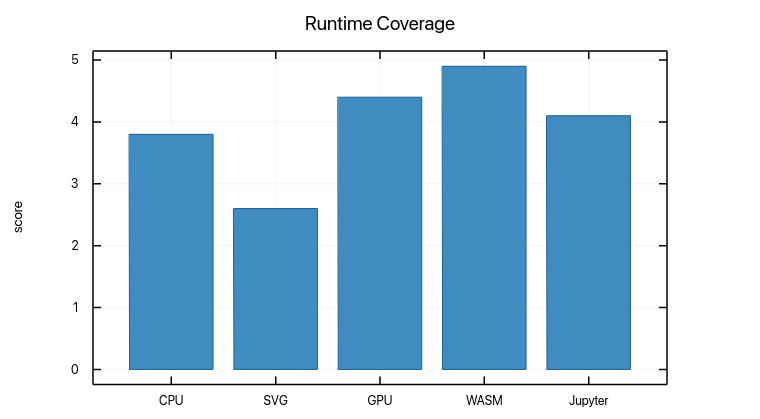

`examples/bar.py`

```python
from __future__ import annotations

from _shared import ExampleMeta, base_plot, categorical_series, save_example

META = ExampleMeta(
    slug="bar",
    title="Bar chart",
    summary="Categorical metrics rendered as a bar chart.",
    section="Basic plots",
)


def build_plot():
    categories, values = categorical_series()
    return base_plot("Runtime Coverage").ylabel("score").bar(categories, values)


if __name__ == "__main__":
    save_example(META, build_plot())
```

### Line plot

A basic fluent line plot built with chained Python methods.

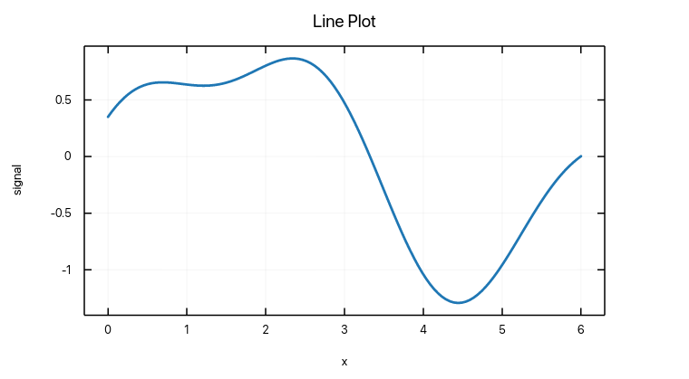

`examples/line.py`

```python
from __future__ import annotations

from _shared import ExampleMeta, base_plot, save_example, wave_series

META = ExampleMeta(
    slug="line",
    title="Line plot",
    summary="A basic fluent line plot built with chained Python methods.",
    section="Basic plots",
)


def build_plot():
    x, y = wave_series()
    return (
        base_plot("Line Plot")
        .xlabel("x")
        .ylabel("signal")
        .line(x, y)
    )


if __name__ == "__main__":
    save_example(META, build_plot())
```

### Scatter plot

A scatter plot for irregular point clouds.

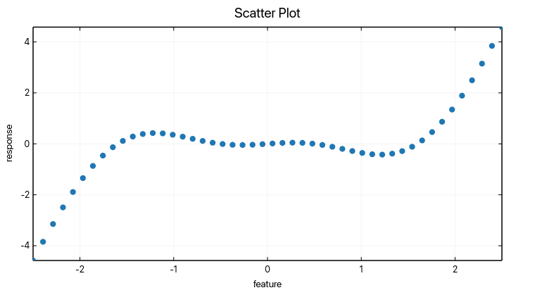

`examples/scatter.py`

```python
from __future__ import annotations

from _shared import ExampleMeta, base_plot, save_example, scatter_series

META = ExampleMeta(
    slug="scatter",
    title="Scatter plot",
    summary="A scatter plot for irregular point clouds.",
    section="Basic plots",
)


def build_plot():
    x, y = scatter_series()
    return (
        base_plot("Scatter Plot")
        .xlabel("feature")
        .ylabel("response")
        .scatter(x, y)
    )


if __name__ == "__main__":
    save_example(META, build_plot())
```

## Categorical plots

### Pie chart

A simple composition view with labels.

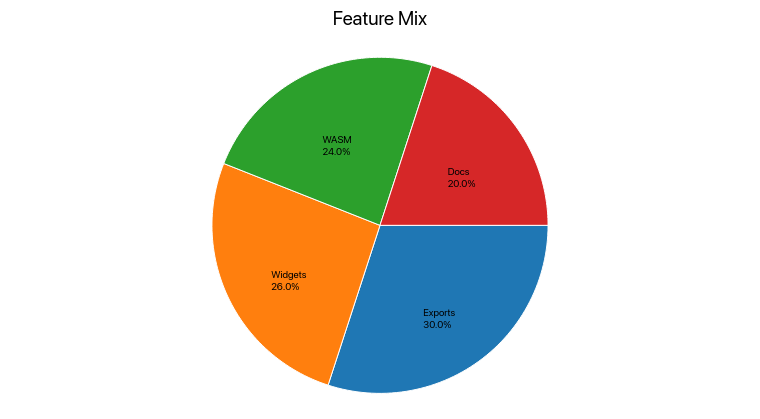

`examples/pie.py`

```python
from __future__ import annotations

from _shared import ExampleMeta, base_plot, save_example

META = ExampleMeta(
    slug="pie",
    title="Pie chart",
    summary="A simple composition view with labels.",
    section="Categorical plots",
)


def build_plot():
    labels = ["Exports", "Widgets", "WASM", "Docs"]
    values = [30.0, 26.0, 24.0, 20.0]
    return base_plot("Feature Mix").pie(values, labels)


if __name__ == "__main__":
    save_example(META, build_plot())
```

### Radar chart

Multi-axis comparison for runtime capabilities.

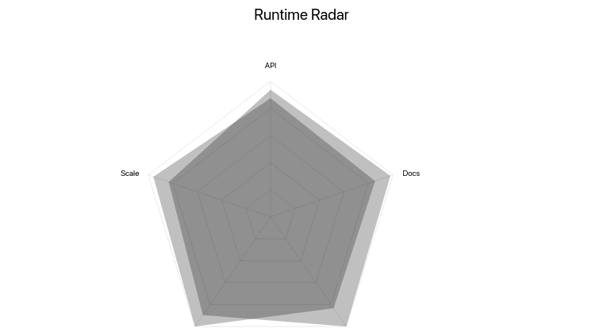

`examples/radar.py`

```python
from __future__ import annotations

from _shared import ExampleMeta, base_plot, radar_inputs, save_example

META = ExampleMeta(
    slug="radar",
    title="Radar chart",
    summary="Multi-axis comparison for runtime capabilities.",
    section="Categorical plots",
)


def build_plot():
    labels, series = radar_inputs()
    return base_plot("Runtime Radar").radar(labels, series)


if __name__ == "__main__":
    save_example(META, build_plot())
```

## Integration

### DataFrame input

Column selection with pandas-backed `data=` inputs.

`examples/dataframe_line.py`

```python
from __future__ import annotations

from _shared import ExampleMeta, base_plot, sample_dataframe, save_example

META = ExampleMeta(
    slug="dataframe-line",
    title="DataFrame input",
    summary="Column selection with pandas-backed `data=` inputs.",
    section="Integration",
    gallery=False,
)


def build_plot():
    frame = sample_dataframe()
    return (
        base_plot("Pandas DataFrame Input")
        .xlabel("time")
        .ylabel("value")
        .line("time", "value", data=frame)
        .line("time", "baseline", data=frame)
    )


if __name__ == "__main__":
    save_example(META, build_plot())
```

## Interactive workflows

### Console interactivity

Open the native interactive window when running outside Jupyter.

`examples/console_interactive.py`

```python
from __future__ import annotations

from _shared import ExampleMeta, base_plot, scatter_series

META = ExampleMeta(
    slug="console-interactive",
    title="Console interactivity",
    summary="Open the native interactive window when running outside Jupyter.",
    section="Interactive workflows",
    gallery=False,
)


def build_plot():
    x, y = scatter_series()
    return (
        base_plot("Native Interactive Window", theme="dark")
        .xlabel("feature")
        .ylabel("response")
        .scatter(x, y)
    )


if __name__ == "__main__":
    build_plot().show()
```

### Notebook export flow

Show a static PNG in Jupyter by default and save a static image alongside it.

`examples/notebook_export.py`

```python
from __future__ import annotations

from pathlib import Path

from _shared import ExampleMeta, base_plot, save_example, wave_series

META = ExampleMeta(
    slug="notebook-export",
    title="Notebook export flow",
    summary="Show a static PNG in Jupyter by default and save a static image alongside it.",
    section="Interactive workflows",
    gallery=False,
)


def build_plot():
    x, y = wave_series()
    return (
        base_plot("Notebook Export")
        .xlabel("x")
        .ylabel("signal")
        .line(x, y)
    )


def show_static():
    return build_plot().show()


def export_static(path: str | Path = "notebook-export.png") -> Path:
    return build_plot().save(path)


if __name__ == "__main__":
    save_example(META, build_plot())
```

### Notebook observables

Observable series driving an explicit widget view in Jupyter.

`examples/notebook_observable.py`

```python
from __future__ import annotations

import ruviz

from _shared import ExampleMeta, base_plot, save_example

META = ExampleMeta(
    slug="notebook-observable",
    title="Notebook observables",
    summary="Observable series driving an explicit widget view in Jupyter.",
    section="Interactive workflows",
    gallery=False,
)


def build_plot():
    source = ruviz.observable([0.2, 0.9, 0.5, 1.3, 0.8])
    return base_plot("Observable Notebook Plot").line([0, 1, 2, 3, 4], source)


def build_widget():
    source = ruviz.observable([0.2, 0.9, 0.5, 1.3, 0.8])
    plot = base_plot("Observable Notebook Plot").line([0, 1, 2, 3, 4], source)
    return plot.widget(), source


if __name__ == "__main__":
    widget, source = build_widget()
    source.replace([0.3, 1.1, 0.7, 1.0, 0.6])
    save_example(META, build_plot())
```

## Matrix plots

### Contour plot

Contours computed from a flattened z-grid over x/y axes.

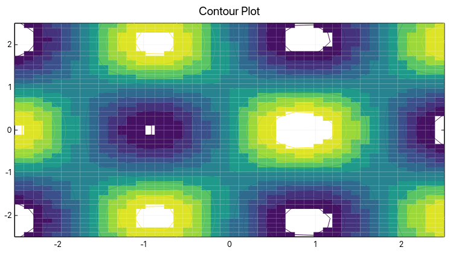

`examples/contour.py`

```python
from __future__ import annotations

from _shared import ExampleMeta, base_plot, contour_grid, save_example

META = ExampleMeta(
    slug="contour",
    title="Contour plot",
    summary="Contours computed from a flattened z-grid over x/y axes.",
    section="Matrix plots",
)


def build_plot():
    x, y, z = contour_grid()
    return base_plot("Contour Plot").contour(x, y, z)


if __name__ == "__main__":
    save_example(META, build_plot())
```

### Heatmap

A rectangular numeric matrix rendered as a heatmap.

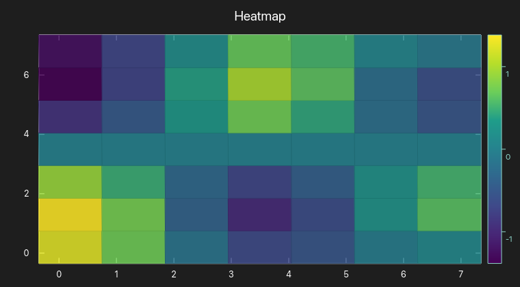

`examples/heatmap.py`

```python
from __future__ import annotations

from _shared import ExampleMeta, base_plot, heatmap_values, save_example

META = ExampleMeta(
    slug="heatmap",
    title="Heatmap",
    summary="A rectangular numeric matrix rendered as a heatmap.",
    section="Matrix plots",
)


def build_plot():
    return base_plot("Heatmap", theme="dark").heatmap(heatmap_values())


if __name__ == "__main__":
    save_example(META, build_plot())
```

## Specialized plots

### Polar line

A polar line rendered from radius and angle vectors.

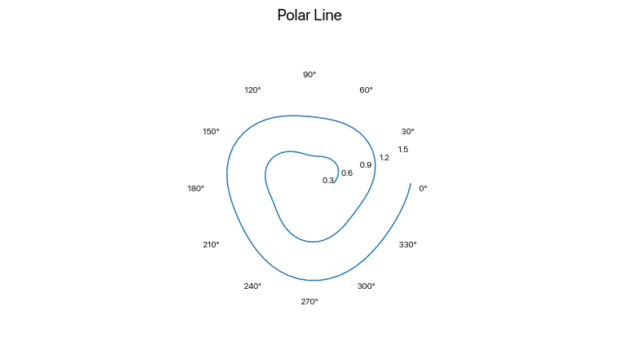

`examples/polar_line.py`

```python
from __future__ import annotations

from _shared import ExampleMeta, base_plot, polar_series, save_example

META = ExampleMeta(
    slug="polar-line",
    title="Polar line",
    summary="A polar line rendered from radius and angle vectors.",
    section="Specialized plots",
)


def build_plot():
    radius, theta = polar_series()
    return base_plot("Polar Line").polar_line(radius, theta)


if __name__ == "__main__":
    save_example(META, build_plot())
```

## Statistical plots

### Boxplot

Quartiles and outliers summarized as a boxplot.

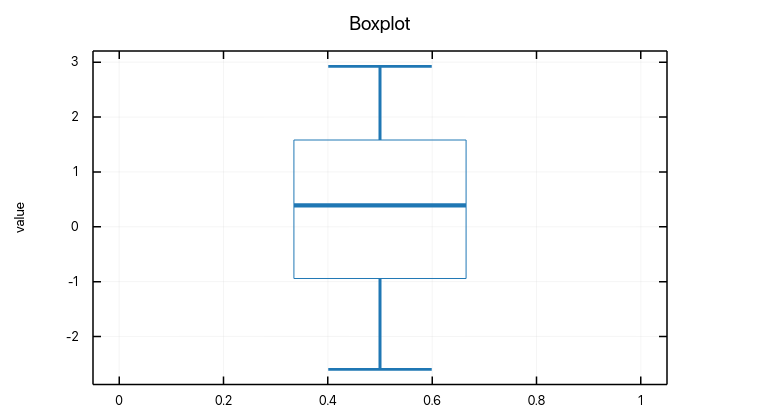

`examples/boxplot.py`

```python
from __future__ import annotations

from _shared import ExampleMeta, base_plot, sample_distribution, save_example

META = ExampleMeta(
    slug="boxplot",
    title="Boxplot",
    summary="Quartiles and outliers summarized as a boxplot.",
    section="Statistical plots",
)


def build_plot():
    return base_plot("Boxplot").ylabel("value").boxplot(sample_distribution())


if __name__ == "__main__":
    save_example(META, build_plot())
```

### ECDF

An empirical cumulative distribution plot for ranked samples.

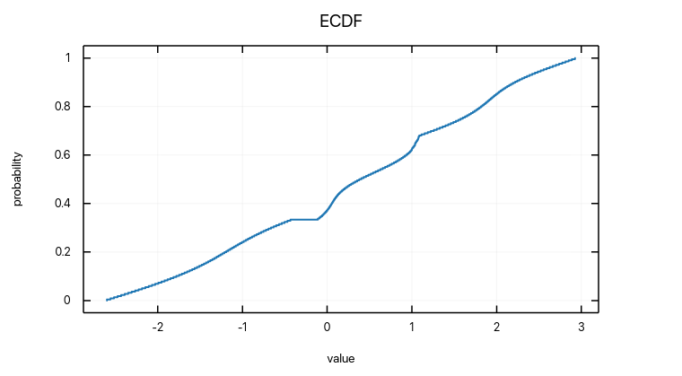

`examples/ecdf.py`

```python
from __future__ import annotations

from _shared import ExampleMeta, base_plot, sample_distribution, save_example

META = ExampleMeta(
    slug="ecdf",
    title="ECDF",
    summary="An empirical cumulative distribution plot for ranked samples.",
    section="Statistical plots",
)


def build_plot():
    return base_plot("ECDF").xlabel("value").ylabel("probability").ecdf(sample_distribution())


if __name__ == "__main__":
    save_example(META, build_plot())
```

### Histogram

A distribution view built from a deterministic sample.

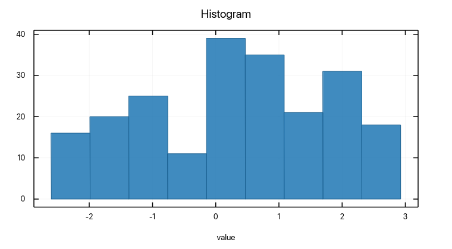

`examples/histogram.py`

```python
from __future__ import annotations

from _shared import ExampleMeta, base_plot, sample_distribution, save_example

META = ExampleMeta(
    slug="histogram",
    title="Histogram",
    summary="A distribution view built from a deterministic sample.",
    section="Statistical plots",
)


def build_plot():
    return base_plot("Histogram").xlabel("value").histogram(sample_distribution())


if __name__ == "__main__":
    save_example(META, build_plot())
```

### Horizontal and vertical error bars

A point series with uncertainty in both axes.

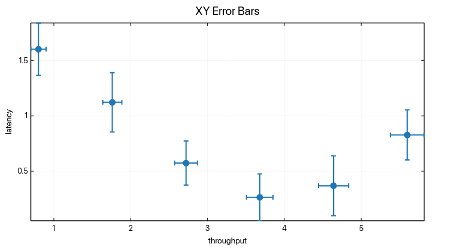

`examples/error_bars_xy.py`

```python
from __future__ import annotations

from _shared import ExampleMeta, base_plot, error_bar_xy_series, save_example

META = ExampleMeta(
    slug="error-bars-xy",
    title="Horizontal and vertical error bars",
    summary="A point series with uncertainty in both axes.",
    section="Statistical plots",
)


def build_plot():
    x, y, x_errors, y_errors = error_bar_xy_series()
    return (
        base_plot("XY Error Bars")
        .xlabel("throughput")
        .ylabel("latency")
        .error_bars_xy(x, y, x_errors, y_errors)
    )


if __name__ == "__main__":
    save_example(META, build_plot())
```

### Kernel density estimate

A smoothed density curve for a numeric sample.

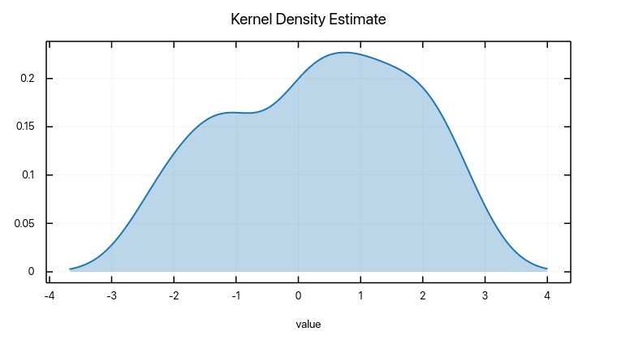

`examples/kde.py`

```python
from __future__ import annotations

from _shared import ExampleMeta, base_plot, sample_distribution, save_example

META = ExampleMeta(
    slug="kde",
    title="Kernel density estimate",
    summary="A smoothed density curve for a numeric sample.",
    section="Statistical plots",
)


def build_plot():
    return base_plot("Kernel Density Estimate").xlabel("value").kde(sample_distribution())


if __name__ == "__main__":
    save_example(META, build_plot())
```

### Vertical error bars

A line-like series with y-direction uncertainty.

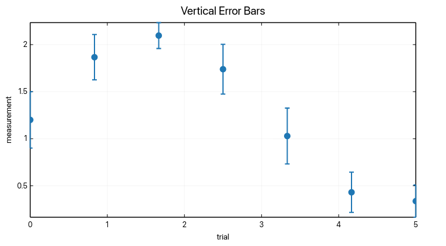

`examples/error_bars.py`

```python
from __future__ import annotations

from _shared import ExampleMeta, base_plot, error_bar_series, save_example

META = ExampleMeta(
    slug="error-bars",
    title="Vertical error bars",
    summary="A line-like series with y-direction uncertainty.",
    section="Statistical plots",
)


def build_plot():
    x, y, errors = error_bar_series()
    return (
        base_plot("Vertical Error Bars")
        .xlabel("trial")
        .ylabel("measurement")
        .error_bars(x, y, errors)
    )


if __name__ == "__main__":
    save_example(META, build_plot())
```

### Violin plot

A violin plot for density and spread in one view.

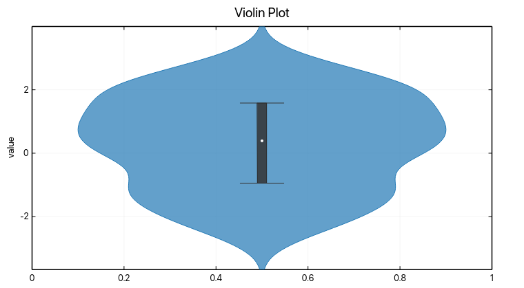

`examples/violin.py`

```python
from __future__ import annotations

from _shared import ExampleMeta, base_plot, sample_distribution, save_example

META = ExampleMeta(
    slug="violin",
    title="Violin plot",
    summary="A violin plot for density and spread in one view.",
    section="Statistical plots",
)


def build_plot():
    return base_plot("Violin Plot").ylabel("value").violin(sample_distribution())


if __name__ == "__main__":
    save_example(META, build_plot())
```
